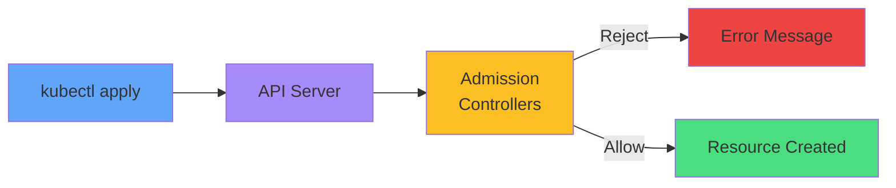

# Admission Control Flow

```mermaid
graph LR
    CLIENT[<carbon-terminal/> kubectl apply] --> API[<carbon-api/> API Server]
    API --> ADMISSION[<carbon-security-services/> Admission<br/>Controllers]

    ADMISSION -->|Reject| ERROR[<carbon-close-filled/> Error Message]
    ADMISSION -->|Allow| CREATE[<carbon-checkmark-filled/> Resource Created]

    style CLIENT fill:#60a5fa
    style API fill:#a78bfa
    style ADMISSION fill:#fbbf24
    style ERROR fill:#ef4444
    style CREATE fill:#4ade80
```

Admission controllers validate/mutate before creation

