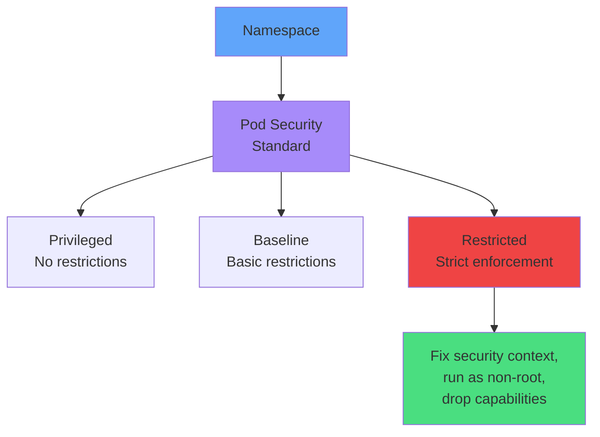

# Pod Security Standards

```mermaid
graph TB
    NS[<carbon-folder/> Namespace] --> PSS[<carbon-security/> Pod Security<br/>Standard]

    PSS --> PRIV[<carbon-unlocked/> Privileged<br/>No restrictions]
    PSS --> BASE[<carbon-shield/> Baseline<br/>Basic restrictions]
    PSS --> REST[<carbon-locked/> Restricted<br/>Strict enforcement]

    REST --> FIX[<carbon-edit/> Fix security context,<br/>run as non-root,<br/>drop capabilities]

    style NS fill:#60a5fa
    style PSS fill:#a78bfa
    style REST fill:#ef4444
    style FIX fill:#4ade80
```

Check ReplicaSet events for Pod Security violations

