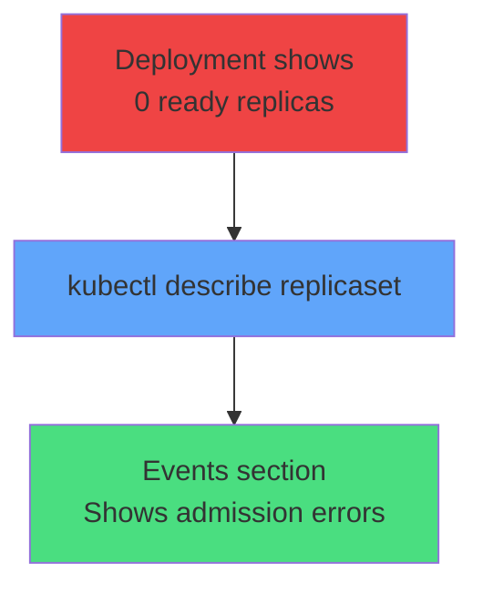

# Where to Find Errors

```mermaid
graph TB
    PROBLEM[<carbon-warning-alt/> Deployment shows<br/>0 ready replicas]

    PROBLEM --> CHECK[<carbon-search/> kubectl describe replicaset]

    CHECK --> EVENTS[<carbon-document/> Events section<br/>Shows admission errors]

    style PROBLEM fill:#ef4444
    style CHECK fill:#60a5fa
    style EVENTS fill:#4ade80
```

### Critical: Admission errors in ReplicaSet events, NOT Pod events

Pods never get created, so no Pod events exist

