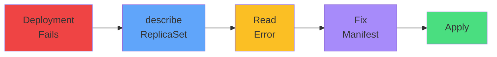

# Troubleshooting Workflow

```mermaid
graph LR
    FAIL[<carbon-close-filled/> Deployment<br/>Fails] --> RS[<carbon-search/> describe<br/>ReplicaSet] --> ERROR[<carbon-view/> Read<br/>Error] --> FIX[<carbon-edit/> Fix<br/>Manifest] --> TEST[<carbon-checkmark/> Apply]

    style FAIL fill:#ef4444
    style RS fill:#60a5fa
    style ERROR fill:#fbbf24
    style FIX fill:#a78bfa
    style TEST fill:#4ade80
```

### Systematic approach saves time
1. Check ReplicaSet events
2. Identify constraint (PSS, quota, limit, webhook)
3. Fix manifest
4. Reapply
5. Move to next question

