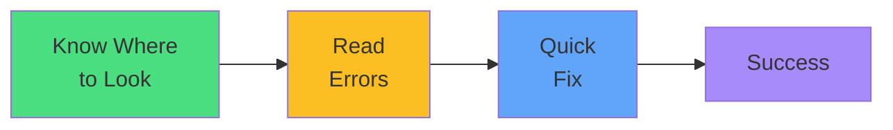

# Exam Mindset

<carbon-lightbulb class="text-yellow-400 text-4xl inline-block" />

### Check ReplicaSet events, not Pod events
### Error messages are your friend
### Fix and move on - don't spend >5 minutes
### Practice the troubleshooting workflow

