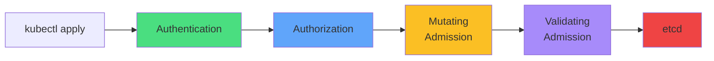
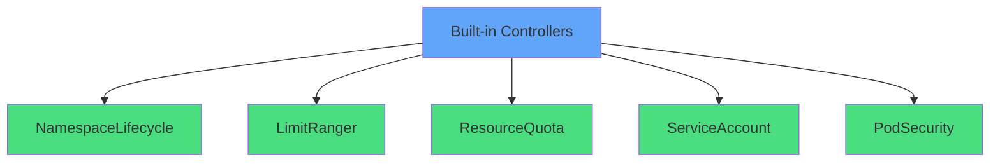
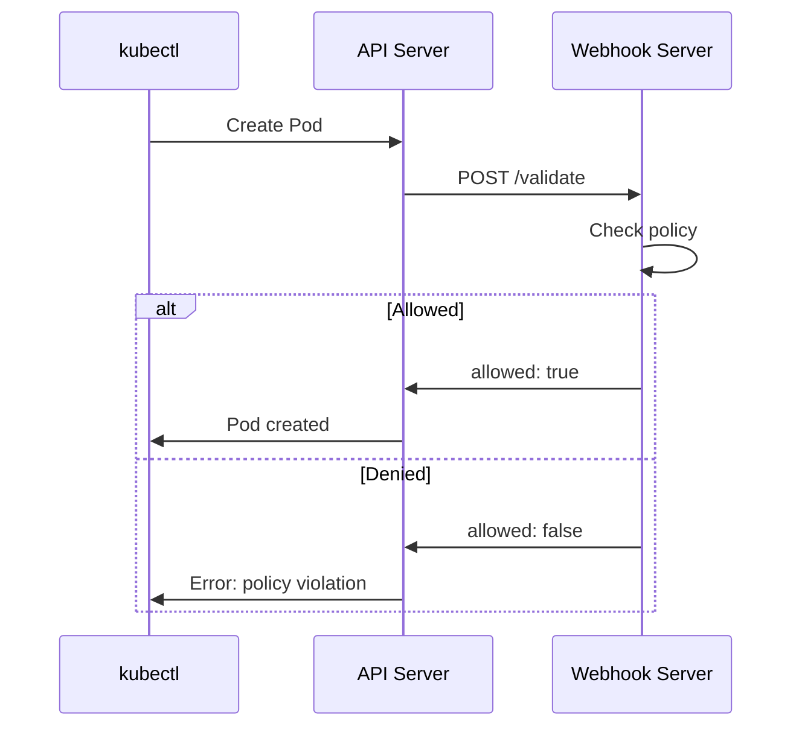
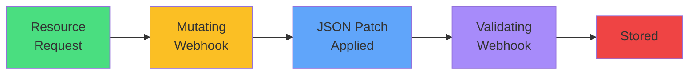
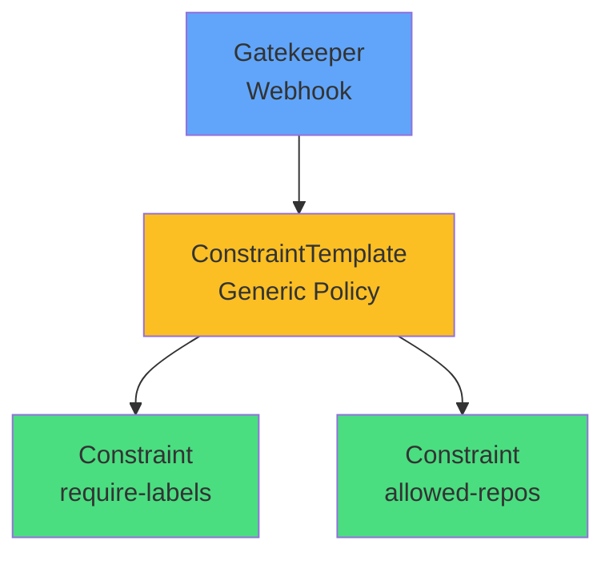
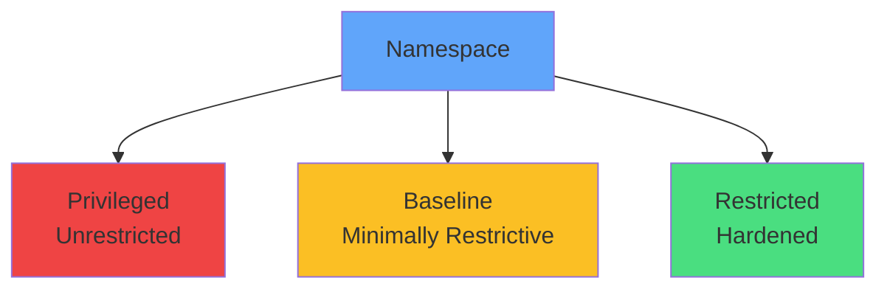
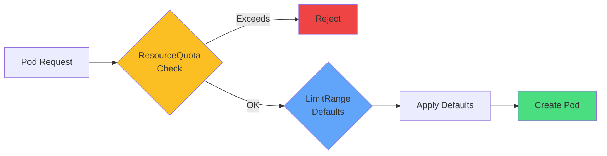
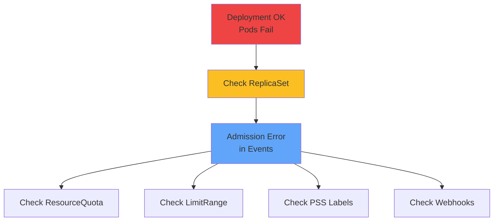
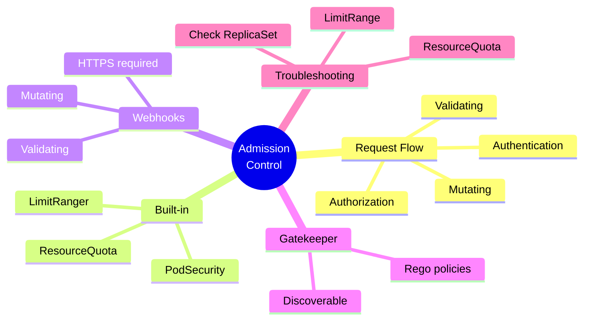

# Admission Control

<div class="abs-br m-6 flex gap-2">
  <carbon-security class="text-6xl text-blue-400" />
</div>

<div v-click class="mt-8 text-xl opacity-80">
The final gatekeeper for Kubernetes resources
</div>

---
layout: center
---

# API Request Flow

<div v-click="1">



</div>

<div class="grid grid-cols-2 gap-4 mt-8 text-sm">
<div v-click="2">
<carbon-user-identification class="inline-block text-3xl text-green-400" /> <strong>Authentication:</strong> Who are you?
</div>
<div v-click="3">
<carbon-locked class="inline-block text-3xl text-blue-400" /> <strong>Authorization:</strong> What can you do?
</div>
<div v-click="4">
<carbon-edit class="inline-block text-3xl text-yellow-400" /> <strong>Mutating:</strong> Modify objects
</div>
<div v-click="5">
<carbon-rule class="inline-block text-3xl text-purple-400" /> <strong>Validating:</strong> Accept or reject
</div>
</div>

---
layout: center
---

# Why Admission Control?

<div class="grid grid-cols-2 gap-6 mt-4">
<div v-click="1">
<carbon-security class="text-5xl text-red-400 mb-2" />
<strong>Security Enforcement</strong><br/>
<span class="text-sm opacity-80">Block privileged containers, require non-root users</span>
</div>
<div v-click="2">
<carbon-rule class="text-5xl text-blue-400 mb-2" />
<strong>Policy Compliance</strong><br/>
<span class="text-sm opacity-80">Enforce labels, naming, resource limits</span>
</div>
<div v-click="3">
<carbon-settings class="text-5xl text-green-400 mb-2" />
<strong>Auto Configuration</strong><br/>
<span class="text-sm opacity-80">Inject sidecars, add defaults, modify resources</span>
</div>
<div v-click="4">
<carbon-network-3 class="text-5xl text-purple-400 mb-2" />
<strong>Multi-tenancy</strong><br/>
<span class="text-sm opacity-80">Prevent team interference, enforce quotas</span>
</div>
</div>

<div v-click="5" class="mt-8 text-center text-yellow-400">
<carbon-warning class="inline-block text-2xl" /> For CKAD: Troubleshoot admission failures
</div>

---
layout: center
---

# Built-in Admission Controllers

<div v-click="1">



</div>

<div class="grid grid-cols-2 gap-4 mt-6 text-xs">
<div v-click="2">
<carbon-close class="inline-block text-2xl text-red-400" /> <strong>NamespaceLifecycle:</strong> Prevent ops in terminating namespaces
</div>
<div v-click="3">
<carbon-dashboard class="inline-block text-2xl text-blue-400" /> <strong>LimitRanger:</strong> Apply default resource limits
</div>
<div v-click="4">
<carbon-rule class="inline-block text-2xl text-yellow-400" /> <strong>ResourceQuota:</strong> Enforce namespace quotas
</div>
<div v-click="5">
<carbon-user class="inline-block text-2xl text-green-400" /> <strong>ServiceAccount:</strong> Inject default credentials
</div>
<div v-click="6">
<carbon-security class="inline-block text-2xl text-purple-400" /> <strong>PodSecurity:</strong> Enforce security standards
</div>
</div>

---
layout: center
---

# Validating Webhooks

<div v-click="1">



</div>

<div v-click="2" class="mt-6 text-center">
<carbon-rule class="inline-block text-4xl text-blue-400" />
<strong class="ml-2">Enforcement & Compliance</strong>
</div>

<div class="grid grid-cols-2 gap-4 mt-4 text-sm">
<div v-click="3">
<carbon-tag class="inline-block text-2xl text-green-400" /> Require specific labels
</div>
<div v-click="4">
<carbon-image class="inline-block text-2xl text-yellow-400" /> Whitelist image registries
</div>
<div v-click="5">
<carbon-text-font class="inline-block text-2xl text-purple-400" /> Validate naming conventions
</div>
<div v-click="6">
<carbon-security class="inline-block text-2xl text-red-400" /> Check security contexts
</div>
</div>

---
layout: center
---

# Mutating Webhooks

<div v-click="1">



</div>

<div v-click="2" class="mt-8 text-center">
<carbon-edit class="inline-block text-4xl text-yellow-400" />
<strong class="ml-2">Automation & Consistency</strong>
</div>

<div class="grid grid-cols-2 gap-4 mt-4 text-sm">
<div v-click="3">
<carbon-side-panel-open class="inline-block text-2xl text-green-400" /> Inject sidecar containers
</div>
<div v-click="4">
<carbon-list class="inline-block text-2xl text-blue-400" /> Add environment variables
</div>
<div v-click="5">
<carbon-security class="inline-block text-2xl text-purple-400" /> Set default security contexts
</div>
<div v-click="6">
<carbon-tag class="inline-block text-2xl text-yellow-400" /> Add labels/annotations
</div>
</div>

<div v-click="7" class="mt-6 text-center text-sm opacity-80">
Mutating runs before validating
</div>

---
layout: center
---

# Webhook Configuration

<div v-click="1" class="mb-4">

```yaml
apiVersion: admissionregistration.k8s.io/v1
kind: ValidatingWebhookConfiguration
metadata:
  name: my-webhook
webhooks:
- name: validate.example.com
  clientConfig:
    service:
      name: webhook-service
      namespace: default
  rules:
  - operations: ["CREATE", "UPDATE"]
    resources: ["pods"]
```

</div>

<div class="grid grid-cols-2 gap-4 text-sm">
<div v-click="2">
<carbon-rule class="inline-block text-2xl text-blue-400" /> Resource & operation rules
</div>
<div v-click="3">
<carbon-network-3 class="inline-block text-2xl text-green-400" /> Service endpoint URL
</div>
<div v-click="4">
<carbon-warning class="inline-block text-2xl text-yellow-400" /> Failure policy (Fail/Ignore)
</div>
<div v-click="5">
<carbon-certificate class="inline-block text-2xl text-purple-400" /> TLS certificate (required)
</div>
</div>

---
layout: center
---

# OPA Gatekeeper

<div v-click="1">



</div>

<div v-click="2" class="mt-6 text-center">
<carbon-rule class="inline-block text-4xl text-purple-400" />
<strong class="ml-2">Declarative Policy Framework</strong>
</div>

<div class="grid grid-cols-2 gap-6 mt-6">
<div v-click="3" class="text-center">
<carbon-document class="text-4xl text-blue-400 mb-2" />
<strong>Write Rego policies</strong><br/>
<span class="text-sm opacity-80">Not webhook code</span>
</div>
<div v-click="4" class="text-center">
<carbon-view class="text-4xl text-green-400 mb-2" />
<strong>Discoverable</strong><br/>
<span class="text-sm opacity-80">kubectl get constraints</span>
</div>
</div>

---
layout: center
---

# Pod Security Standards

<div v-click="1">



</div>

<div class="grid grid-cols-3 gap-4 mt-8 text-sm">
<div v-click="2" class="text-center">
<carbon-unlocked class="text-4xl text-red-400 mb-2" />
<strong>Privileged</strong><br/>
Allows everything
</div>
<div v-click="3" class="text-center">
<carbon-security class="text-4xl text-yellow-400 mb-2" />
<strong>Baseline</strong><br/>
Prevents escalation
</div>
<div v-click="4" class="text-center">
<carbon-locked class="text-4xl text-green-400 mb-2" />
<strong>Restricted</strong><br/>
Best practices
</div>
</div>

<div v-click="5" class="mt-6 text-center text-sm">
<carbon-rule class="inline-block text-2xl text-blue-400" /> <strong>enforce</strong> · <strong>audit</strong> · <strong>warn</strong>
</div>

---
layout: center
---

# ResourceQuota & LimitRange

<div v-click="1">



</div>

<div class="grid grid-cols-2 gap-6 mt-8">
<div v-click="2">
<carbon-rule class="text-4xl text-yellow-400 mb-2" />
<strong>ResourceQuota</strong><br/>
<span class="text-sm opacity-80">Namespace limits: CPU, memory, Pod count</span>
</div>
<div v-click="3">
<carbon-dashboard class="text-4xl text-blue-400 mb-2" />
<strong>LimitRange</strong><br/>
<span class="text-sm opacity-80">Per-resource min/max/defaults</span>
</div>
</div>

<div v-click="4" class="mt-6 text-center text-sm text-red-400">
<carbon-warning class="inline-block text-2xl" /> Common cause of deployment failures!
</div>

---
layout: center
---

# Troubleshooting Admission Failures

<div v-click="1">



</div>

<div class="grid grid-cols-2 gap-4 mt-6 text-sm">
<div v-click="2">
<carbon-terminal class="inline-block text-2xl text-blue-400" /> kubectl describe rs -l app=myapp
</div>
<div v-click="3">
<carbon-rule class="inline-block text-2xl text-yellow-400" /> kubectl describe resourcequota
</div>
<div v-click="4">
<carbon-dashboard class="inline-block text-2xl text-green-400" /> kubectl describe limitrange
</div>
<div v-click="5">
<carbon-security class="inline-block text-2xl text-purple-400" /> Check namespace labels (PSS)
</div>
</div>

<div v-click="6" class="mt-6 text-center text-lg">
<carbon-idea class="inline-block text-3xl text-yellow-400" /> Read error messages carefully!
</div>

---
layout: center
---

# Summary

<div v-click="1">



</div>

---
layout: center
---

# Key Takeaways

<div class="grid grid-cols-2 gap-6 mt-6">
<div v-click="1">
<carbon-security class="text-4xl text-blue-400 mb-2" />
<strong>Final gatekeeper</strong><br/>
<span class="text-sm opacity-80">Between auth and persistence</span>
</div>
<div v-click="2">
<carbon-rule class="text-4xl text-green-400 mb-2" />
<strong>Built-in controllers</strong><br/>
<span class="text-sm opacity-80">LimitRange, ResourceQuota, PodSecurity</span>
</div>
<div v-click="3">
<carbon-edit class="text-4xl text-yellow-400 mb-2" />
<strong>Webhooks</strong><br/>
<span class="text-sm opacity-80">Validate policies, mutate resources</span>
</div>
<div v-click="4">
<carbon-debug class="text-4xl text-red-400 mb-2" />
<strong>CKAD skill</strong><br/>
<span class="text-sm opacity-80">Troubleshoot admission failures quickly</span>
</div>
</div>

<div v-click="5" class="mt-8 text-center text-lg">
Check ReplicaSet events for admission errors! <carbon-arrow-right class="inline-block text-2xl" />
</div>
