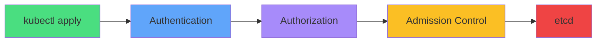
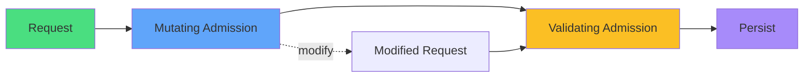
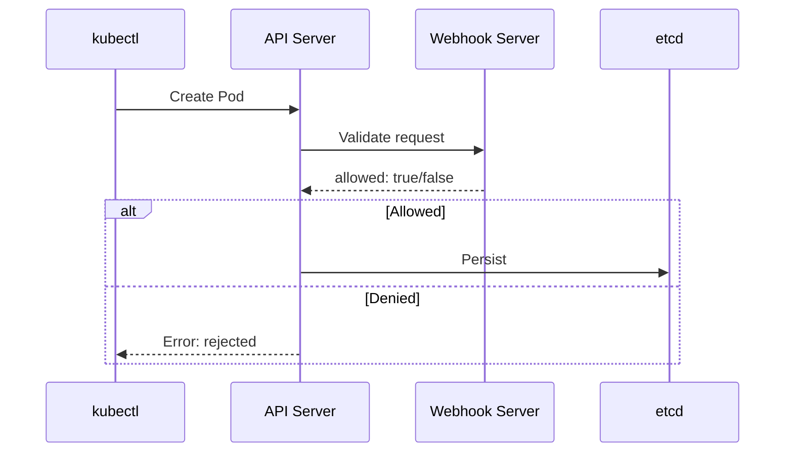
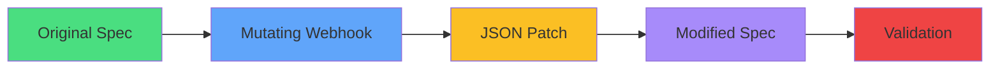
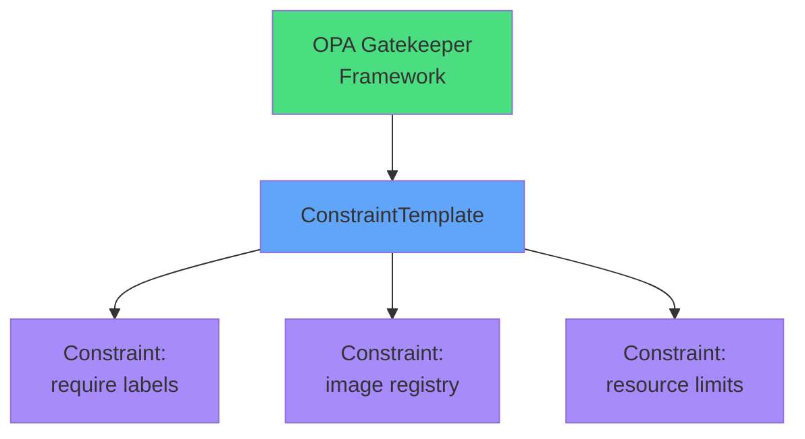
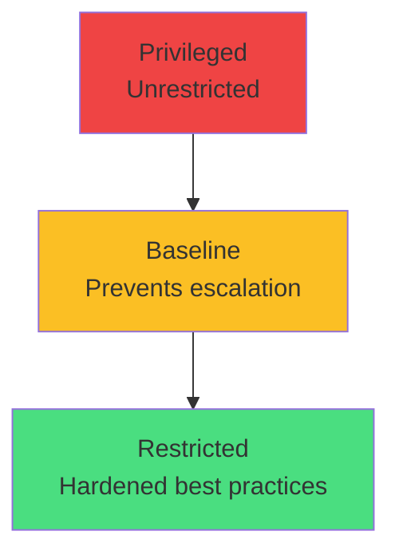
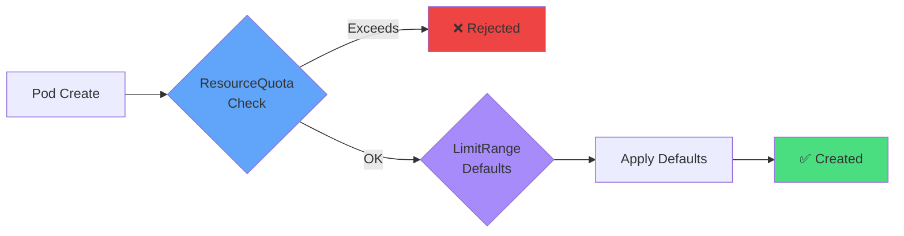
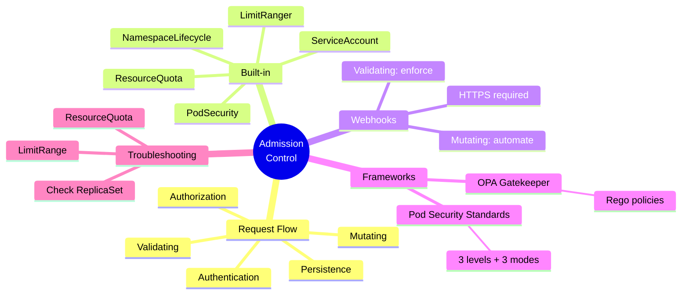

# Admission Control

<div class="abs-br m-6 flex gap-2">
  <carbon-security class="text-6xl text-blue-400" />
</div>

<div v-click class="mt-8 text-xl opacity-80">
The final gatekeeper between API and etcd
</div>

<div v-click class="mt-4 text-lg opacity-60">
Advanced topic for understanding policy enforcement
</div>

---
layout: center
---

# Admission Control in API Flow

<div v-click="1">



</div>

<div v-click="2" class="mt-6 text-center">
<carbon-credential class="inline-block text-3xl text-blue-400" /> Authentication: Who are you?
</div>

<div v-click="3" class="text-center mt-2">
<carbon-locked class="inline-block text-3xl text-purple-400" /> Authorization: What can you do?
</div>

<div v-click="4" class="text-center mt-2">
<carbon-security class="inline-block text-3xl text-yellow-400" /> Admission: Should this be allowed?
</div>

<div v-click="5" class="text-center mt-2">
<carbon-data-base class="inline-block text-3xl text-red-400" /> Persistence: Store in etcd
</div>

---
layout: center
---

# Two-Phase Admission

<div v-click="1">



</div>

<div v-click="2" class="mt-8 flex justify-around">
<div class="text-center">
<carbon-upgrade class="text-5xl text-blue-400 mb-2" />
<div class="font-semibold">Mutating</div>
<div class="text-sm opacity-80">Runs first, can modify</div>
</div>
<div v-click="3" class="text-center">
<carbon-checkmark class="text-5xl text-yellow-400 mb-2" />
<div class="font-semibold">Validating</div>
<div class="text-sm opacity-80">Runs second, accept/reject</div>
</div>
</div>

<div v-click="4" class="mt-6 text-center text-lg">
Last line of defense before persistence
</div>

---
layout: center
---

# Why Admission Control?

<div class="grid grid-cols-2 gap-6 mt-8">
<div v-click="1">
<carbon-security class="text-5xl text-red-400 mb-3" />
<div class="font-semibold text-lg">Security Enforcement</div>
<div class="text-sm opacity-80">Block privileged containers<br/>Require non-root users<br/>Enforce image registries</div>
</div>

<div v-click="2">
<carbon-rule class="text-5xl text-blue-400 mb-3" />
<div class="font-semibold text-lg">Policy Compliance</div>
<div class="text-sm opacity-80">Required labels<br/>Resource limits<br/>Naming conventions</div>
</div>

<div v-click="3">
<carbon-automation class="text-5xl text-green-400 mb-3" />
<div class="font-semibold text-lg">Auto Configuration</div>
<div class="text-sm opacity-80">Inject sidecars<br/>Add env vars<br/>Apply defaults</div>
</div>

<div v-click="4">
<carbon-user-multiple class="text-5xl text-purple-400 mb-3" />
<div class="font-semibold text-lg">Multi-tenancy</div>
<div class="text-sm opacity-80">Namespace quotas<br/>Network policies<br/>Resource isolation</div>
</div>
</div>

<div v-click="5" class="mt-6 text-center text-yellow-400">
<carbon-information class="inline-block text-2xl" /> For CKAD: Understand to troubleshoot failures
</div>

---
layout: center
---

# Built-in Admission Controllers

<div class="grid grid-cols-2 gap-4 mt-6 text-sm">
<div v-click="1">
<carbon-namespace class="inline-block text-3xl text-blue-400" />
<div class="font-semibold">NamespaceLifecycle</div>
<div class="opacity-80">Prevents ops in terminating namespaces</div>
</div>

<div v-click="2">
<carbon-edge-node class="inline-block text-3xl text-green-400" />
<div class="font-semibold">LimitRanger</div>
<div class="opacity-80">Applies default resource limits</div>
</div>

<div v-click="3">
<carbon-dashboard class="inline-block text-3xl text-yellow-400" />
<div class="font-semibold">ResourceQuota</div>
<div class="opacity-80">Enforces namespace quotas</div>
</div>

<div v-click="4">
<carbon-user-access class="inline-block text-3xl text-purple-400" />
<div class="font-semibold">ServiceAccount</div>
<div class="opacity-80">Auto-injects default service account</div>
</div>

<div v-click="5">
<carbon-security-services class="inline-block text-3xl text-red-400" />
<div class="font-semibold">PodSecurity</div>
<div class="opacity-80">Enforces Pod Security Standards</div>
</div>
</div>

<div v-click="6" class="mt-8 text-center text-lg opacity-80">
These run automatically - you see their effects
</div>

---
layout: center
---

# Validating Webhooks

<div v-click="1">



</div>

<div class="grid grid-cols-3 gap-4 mt-6 text-sm">
<div v-click="2" class="text-center">
<carbon-tag class="text-3xl text-blue-400 mb-2" />
<div>Require labels</div>
</div>
<div v-click="3" class="text-center">
<carbon-container-registry class="text-3xl text-green-400 mb-2" />
<div>Image whitelists</div>
</div>
<div v-click="4" class="text-center">
<carbon-security class="text-3xl text-purple-400 mb-2" />
<div>Security contexts</div>
</div>
</div>

<div v-click="5" class="mt-6 text-center">
<carbon-locked class="inline-block text-2xl text-red-400" /> Must use HTTPS with valid TLS
</div>

---
layout: center
---

# Mutating Webhooks

<div v-click="1">



</div>

<div class="mt-8">
<div v-click="2" class="mb-4">
<carbon-side-panel-open class="inline-block text-3xl text-blue-400" /> Inject sidecar containers (Istio)
</div>
<div v-click="3" class="mb-4">
<carbon-list class="inline-block text-3xl text-green-400" /> Add environment variables
</div>
<div v-click="4" class="mb-4">
<carbon-security class="inline-block text-3xl text-purple-400" /> Set default security contexts
</div>
<div v-click="5" class="mb-4">
<carbon-tag class="inline-block text-3xl text-yellow-400" /> Add labels or annotations
</div>
<div v-click="6" class="mb-4">
<carbon-container-registry class="inline-block text-3xl text-orange-400" /> Rewrite image references
</div>
</div>

<div v-click="7" class="mt-6 text-center text-lg font-semibold">
Validating = enforcement | Mutating = automation
</div>

---
layout: center
---

# Webhook Configuration

<div v-click="1" class="mb-6">

```yaml
apiVersion: admissionregistration.k8s.io/v1
kind: ValidatingWebhookConfiguration
metadata:
  name: my-webhook
webhooks:
- name: validate.example.com
  rules:
  - operations: ["CREATE", "UPDATE"]
    resources: ["pods"]
  clientConfig:
    service:
      name: webhook-service
    caBundle: <cert>
  failurePolicy: Fail
```

</div>

<div class="grid grid-cols-2 gap-4 text-sm">
<div v-click="2">
<carbon-rule class="inline-block text-2xl text-blue-400" /> Which resources trigger
</div>
<div v-click="3">
<carbon-network-3 class="inline-block text-2xl text-green-400" /> Webhook endpoint
</div>
<div v-click="4">
<carbon-filter class="inline-block text-2xl text-purple-400" /> Namespace selectors
</div>
<div v-click="5">
<carbon-warning class="inline-block text-2xl text-red-400" /> Failure policy
</div>
</div>

<div v-click="6" class="mt-6 text-center text-yellow-400">
<carbon-warning class="inline-block text-2xl" /> Fail policy can lock you out if webhook is down!
</div>

---
layout: center
---

# OPA Gatekeeper

<div v-click="1">



</div>

<div v-click="2" class="mt-8 text-center">
<carbon-document class="inline-block text-4xl text-blue-400" /> Write policies in Rego
</div>

<div v-click="3" class="mt-4 text-center">
<carbon-rule class="inline-block text-4xl text-green-400" /> Not custom webhook code
</div>

<div v-click="4" class="mt-8 flex justify-around">
<div class="text-center">
<carbon-view class="text-4xl text-purple-400 mb-2" />
<div class="text-sm">Discoverable via kubectl</div>
</div>
<div v-click="5" class="text-center">
<carbon-search class="text-4xl text-yellow-400 mb-2" />
<div class="text-sm">Audit existing violations</div>
</div>
</div>

---
layout: center
---

# Pod Security Standards

<div v-click="1">



</div>

<div class="grid grid-cols-3 gap-4 mt-8 text-sm">
<div v-click="2" class="text-center">
<carbon-locked class="text-4xl text-red-400 mb-2" />
<div class="font-semibold">enforce</div>
<div class="opacity-80">Violations rejected</div>
</div>
<div v-click="3" class="text-center">
<carbon-document class="text-4xl text-yellow-400 mb-2" />
<div class="font-semibold">audit</div>
<div class="opacity-80">Violations logged</div>
</div>
<div v-click="4" class="text-center">
<carbon-warning class="text-4xl text-blue-400 mb-2" />
<div class="font-semibold">warn</div>
<div class="opacity-80">User sees warning</div>
</div>
</div>

<div v-click="5" class="mt-8 text-center text-sm opacity-80">
Applied via namespace labels:
</div>

<div v-click="6" class="text-center text-xs">
pod-security.kubernetes.io/enforce=baseline
</div>

<div v-click="7" class="mt-4 text-center">
<carbon-information class="inline-block text-2xl text-green-400" /> Replaced PodSecurityPolicy in K8s 1.25
</div>

---
layout: center
---

# ResourceQuota & LimitRange

<div v-click="1">



</div>

<div class="grid grid-cols-2 gap-6 mt-8 text-sm">
<div v-click="2">
<div class="font-semibold text-lg mb-2"><carbon-dashboard class="inline-block text-3xl text-blue-400" /> ResourceQuota</div>
<div class="opacity-80">
• Max pods<br/>
• Total requests.cpu / requests.memory<br/>
• Total limits.cpu / limits.memory<br/>
• PVC count
</div>
</div>

<div v-click="3">
<div class="font-semibold text-lg mb-2"><carbon-edge-node class="inline-block text-3xl text-purple-400" /> LimitRange</div>
<div class="opacity-80">
• Min/max per container<br/>
• Default requests/limits<br/>
• Auto-applies defaults
</div>
</div>
</div>

<div v-click="4" class="mt-6 text-center text-yellow-400">
<carbon-warning class="inline-block text-2xl" /> Most common cause of mysterious failures
</div>

---
layout: center
---

# Troubleshooting Admission Failures

<div v-click="1" class="mb-6 text-center">
<carbon-warning class="inline-block text-6xl text-red-400" />
<div class="text-xl mt-2">Deployment creates but Pods don't?</div>
</div>

<div v-click="2" class="mb-4">
<carbon-search class="inline-block text-3xl text-blue-400" /> Check ReplicaSet events
<div class="text-sm opacity-80 ml-10">kubectl describe rs -l app=myapp</div>
</div>

<div v-click="3" class="mb-4">
<carbon-dashboard class="inline-block text-3xl text-green-400" /> Check ResourceQuota
<div class="text-sm opacity-80 ml-10">kubectl describe resourcequota</div>
</div>

<div v-click="4" class="mb-4">
<carbon-edge-node class="inline-block text-3xl text-purple-400" /> Check LimitRange
<div class="text-sm opacity-80 ml-10">kubectl describe limitrange</div>
</div>

<div v-click="5" class="mb-4">
<carbon-security class="inline-block text-3xl text-yellow-400" /> Check Pod Security labels
<div class="text-sm opacity-80 ml-10">kubectl get ns --show-labels</div>
</div>

<div v-click="6" class="mb-4">
<carbon-webhook class="inline-block text-3xl text-red-400" /> List webhook configs
<div class="text-sm opacity-80 ml-10">kubectl get validatingwebhookconfiguration</div>
</div>

<div v-click="7" class="mt-6 text-center text-lg font-semibold">
<carbon-idea class="inline-block text-3xl text-yellow-400" /> Read error messages carefully!
</div>

---
layout: center
---

# Summary

<div v-click="1">



</div>

---
layout: center
---

# Key CKAD Takeaways

<div class="grid grid-cols-2 gap-6 mt-6">
<div v-click="1">
<carbon-information class="text-4xl text-blue-400 mb-2" />
<div class="text-sm">Admission = final gatekeeper before etcd</div>
</div>

<div v-click="2">
<carbon-debug class="text-4xl text-red-400 mb-2" />
<div class="text-sm">Check ReplicaSet events for admission errors</div>
</div>

<div v-click="3">
<carbon-dashboard class="text-4xl text-green-400 mb-2" />
<div class="text-sm">ResourceQuota causes most failures</div>
</div>

<div v-click="4">
<carbon-security class="text-4xl text-purple-400 mb-2" />
<div class="text-sm">Know Pod Security Standards: privileged, baseline, restricted</div>
</div>

<div v-click="5">
<carbon-upgrade class="text-4xl text-yellow-400 mb-2" />
<div class="text-sm">Mutating runs before Validating</div>
</div>

<div v-click="6">
<carbon-tools class="text-4xl text-orange-400 mb-2" />
<div class="text-sm">Won't implement, but must troubleshoot</div>
</div>
</div>

<div v-click="7" class="mt-8 text-center text-xl">
Next: Hands-on admission control practice <carbon-arrow-right class="inline-block text-2xl" />
</div>
