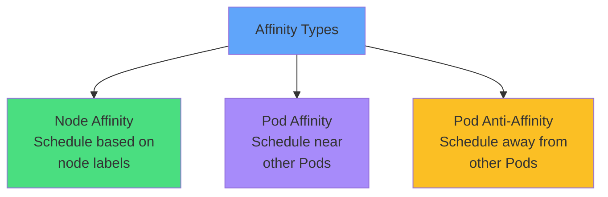

# Affinity Types

```mermaid
graph TB
    AFFINITY[<carbon-grid/> Affinity Types]

    AFFINITY --> NODE[<carbon-server/> Node Affinity<br/>Schedule based on<br/>node labels]
    AFFINITY --> POD_AFF[<carbon-arrows-horizontal/> Pod Affinity<br/>Schedule near<br/>other Pods]
    AFFINITY --> POD_ANTI[<carbon-split/> Pod Anti-Affinity<br/>Schedule away from<br/>other Pods]

    style AFFINITY fill:#60a5fa
    style NODE fill:#4ade80
    style POD_AFF fill:#a78bfa
    style POD_ANTI fill:#fbbf24
```

Choose based on placement requirements

