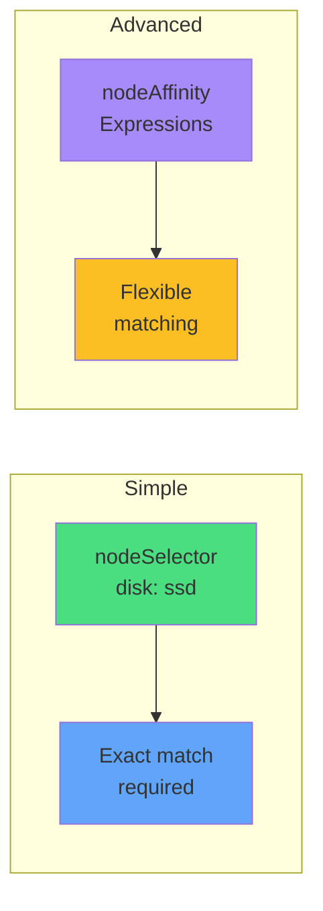

# nodeSelector vs Node Affinity

```mermaid
graph LR
    subgraph Simple
        NS[<carbon-settings/> nodeSelector<br/>disk: ssd] --> EXACT[<carbon-checkmark/> Exact match<br/>required]
    end

    subgraph Advanced
        NA[<carbon-grid/> nodeAffinity<br/>Expressions] --> FLEXIBLE[<carbon-arrow-right/> Flexible<br/>matching]
    end

    style NS fill:#4ade80
    style EXACT fill:#60a5fa
    style NA fill:#a78bfa
    style FLEXIBLE fill:#fbbf24
```

### Use nodeSelector when simple matching works
### Use node affinity for complex requirements

Don't over-engineer - simpler is faster

