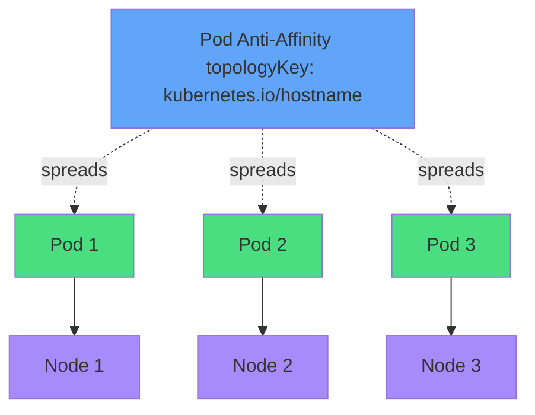

# Pod Anti-Affinity for HA

```mermaid
graph TB
    POD1[<carbon-container-software/> Pod 1] --> NODE1[<carbon-server/> Node 1]
    POD2[<carbon-container-software/> Pod 2] --> NODE2[<carbon-server/> Node 2]
    POD3[<carbon-container-software/> Pod 3] --> NODE3[<carbon-server/> Node 3]

    ANTI[<carbon-split/> Pod Anti-Affinity<br/>topologyKey: kubernetes.io/hostname]
    ANTI -.->|spreads| POD1
    ANTI -.->|spreads| POD2
    ANTI -.->|spreads| POD3

    style ANTI fill:#60a5fa
    style POD1 fill:#4ade80
    style POD2 fill:#4ade80
    style POD3 fill:#4ade80
    style NODE1 fill:#a78bfa
    style NODE2 fill:#a78bfa
    style NODE3 fill:#a78bfa
```

Common pattern: spread replicas across nodes

