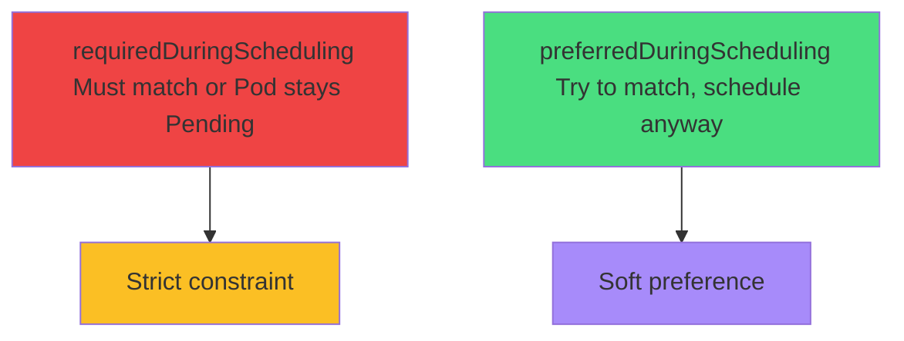

# Required vs Preferred

```mermaid
graph TB
    REQUIRED[<carbon-locked/> requiredDuringScheduling<br/>Must match or Pod stays Pending]
    PREFERRED[<carbon-unlocked/> preferredDuringScheduling<br/>Try to match, schedule anyway]

    REQUIRED --> STRICT[<carbon-close-filled/> Strict constraint]
    PREFERRED --> SOFT[<carbon-checkmark-outline/> Soft preference]

    style REQUIRED fill:#ef4444
    style PREFERRED fill:#4ade80
    style STRICT fill:#fbbf24
    style SOFT fill:#a78bfa
```

### Required = Hard constraint (can block scheduling)
### Preferred = Soft preference (won't block)

Use preferred when possible to avoid Pending Pods

