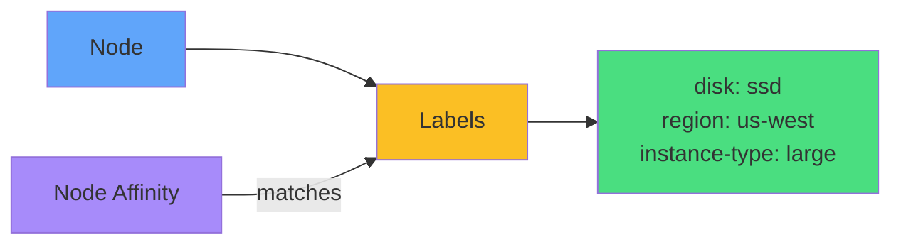

# Node Labels

```mermaid
graph LR
    NODE[<carbon-server/> Node] --> LABELS[<carbon-tag/> Labels]

    LABELS --> BUILTIN[disk: ssd<br/>region: us-west<br/>instance-type: large]

    AFFINITY[<carbon-grid/> Node Affinity] -->|matches| LABELS

    style NODE fill:#60a5fa
    style LABELS fill:#fbbf24
    style BUILTIN fill:#4ade80
    style AFFINITY fill:#a78bfa
```

### Check existing labels: `kubectl get nodes --show-labels`
### Add labels: `kubectl label node name key=value`

Affinity rules match node labels

