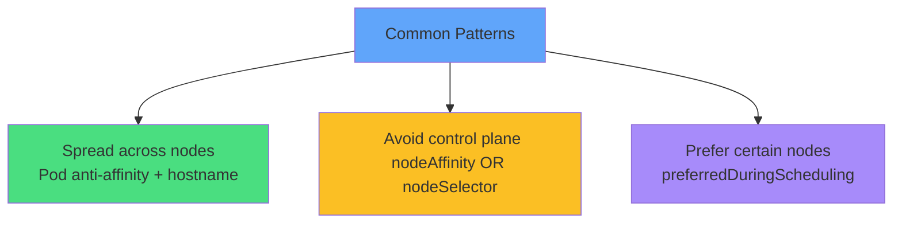

# Common Patterns

```mermaid
graph TB
    PATTERNS[<carbon-grid/> Common Patterns]

    PATTERNS --> SPREAD[<carbon-split/> Spread across nodes<br/>Pod anti-affinity + hostname]
    PATTERNS --> AVOID[<carbon-close/> Avoid control plane<br/>nodeAffinity OR nodeSelector]
    PATTERNS --> PREFER[<carbon-checkmark-outline/> Prefer certain nodes<br/>preferredDuringScheduling]

    style PATTERNS fill:#60a5fa
    style SPREAD fill:#4ade80
    style AVOID fill:#fbbf24
    style PREFER fill:#a78bfa
```

Know these patterns for quick application

