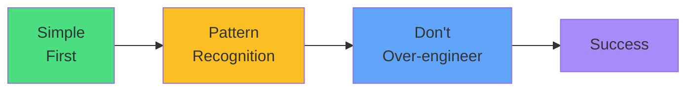

# Exam Mindset

<carbon-lightbulb class="text-yellow-400 text-4xl inline-block" />

### Use nodeSelector when it works
### Know the spread-across-nodes pattern
### Use kubectl explain for syntax help
### Don't spend >5 minutes on affinity

