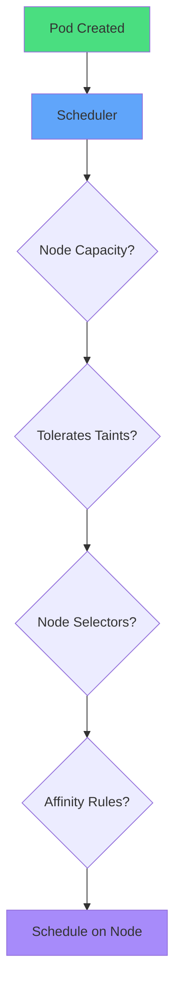
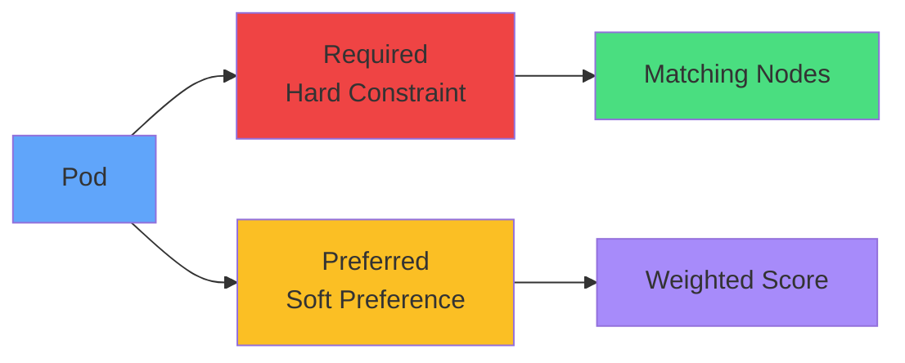
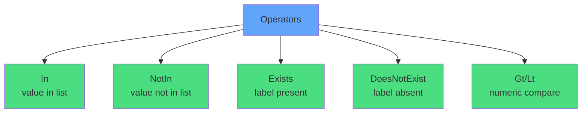
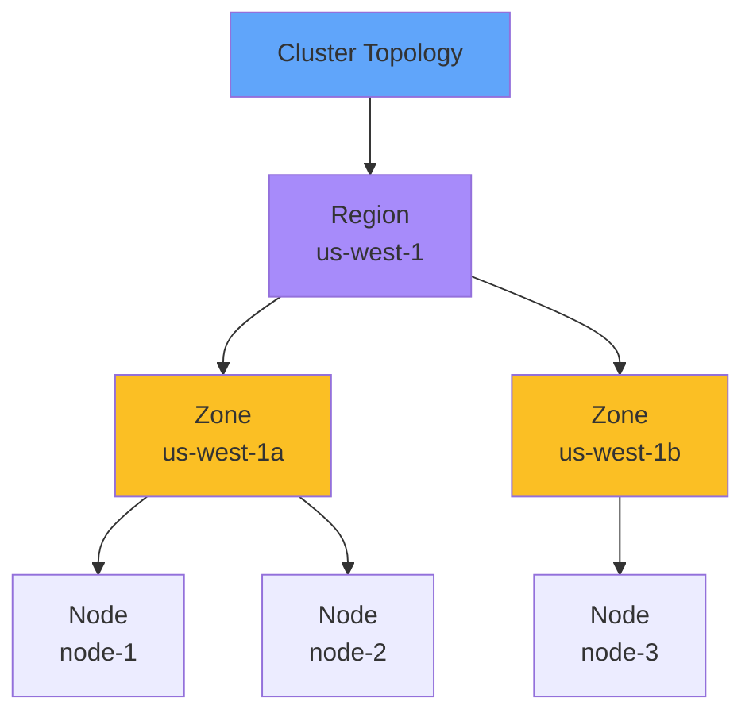
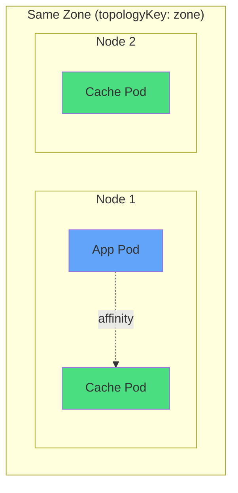
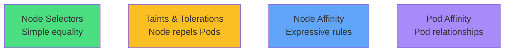
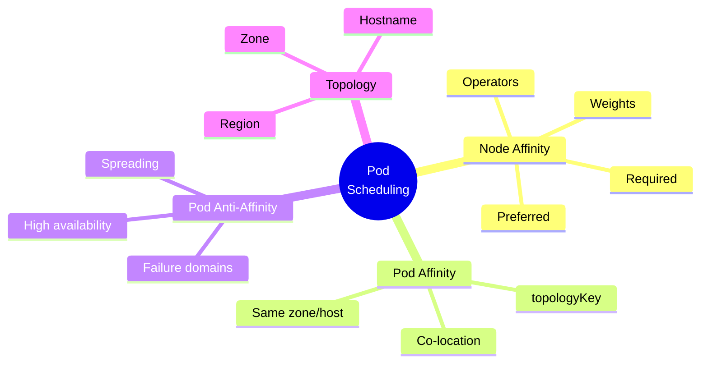

# Pod Scheduling with Affinity

<div class="abs-br m-6 flex gap-2">
  <carbon-network-3 class="text-6xl text-blue-400" />
</div>

<div v-click class="mt-8 text-xl opacity-80">
Advanced control over Pod placement
</div>

---
layout: center
---

# Why Pod Placement Matters

<div class="grid grid-cols-2 gap-6 mt-4">
<div v-click="1">
<carbon-dashboard class="text-5xl text-blue-400 mb-2" />
<strong>Performance</strong><br/>
<span class="text-sm opacity-80">GPUs, SSDs, specialized hardware</span>
</div>
<div v-click="2">
<carbon-hybrid-networking class="text-5xl text-green-400 mb-2" />
<strong>High Availability</strong><br/>
<span class="text-sm opacity-80">Spread across failure zones</span>
</div>
<div v-click="3">
<carbon-location class="text-5xl text-purple-400 mb-2" />
<strong>Co-location</strong><br/>
<span class="text-sm opacity-80">Reduce latency between components</span>
</div>
<div v-click="4">
<carbon-security class="text-5xl text-red-400 mb-2" />
<strong>Isolation</strong><br/>
<span class="text-sm opacity-80">Compliance and security zones</span>
</div>
</div>

---
layout: center
---

# Scheduling Basics

<div v-click="1">



</div>

<div class="grid grid-cols-2 gap-4 mt-6 text-sm">
<div v-click="2">
<carbon-dashboard class="inline-block text-2xl text-blue-400" /> CPU & memory capacity
</div>
<div v-click="3">
<carbon-close class="inline-block text-2xl text-red-400" /> Taints & tolerations
</div>
<div v-click="4">
<carbon-tag class="inline-block text-2xl text-green-400" /> Node selectors (simple)
</div>
<div v-click="5">
<carbon-rule class="inline-block text-2xl text-purple-400" /> Affinity (expressive)
</div>
</div>

---
layout: center
---

# Node Affinity Overview

<div v-click="1">



</div>

<div v-click="2" class="mt-6 text-center text-sm opacity-80">
Like node selectors, but much more powerful
</div>

<div class="grid grid-cols-2 gap-6 mt-6">
<div v-click="3">
<carbon-rule class="text-4xl text-red-400 mb-2" />
<strong>Required</strong><br/>
<span class="text-sm opacity-80">Must match or Pod stays Pending</span>
</div>
<div v-click="4">
<carbon-star class="text-4xl text-yellow-400 mb-2" />
<strong>Preferred</strong><br/>
<span class="text-sm opacity-80">Weighted preferences (1-100)</span>
</div>
</div>

---
layout: center
---

# Required vs Preferred

<div v-click="1" class="mb-4">

```yaml
affinity:
  nodeAffinity:
    required:
      - key: kubernetes.io/os
        operator: In
        values: [linux]
    preferred:
      - weight: 80
        key: disktype
        operator: In
        values: [ssd]
```

</div>

<div class="grid grid-cols-2 gap-6">
<div v-click="2" class="text-center">
<carbon-checkmark class="text-5xl text-red-400 mb-2" />
<strong>Required: Linux</strong><br/>
<span class="text-sm opacity-80">Non-negotiable</span>
</div>
<div v-click="3" class="text-center">
<carbon-star class="text-5xl text-yellow-400 mb-2" />
<strong>Preferred: SSD</strong><br/>
<span class="text-sm opacity-80">Nice to have</span>
</div>
</div>

<div v-click="4" class="mt-6 text-center text-sm">
Scheduler filters by required, then scores by preferred
</div>

---
layout: center
---

# Affinity Operators

<div v-click="1">



</div>

<div class="grid grid-cols-2 gap-4 mt-6 text-xs">
<div v-click="2">
<carbon-checkmark class="inline-block text-xl text-green-400" /> zone <strong>In</strong> [us-west-1a, us-west-1b]
</div>
<div v-click="3">
<carbon-close class="inline-block text-xl text-red-400" /> disktype <strong>NotIn</strong> [hdd]
</div>
<div v-click="4">
<carbon-tag class="inline-block text-xl text-blue-400" /> gpu <strong>Exists</strong> (any value)
</div>
<div v-click="5">
<carbon-subtract class="inline-block text-xl text-yellow-400" /> spot <strong>DoesNotExist</strong>
</div>
</div>

---
layout: center
---

# Node Topology Labels

<div v-click="1">



</div>

<div class="grid grid-cols-3 gap-4 mt-6 text-xs">
<div v-click="2" class="text-center">
<carbon-location class="text-3xl text-purple-400 mb-2" />
<strong>Region</strong><br/>
topology.kubernetes.io/region
</div>
<div v-click="3" class="text-center">
<carbon-grid class="text-3xl text-yellow-400 mb-2" />
<strong>Zone</strong><br/>
topology.kubernetes.io/zone
</div>
<div v-click="4" class="text-center">
<carbon-virtual-machine class="text-3xl text-blue-400 mb-2" />
<strong>Hostname</strong><br/>
kubernetes.io/hostname
</div>
</div>

---
layout: center
---

# Pod Affinity

<div v-click="1">



</div>

<div v-click="2" class="mt-6 text-center">
<carbon-network-3 class="inline-block text-4xl text-green-400" />
<strong class="ml-2">Co-locate with other Pods</strong>
</div>

<div class="grid grid-cols-2 gap-6 mt-6 text-sm">
<div v-click="3">
<carbon-location class="text-3xl text-blue-400 mb-2" />
<strong>topologyKey: hostname</strong><br/>
Same physical node
</div>
<div v-click="4">
<carbon-grid class="text-3xl text-purple-400 mb-2" />
<strong>topologyKey: zone</strong><br/>
Same availability zone
</div>
</div>

---
layout: center
---

# Pod Anti-Affinity

<div v-click="1">

```mermaid
graph TB
    subgraph Zone1[Zone A]
        N1[Node 1]
        R1[Replica 1]
    end
    subgraph Zone2[Zone B]
        N2[Node 2]
        R2[Replica 2]
    end
    subgraph Zone3[Zone C]
        N3[Node 3]
        R3[Replica 3]
    end
    R1 -.X.-|anti-affinity| R2
    R2 -.X.-|anti-affinity| R3
    R1 -.X.-|anti-affinity| R3
    style R1 fill:#60a5fa
    style R2 fill:#60a5fa
    style R3 fill:#60a5fa
```

</div>

<div v-click="2" class="mt-6 text-center">
<carbon-arrows-horizontal class="inline-block text-4xl text-red-400" />
<strong class="ml-2">Spread Pods for High Availability</strong>
</div>

<div v-click="3" class="mt-4 text-center text-sm opacity-80">
Don't schedule replicas together
</div>

---
layout: center
---

# Practical Use Cases

<div class="grid grid-cols-2 gap-6 mt-4">
<div v-click="1">
<carbon-hybrid-networking class="text-4xl text-green-400 mb-2" />
<strong>HA Deployments</strong><br/>
<span class="text-sm opacity-80">Anti-affinity across zones</span>
</div>
<div v-click="2">
<carbon-lightning class="text-4xl text-yellow-400 mb-2" />
<strong>Performance</strong><br/>
<span class="text-sm opacity-80">Co-locate app with cache</span>
</div>
<div v-click="3">
<carbon-chip class="text-4xl text-purple-400 mb-2" />
<strong>Specialized Hardware</strong><br/>
<span class="text-sm opacity-80">GPUs, high-IOPS storage</span>
</div>
<div v-click="4">
<carbon-close class="text-4xl text-red-400 mb-2" />
<strong>Avoid Noisy Neighbors</strong><br/>
<span class="text-sm opacity-80">Separate latency-sensitive apps</span>
</div>
<div v-click="5">
<carbon-security class="text-4xl text-blue-400 mb-2" />
<strong>Compliance</strong><br/>
<span class="text-sm opacity-80">Dedicated security zones</span>
</div>
<div v-click="6">
<carbon-user-multiple class="text-4xl text-orange-400 mb-2" />
<strong>Multi-tenancy</strong><br/>
<span class="text-sm opacity-80">Team-specific nodes</span>
</div>
</div>

---
layout: center
---

# Affinity vs Selectors vs Taints

<div v-click="1">



</div>

<div class="grid grid-cols-2 gap-4 mt-6 text-sm">
<div v-click="2">
<carbon-tag class="inline-block text-2xl text-green-400" /> <strong>Node Selectors:</strong> Simple, equality only
</div>
<div v-click="3">
<carbon-close class="inline-block text-2xl text-yellow-400" /> <strong>Taints:</strong> Nodes repel, Pods tolerate
</div>
<div v-click="4">
<carbon-rule class="inline-block text-2xl text-blue-400" /> <strong>Node Affinity:</strong> Complex, preferred + required
</div>
<div v-click="5">
<carbon-network-3 class="inline-block text-2xl text-purple-400" /> <strong>Pod Affinity:</strong> Relationships between Pods
</div>
</div>

<div v-click="6" class="mt-6 text-center text-lg">
<carbon-idea class="inline-block text-3xl text-yellow-400" /> Often combined together!
</div>

---
layout: center
---

# Summary

<div v-click="1">



</div>

---
layout: center
---

# Key Takeaways

<div class="grid grid-cols-2 gap-6 mt-6">
<div v-click="1">
<carbon-rule class="text-4xl text-blue-400 mb-2" />
<strong>Node Affinity</strong><br/>
<span class="text-sm opacity-80">Expressive node selection rules</span>
</div>
<div v-click="2">
<carbon-network-3 class="text-4xl text-green-400 mb-2" />
<strong>Pod Affinity</strong><br/>
<span class="text-sm opacity-80">Co-location strategies</span>
</div>
<div v-click="3">
<carbon-arrows-horizontal class="text-4xl text-red-400 mb-2" />
<strong>Pod Anti-Affinity</strong><br/>
<span class="text-sm opacity-80">Spreading for HA</span>
</div>
<div v-click="4">
<carbon-location class="text-4xl text-purple-400 mb-2" />
<strong>Topology Key</strong><br/>
<span class="text-sm opacity-80">Defines "near" or "far"</span>
</div>
</div>

<div v-click="5" class="mt-8 text-center text-lg">
Combine multiple affinity types for sophisticated placement! <carbon-arrow-right class="inline-block text-2xl" />
</div>
