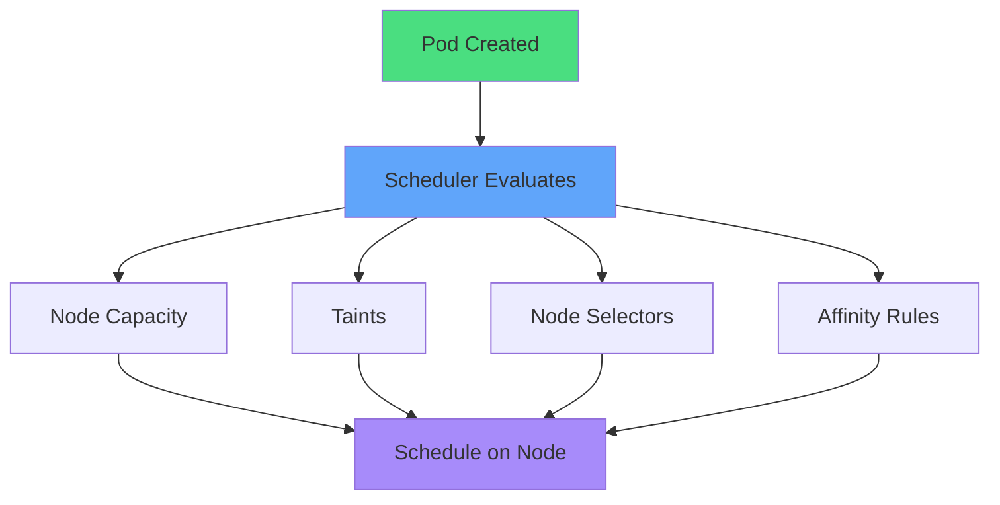
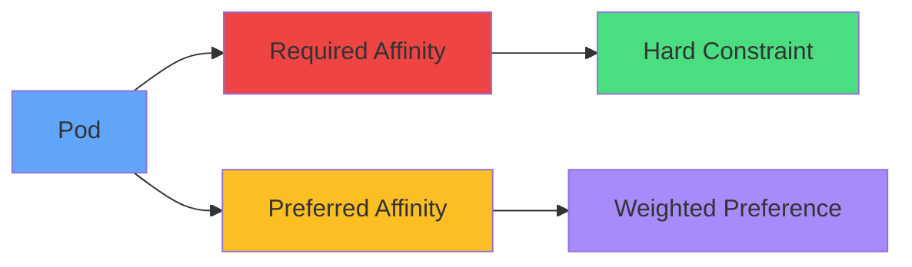
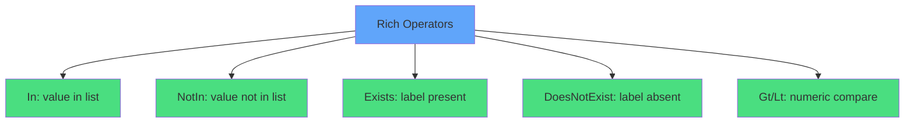
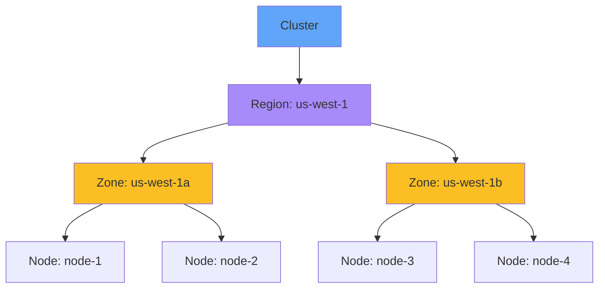
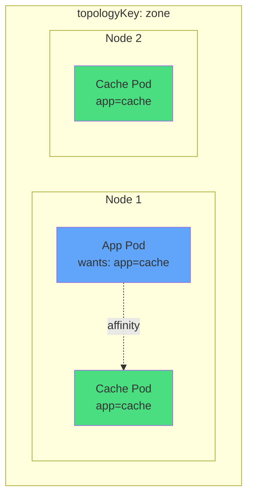
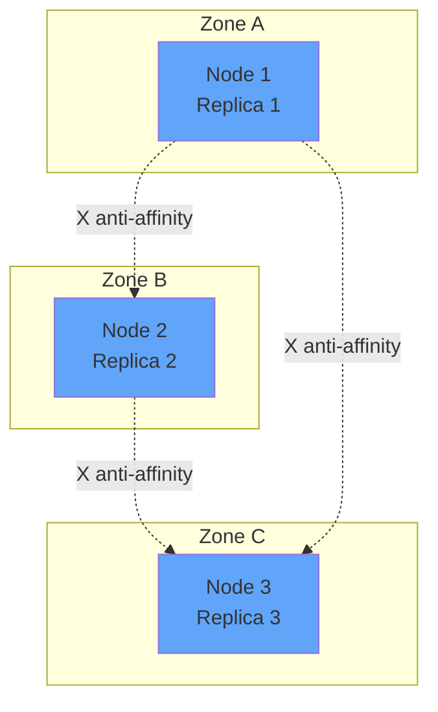
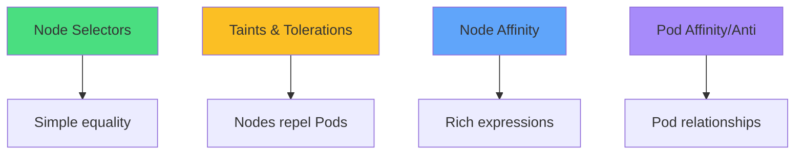
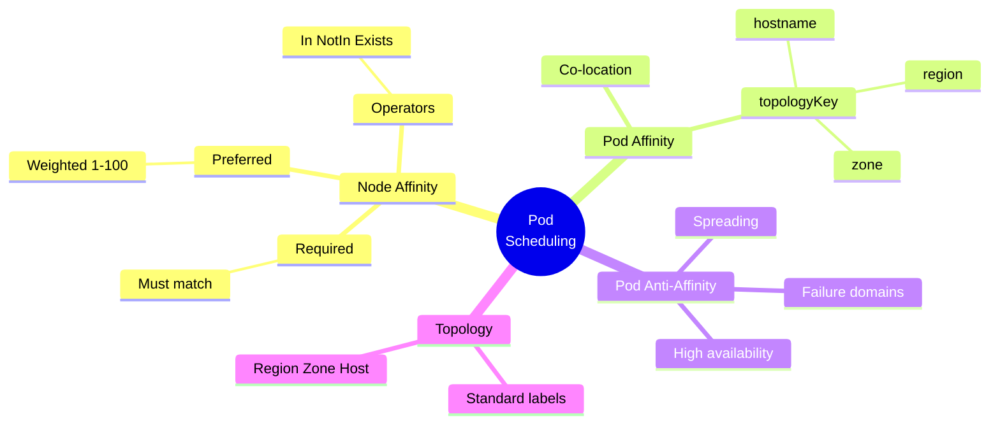

# Pod Scheduling with Affinity

<div class="abs-br m-6 flex gap-2">
  <carbon-network-3 class="text-6xl text-blue-400" />
</div>

<div v-click class="mt-8 text-xl opacity-80">
Advanced control over Pod placement
</div>

<div v-click class="mt-4 text-lg opacity-60">
Node affinity, Pod affinity, and anti-affinity
</div>

---
layout: center
---

# Why Pod Placement Matters

<div class="grid grid-cols-2 gap-6 mt-8">
<div v-click="1">
<carbon-dashboard class="text-5xl text-blue-400 mb-3" />
<div class="font-semibold text-lg">Performance Optimization</div>
<div class="text-sm opacity-80">GPU nodes, SSD storage<br/>ML workloads, databases</div>
</div>

<div v-click="2">
<carbon-network-overlay class="text-5xl text-green-400 mb-3" />
<div class="font-semibold text-lg">High Availability</div>
<div class="text-sm opacity-80">Spread replicas<br/>Survive infrastructure failures</div>
</div>

<div v-click="3">
<carbon-location class="text-5xl text-purple-400 mb-3" />
<div class="font-semibold text-lg">Co-location Efficiency</div>
<div class="text-sm opacity-80">Cache near application<br/>Reduce network latency</div>
</div>

<div v-click="4">
<carbon-security class="text-5xl text-red-400 mb-3" />
<div class="font-semibold text-lg">Isolation & Compliance</div>
<div class="text-sm opacity-80">Dedicated nodes<br/>Security requirements</div>
</div>
</div>

---
layout: center
---

# Scheduling Basics Recap

<div v-click="1">



</div>

<div v-click="2" class="mt-6 text-center">
<carbon-dashboard class="inline-block text-3xl text-blue-400" /> Does node have capacity?
</div>

<div v-click="3" class="text-center mt-2">
<carbon-close class="inline-block text-3xl text-red-400" /> Does Pod tolerate taints?
</div>

<div v-click="4" class="text-center mt-2">
<carbon-tag class="inline-block text-3xl text-green-400" /> Do node labels match selectors?
</div>

<div v-click="5" class="text-center mt-2">
<carbon-rule class="inline-block text-3xl text-purple-400" /> Do affinity rules match?
</div>

---
layout: center
---

# Node Affinity Overview

<div v-click="1" class="text-center mb-6">
Node selectors on steroids
</div>

<div v-click="2">



</div>

<div class="grid grid-cols-2 gap-6 mt-8">
<div v-click="3">
<carbon-locked class="text-4xl text-red-400 mb-2" />
<div class="font-semibold">Required</div>
<div class="text-sm opacity-80">Must be met</div>
</div>
<div v-click="4">
<carbon-star class="text-4xl text-yellow-400 mb-2" />
<div class="font-semibold">Preferred</div>
<div class="text-sm opacity-80">Try to honor</div>
</div>
</div>

<div v-click="5" class="mt-6 text-center text-sm opacity-60">
*DuringSchedulingIgnoredDuringExecution = rules only apply at scheduling
</div>

---
layout: center
---

# Required vs Preferred Affinity

<div v-click="1" class="mb-4">

```yaml
nodeAffinity:
  requiredDuringSchedulingIgnoredDuringExecution:
    - matchExpressions:
      - key: kubernetes.io/os
        operator: In
        values: [linux]
  preferredDuringSchedulingIgnoredDuringExecution:
    - weight: 80
      preference:
        - key: disktype
          operator: In
          values: [ssd]
```

</div>

<div v-click="2" class="text-center mb-4">
<carbon-locked class="inline-block text-4xl text-red-400" /> Required: Must run on Linux
</div>

<div v-click="3" class="text-center mb-4">
<carbon-star class="inline-block text-4xl text-yellow-400" /> Preferred: Would like SSD (weight 80)
</div>

<div v-click="4" class="mt-6 text-center text-lg">
Filter by required → Score by preferred
</div>

---
layout: center
---

# Affinity Operators

<div v-click="1">



</div>

<div class="mt-6">
<div v-click="2" class="mb-3">
<carbon-checkmark class="inline-block text-2xl text-green-400" /> zone <strong>In</strong> [us-west-1a, us-west-1b]
</div>
<div v-click="3" class="mb-3">
<carbon-close class="inline-block text-2xl text-red-400" /> disktype <strong>NotIn</strong> [hdd]
</div>
<div v-click="4" class="mb-3">
<carbon-tag class="inline-block text-2xl text-blue-400" /> gpu <strong>Exists</strong>
</div>
<div v-click="5" class="mb-3">
<carbon-subtract class="inline-block text-2xl text-yellow-400" /> spot <strong>DoesNotExist</strong>
</div>
</div>

<div v-click="6" class="mt-6 text-center text-sm opacity-80">
Multiple expressions = AND | Multiple terms = OR
</div>

---
layout: center
---

# Node Topology & Standard Labels

<div v-click="1">



</div>

<div class="grid grid-cols-3 gap-4 mt-8 text-sm">
<div v-click="2" class="text-center">
<carbon-location class="text-3xl text-purple-400 mb-2" />
<div class="font-semibold">Region</div>
<div class="text-xs opacity-80">topology.kubernetes.io/region</div>
</div>
<div v-click="3" class="text-center">
<carbon-grid class="text-3xl text-yellow-400 mb-2" />
<div class="font-semibold">Zone</div>
<div class="text-xs opacity-80">topology.kubernetes.io/zone</div>
</div>
<div v-click="4" class="text-center">
<carbon-virtual-machine class="text-3xl text-blue-400 mb-2" />
<div class="font-semibold">Hostname</div>
<div class="text-xs opacity-80">kubernetes.io/hostname</div>
</div>
</div>

<div v-click="5" class="mt-6 text-center text-lg">
Zones = independent failure domains
</div>

---
layout: center
---

# Pod Affinity Introduction

<div v-click="1" class="text-center mb-6">
Placement based on <strong>other Pods</strong>, not nodes
</div>

<div v-click="2">



</div>

<div v-click="3" class="mt-6 text-center">
<carbon-location class="inline-block text-3xl text-green-400" /> topologyKey defines "near"
</div>

<div v-click="4" class="text-center mt-2">
hostname = same node | zone = same zone
</div>

---
layout: center
---

# Pod Anti-Affinity for HA

<div v-click="1" class="text-center mb-6">
Keep Pods <strong>away</strong> from each other
</div>

<div v-click="2">



</div>

<div v-click="3" class="mt-6 text-center">
<carbon-checkmark class="inline-block text-3xl text-green-400" /> Spreads replicas across nodes/zones
</div>

<div v-click="4" class="text-center mt-2">
<carbon-network-overlay class="inline-block text-2xl text-blue-400" /> Single node failure doesn't kill app
</div>

<div v-click="5" class="mt-4 text-center text-sm opacity-80">
Combine: required at region + preferred at zone
</div>

---
layout: center
---

# Practical Use Cases

<div class="grid grid-cols-2 gap-6 mt-6">
<div v-click="1">
<carbon-network-overlay class="text-4xl text-green-400 mb-2" />
<div class="font-semibold">HA Deployments</div>
<div class="text-sm opacity-80">Anti-affinity across zones</div>
</div>

<div v-click="2">
<carbon-lightning class="text-4xl text-yellow-400 mb-2" />
<div class="font-semibold">Performance</div>
<div class="text-sm opacity-80">Co-locate app with cache</div>
</div>

<div v-click="3">
<carbon-chip class="text-4xl text-purple-400 mb-2" />
<div class="font-semibold">Resource Specialization</div>
<div class="text-sm opacity-80">GPU nodes, high-IOPS storage</div>
</div>

<div v-click="4">
<carbon-close class="text-4xl text-red-400 mb-2" />
<div class="font-semibold">Avoid Noisy Neighbors</div>
<div class="text-sm opacity-80">Separate latency-sensitive apps</div>
</div>

<div v-click="5">
<carbon-security class="text-4xl text-blue-400 mb-2" />
<div class="font-semibold">Compliance & Security</div>
<div class="text-sm opacity-80">Dedicated compliance zones</div>
</div>

<div v-click="6">
<carbon-user-multiple class="text-4xl text-orange-400 mb-2" />
<div class="font-semibold">Multi-tenancy</div>
<div class="text-sm opacity-80">Team-specific nodes</div>
</div>
</div>

---
layout: center
---

# Affinity vs Selectors vs Taints

<div v-click="1">



</div>

<div class="mt-8">
<div v-click="2" class="mb-3">
<carbon-tag class="inline-block text-2xl text-green-400" /> <strong>Node Selectors:</strong> Simple, equality only
</div>
<div v-click="3" class="mb-3">
<carbon-close class="inline-block text-2xl text-yellow-400" /> <strong>Taints:</strong> Nodes repel, Pods tolerate
</div>
<div v-click="4" class="mb-3">
<carbon-rule class="inline-block text-2xl text-blue-400" /> <strong>Node Affinity:</strong> Flexible with preferences
</div>
<div v-click="5" class="mb-3">
<carbon-network-3 class="inline-block text-2xl text-purple-400" /> <strong>Pod Affinity:</strong> Based on other Pods
</div>
</div>

<div v-click="6" class="mt-6 text-center text-lg">
<carbon-idea class="inline-block text-3xl text-yellow-400" /> Often combined together!
</div>

---
layout: center
---

# Summary

<div v-click="1">



</div>

---
layout: center
---

# Key Takeaways

<div class="grid grid-cols-2 gap-6 mt-6">
<div v-click="1">
<carbon-rule class="text-4xl text-blue-400 mb-2" />
<div class="font-semibold">Node Affinity</div>
<div class="text-sm opacity-80">Expressive control, required + preferred</div>
</div>

<div v-click="2">
<carbon-network-3 class="text-4xl text-green-400 mb-2" />
<div class="font-semibold">Pod Affinity</div>
<div class="text-sm opacity-80">Co-location based on topology</div>
</div>

<div v-click="3">
<carbon-arrows-horizontal class="text-4xl text-red-400 mb-2" />
<div class="font-semibold">Pod Anti-Affinity</div>
<div class="text-sm opacity-80">Spreading for resilience</div>
</div>

<div v-click="4">
<carbon-location class="text-4xl text-purple-400 mb-2" />
<div class="font-semibold">Topology Key</div>
<div class="text-sm opacity-80">Defines scope of near/far</div>
</div>

<div v-click="5">
<carbon-locked class="text-4xl text-yellow-400 mb-2" />
<div class="font-semibold">Required</div>
<div class="text-sm opacity-80">Hard constraints, Pending if not met</div>
</div>

<div v-click="6">
<carbon-star class="text-4xl text-orange-400 mb-2" />
<div class="font-semibold">Preferred</div>
<div class="text-sm opacity-80">Best effort with weights</div>
</div>
</div>

<div v-click="7" class="mt-8 text-center text-lg">
Next: Hands-on affinity practice <carbon-arrow-right class="inline-block text-2xl" />
</div>
