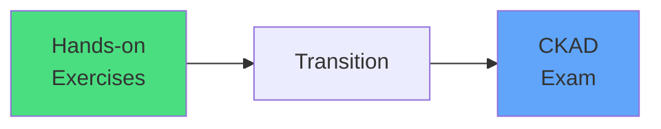

# From Practice to Performance

```mermaid
graph LR
    A[<carbon-education/> Hands-on<br/>Exercises] --> B[<carbon-arrow-right/> Transition] --> C[<carbon-certificate/> CKAD<br/>Exam]
    style A fill:#4ade80
    style C fill:#60a5fa
```

API version questions are quick wins 
Know the commands and patterns

