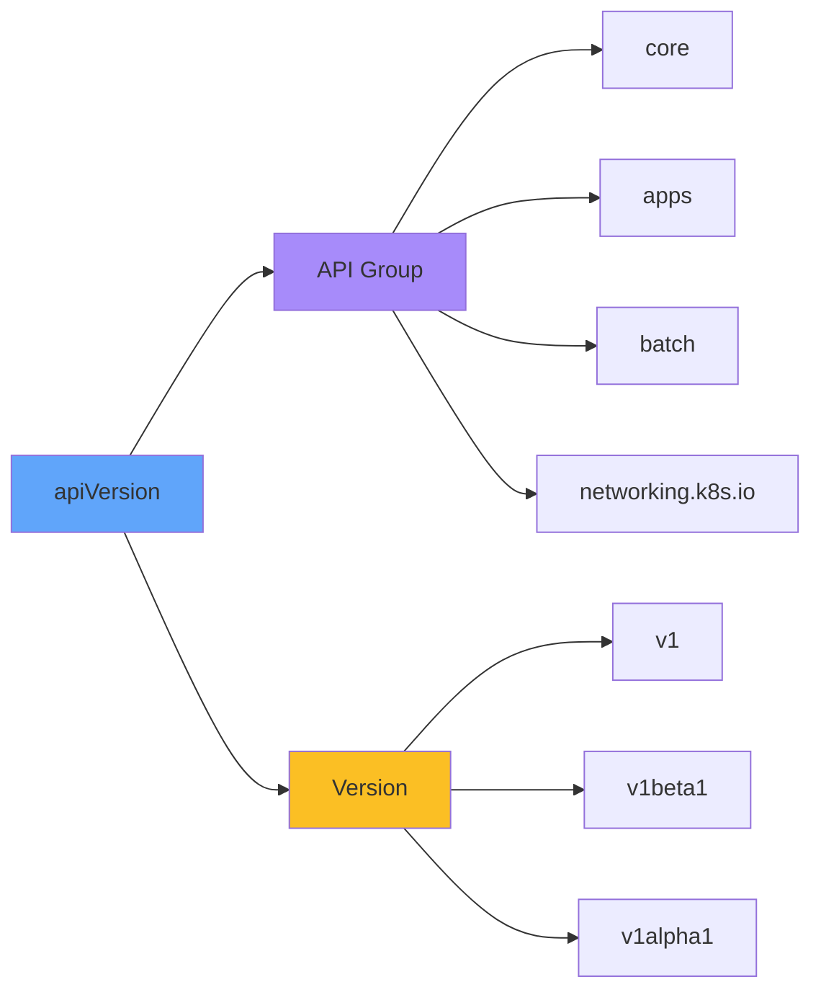

# API Version Structure

```mermaid
graph LR
    API[<carbon-api/> apiVersion] --> GROUP[API Group]
    API --> VERSION[Version]

    GROUP --> CORE[" " core]
    GROUP --> APPS[apps]
    GROUP --> BATCH[batch]
    GROUP --> NET[networking.k8s.io]

    VERSION --> V1[v1]
    VERSION --> BETA[v1beta1]
    VERSION --> ALPHA[v1alpha1]

    style API fill:#60a5fa
    style GROUP fill:#a78bfa
    style VERSION fill:#fbbf24
```

### Examples: `v1`, `apps/v1`, `batch/v1`, `networking.k8s.io/v1`

