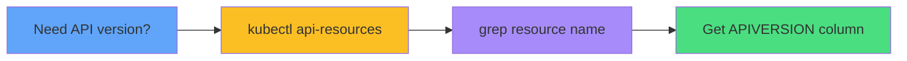

# Finding API Versions

```mermaid
graph LR
    NEED[<carbon-document-tasks/> Need API version?] --> CMD[<carbon-terminal/> kubectl api-resources]

    CMD --> SEARCH[<carbon-search/> grep resource name]
    SEARCH --> ANSWER[<carbon-checkmark-filled/> Get APIVERSION column]

    style NEED fill:#60a5fa
    style CMD fill:#fbbf24
    style SEARCH fill:#a78bfa
    style ANSWER fill:#4ade80
```

### `kubectl api-resources | grep ingress`
Shows: `networking.k8s.io/v1`

Under 30 seconds to find any API version

