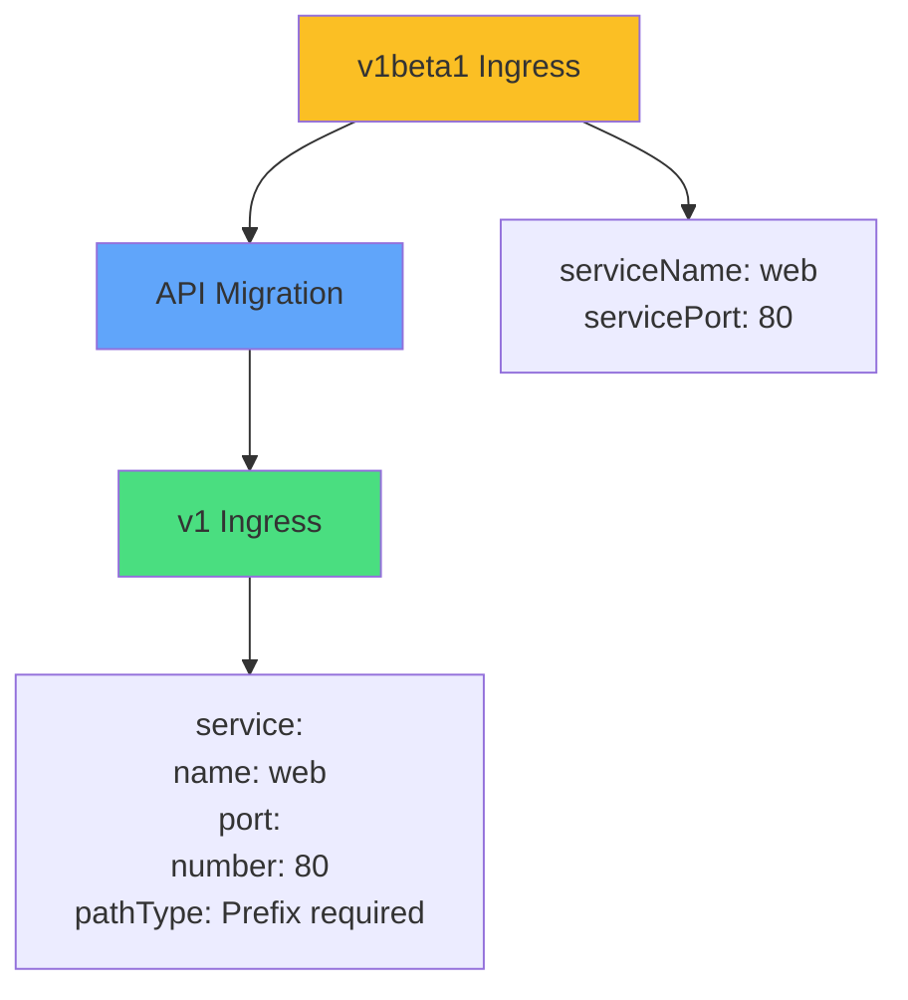

# Schema Changes

```mermaid
graph TB
    V1BETA[<carbon-document/> v1beta1 Ingress] --> CHANGE[<carbon-renew/> API Migration] --> V1[<carbon-document/> v1 Ingress]

    V1BETA --> OLD[serviceName: web<br/>servicePort: 80]
    V1 --> NEW[service:<br/>  name: web<br/>  port:<br/>    number: 80<br/>pathType: Prefix required]

    style V1BETA fill:#fbbf24
    style CHANGE fill:#60a5fa
    style V1 fill:#4ade80
```

API migrations may require structural changes

