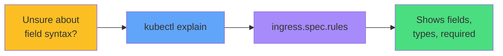

# kubectl explain

```mermaid
graph LR
    UNSURE[<carbon-help/> Unsure about<br/>field syntax?] --> EXPLAIN[<carbon-terminal/> kubectl explain]

    EXPLAIN --> RESOURCE[ingress.spec.rules]
    RESOURCE --> SCHEMA[<carbon-view/> Shows fields,<br/>types, required]

    style UNSURE fill:#fbbf24
    style EXPLAIN fill:#60a5fa
    style RESOURCE fill:#a78bfa
    style SCHEMA fill:#4ade80
```

### `kubectl explain ingress.spec.rules.http.paths`
Shows required fields and structure

Instant schema verification without leaving terminal

