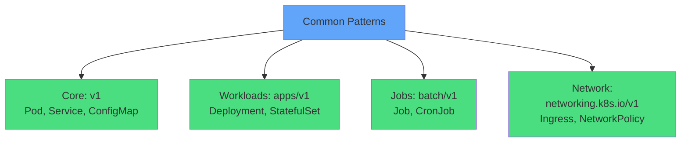

# Common API Patterns

```mermaid
graph TB
    PATTERNS[<carbon-api/> Common Patterns]

    PATTERNS --> CORE[<carbon-cube/> Core: v1<br/>Pod, Service, ConfigMap]
    PATTERNS --> APPS[<carbon-deploy/> Workloads: apps/v1<br/>Deployment, StatefulSet]
    PATTERNS --> BATCH[<carbon-task/> Jobs: batch/v1<br/>Job, CronJob]
    PATTERNS --> NET[<carbon-network-3/> Network: networking.k8s.io/v1<br/>Ingress, NetworkPolicy]

    style PATTERNS fill:#60a5fa
    style CORE fill:#4ade80
    style APPS fill:#4ade80
    style BATCH fill:#4ade80
    style NET fill:#4ade80
```

Memorize these to save seconds

