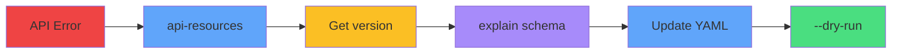

# Exam Workflow

```mermaid
graph LR
    ERROR[<carbon-warning-alt/> API Error] --> FIND[<carbon-terminal/> api-resources] --> VERSION[<carbon-view/> Get version] --> EXPLAIN[<carbon-terminal/> explain schema] --> FIX[<carbon-edit/> Update YAML] --> TEST[<carbon-checkmark/> --dry-run]

    style ERROR fill:#ef4444
    style FIND fill:#60a5fa
    style VERSION fill:#fbbf24
    style EXPLAIN fill:#a78bfa
    style FIX fill:#60a5fa
    style TEST fill:#4ade80
```

### Complete workflow: 2-4 minutes
1. Find correct API version
2. Check schema with explain
3. Update manifest
4. Test with --dry-run=server
5. Apply

