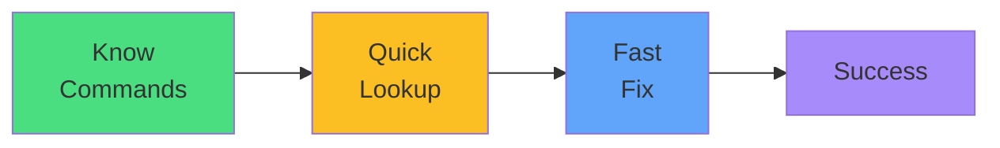

# Exam Mindset

<carbon-lightbulb class="text-yellow-400 text-4xl inline-block" />

### kubectl api-resources for version lookup
### kubectl explain for schema verification
### --dry-run=server to test before applying
### These are quick wins - under 4 minutes each

