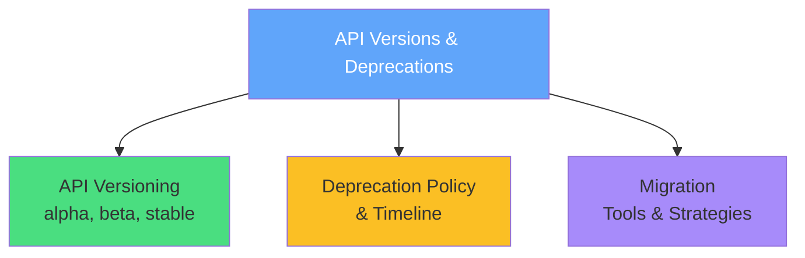
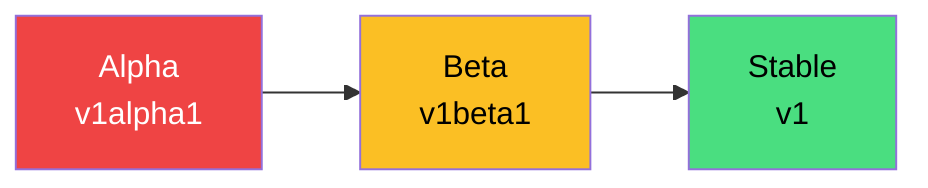
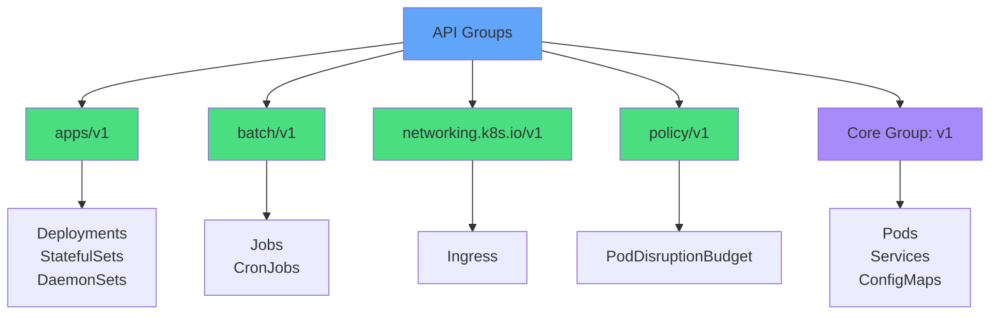
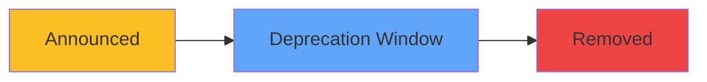
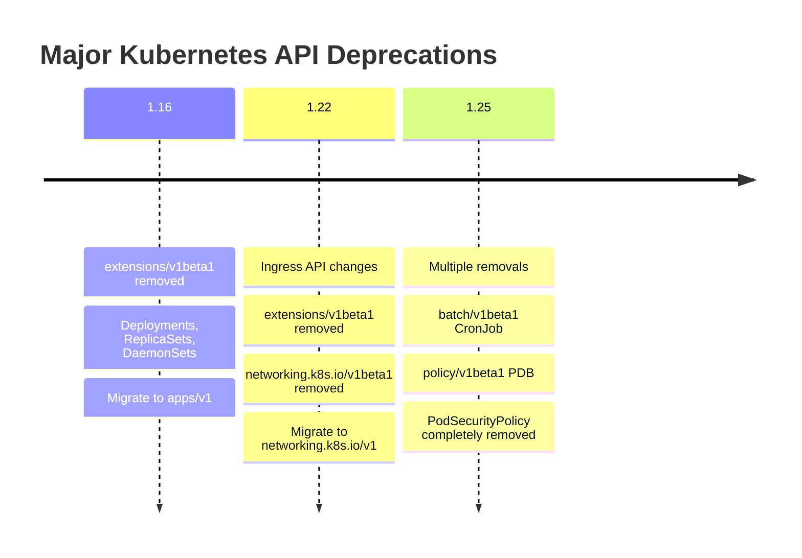
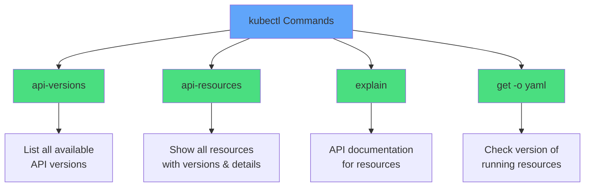
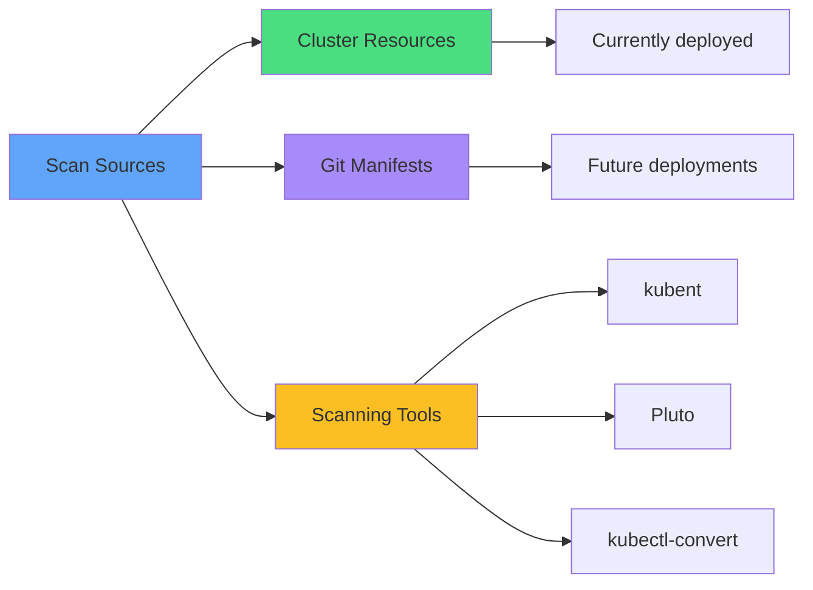
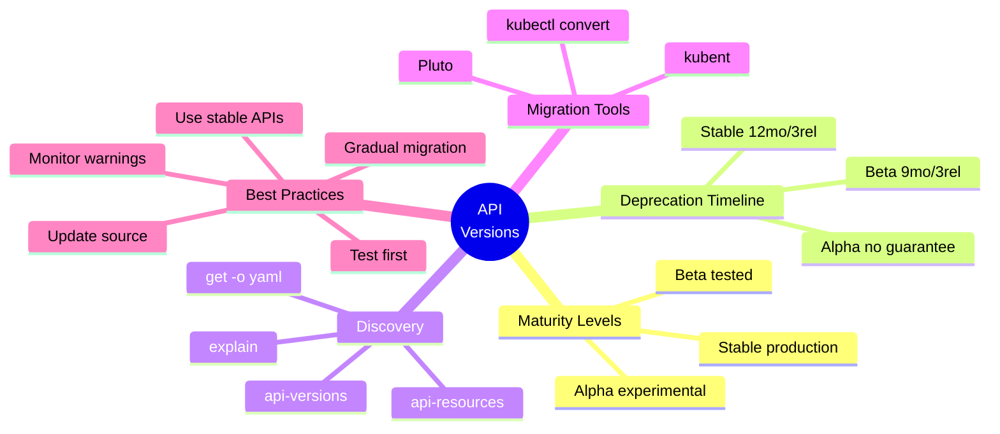
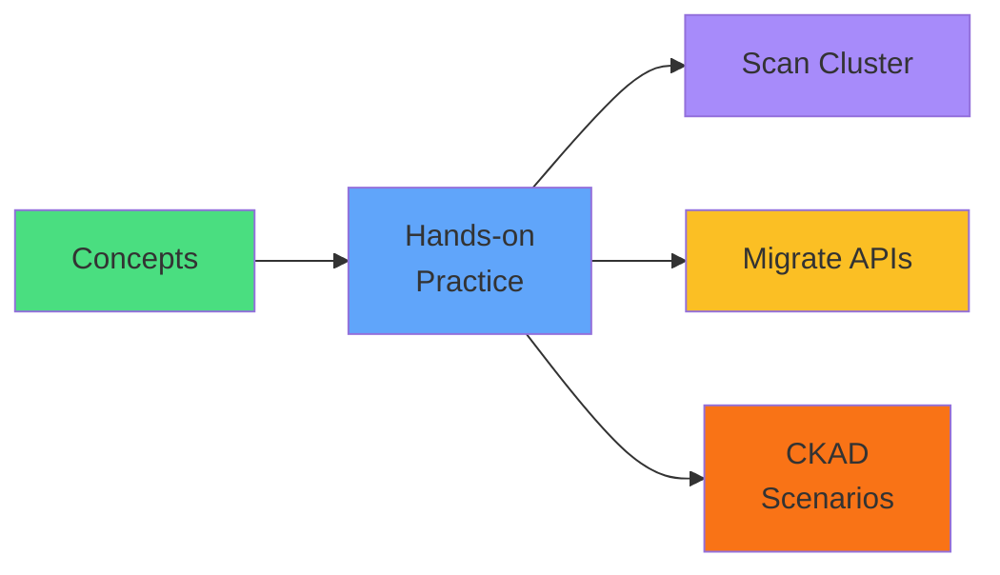

# API Versions & Deprecations

<div class="abs-br m-6 flex gap-2">
  <carbon-api class="text-6xl text-blue-400" />
</div>

<div v-click class="mt-8 text-xl opacity-80">
Critical topic for CKAD exam and real-world operations
</div>

---
layout: center
---

# Session Overview

<div v-click="1">



</div>

<div v-click="2" class="mt-8 text-center text-lg opacity-80">
<carbon-document class="inline-block text-3xl text-blue-400" /> Avoid breaking deployments during upgrades
</div>

<div v-click="3" class="text-center text-lg opacity-80">
<carbon-checkmark class="inline-block text-3xl text-green-400" /> Ensure manifest compatibility across versions
</div>

---
layout: center
---

# Why API Versioning Matters

<div v-click="1" class="mb-4">
<carbon-warning class="text-5xl text-red-400 mb-2" />
<strong>Cluster Upgrades Can Break Applications</strong>
</div>

<div v-click="2" class="text-center text-sm opacity-80 mb-4">
Deprecated APIs removed in new versions cause deployment failures
</div>

<div v-click="3" class="mb-4">
<carbon-certificate class="text-5xl text-blue-400 mb-2" />
<strong>CKAD Exam Compatibility</strong>
</div>

<div v-click="4" class="text-center text-sm opacity-80 mb-4">
Identify deprecated APIs and migrate resources to current versions
</div>

<div v-click="5" class="mb-4">
<carbon-checkmark class="text-5xl text-green-400 mb-2" />
<strong>Best Practices</strong>
</div>

<div v-click="6" class="text-center text-sm opacity-80 mb-4">
Stable APIs ensure production-ready applications
</div>

<div v-click="7" class="mb-4">
<carbon-debug class="text-5xl text-purple-400 mb-2" />
<strong>Troubleshooting</strong>
</div>

<div v-click="8" class="text-center text-sm opacity-80">
Fix "no matches for kind Ingress in version networking.k8s.io/v1beta1" errors
</div>

---
layout: center
---

# API Maturity Levels

<div v-click="1">



</div>

<div class="grid grid-cols-3 gap-6 mt-8 text-sm">
<div v-click="2">
<carbon-close class="text-5xl text-red-400 mb-2" />
<strong>Alpha APIs</strong>
</div>
<div v-click="3">
<span class="text-xs opacity-80">v1alpha1, v1alpha2</span><br/>
<span class="text-xs opacity-60">Experimental, may be buggy</span>
</div>
<div v-click="4">
<span class="text-xs text-red-400">Disabled by default</span><br/>
<span class="text-xs text-red-400">Can be removed anytime</span><br/>
<span class="text-xs text-red-400">Never use in production</span>
</div>

<div v-click="5">
<carbon-warning class="text-5xl text-yellow-400 mb-2" />
<strong>Beta APIs</strong>
</div>
<div v-click="6">
<span class="text-xs opacity-80">v1beta1, v1beta2</span><br/>
<span class="text-xs opacity-60">Well-tested, safe for use</span>
</div>
<div v-click="7">
<span class="text-xs text-yellow-600">Enabled by default</span><br/>
<span class="text-xs text-yellow-600">Supported for 1+ release</span><br/>
<span class="text-xs text-yellow-600">Use with caution in prod</span>
</div>

<div v-click="8">
<carbon-checkmark class="text-5xl text-green-400 mb-2" />
<strong>Stable APIs</strong>
</div>
<div v-click="9">
<span class="text-xs opacity-80">v1, v2</span><br/>
<span class="text-xs opacity-60">Production-ready</span>
</div>
<div v-click="10">
<span class="text-xs text-green-600">Widely adopted</span><br/>
<span class="text-xs text-green-600">Long-term support</span><br/>
<span class="text-xs text-green-600">Recommended for all workloads</span>
</div>
</div>

---
layout: center
---

# API Groups and Versions

<div v-click="1" class="mb-4">
<carbon-api class="inline-block text-4xl text-blue-400" />
<strong class="ml-2">apiVersion Format: group/version</strong>
</div>

<div v-click="2">



</div>

<div v-click="3" class="mt-6 text-center text-sm opacity-80">
<carbon-document class="inline-block text-2xl text-blue-400" /> Core group is special - no group name, just v1
</div>

<div v-click="4" class="text-center text-sm opacity-80">
<carbon-plugin class="inline-block text-2xl text-purple-400" /> Cloud providers can add custom groups (e.g., cert-manager.io/v1)
</div>

---
layout: center
---

# Deprecation Policy and Timeline

<div v-click="1">



</div>

<div class="grid grid-cols-3 gap-6 mt-8">
<div v-click="2">
<carbon-checkmark class="text-5xl text-green-400 mb-2" />
<strong>Stable APIs</strong>
</div>
<div v-click="3">
<span class="text-sm">12 months or 3 releases</span><br/>
<span class="text-xs opacity-60">(whichever is longer)</span>
</div>
<div v-click="4">
<span class="text-sm text-green-600">Ample time to update manifests</span>
</div>

<div v-click="5">
<carbon-warning class="text-5xl text-yellow-400 mb-2" />
<strong>Beta APIs</strong>
</div>
<div v-click="6">
<span class="text-sm">9 months or 3 releases</span><br/>
<span class="text-xs opacity-60">(whichever is longer)</span>
</div>
<div v-click="7">
<span class="text-sm text-yellow-600">Shorter timeline - not fully stable</span>
</div>

<div v-click="8">
<carbon-close class="text-5xl text-red-400 mb-2" />
<strong>Alpha APIs</strong>
</div>
<div v-click="9">
<span class="text-sm">No guarantees</span><br/>
<span class="text-xs opacity-60">(removed in any release)</span>
</div>
<div v-click="10">
<span class="text-sm text-red-400">Never use in production</span>
</div>
</div>

<div v-click="11" class="mt-8 text-center text-lg">
<carbon-idea class="inline-block text-3xl text-blue-400" /> Monitor release notes before cluster upgrades
</div>

<div v-click="12" class="text-center text-sm opacity-80">
Old version continues working during deprecation window
</div>

---
layout: center
---

# Common Deprecated APIs

<div v-click="1" class="text-center mb-4 text-lg">
<carbon-document class="inline-block text-3xl text-blue-400" /> Historical API Deprecations
</div>

<div v-click="2">



</div>

<div v-click="3" class="mt-6 text-center text-sm">
<carbon-warning class="inline-block text-2xl text-red-400" /> v1.16: extensions/v1beta1 → apps/v1 broke many clusters
</div>

<div v-click="4" class="text-center text-sm">
<carbon-network-3 class="inline-block text-2xl text-yellow-400" /> v1.22: Ingress schema changed (pathType required)
</div>

<div v-click="5" class="text-center text-sm">
<carbon-timer class="inline-block text-2xl text-purple-400" /> v1.25: batch/v1beta1 → batch/v1 for CronJob
</div>

<div v-click="6" class="text-center text-sm">
<carbon-security class="inline-block text-2xl text-blue-400" /> v1.25: PSP → Pod Security Standards (fundamental shift)
</div>

<div v-click="7" class="mt-6 text-center text-lg text-yellow-400">
<carbon-idea class="inline-block text-2xl" /> Major deprecations happen regularly - stay current!
</div>

---
layout: center
---

# Discovering API Versions

<div v-click="1" class="text-center mb-4">
<carbon-terminal class="inline-block text-5xl text-blue-400" />
<strong class="text-xl">kubectl Discovery Commands</strong>
</div>

<div v-click="2">



</div>

<div class="grid grid-cols-2 gap-4 mt-6 text-sm">
<div v-click="3">
<carbon-list class="inline-block text-2xl text-green-400" /> <code>kubectl api-versions</code>
</div>
<div v-click="4">
<span class="text-xs opacity-60">Shows what cluster can accept</span><br/>
<span class="text-xs opacity-60">e.g., apps/v1, batch/v1, networking.k8s.io/v1</span>
</div>

<div v-click="5">
<carbon-document class="inline-block text-2xl text-blue-400" /> <code>kubectl api-resources</code>
</div>
<div v-click="6">
<span class="text-xs opacity-60">Resource type, API version, namespaced, short name</span><br/>
<span class="text-xs opacity-60">grep to find specific resources</span>
</div>

<div v-click="7">
<carbon-view class="inline-block text-2xl text-purple-400" /> <code>kubectl get deployment myapp -o yaml</code>
</div>
<div v-click="8">
<span class="text-xs opacity-60">Check version of deployed resources</span><br/>
<span class="text-xs opacity-60">grep apiVersion for quick check</span>
</div>

<div v-click="9">
<carbon-help class="inline-block text-2xl text-yellow-400" /> <code>kubectl explain ingress</code>
</div>
<div v-click="10">
<span class="text-xs opacity-60">Show API structure and documentation</span><br/>
<span class="text-xs opacity-60">Essential for CKAD exam</span>
</div>
</div>

---
layout: center
---

# Identifying Deprecated APIs

<div v-click="1" class="text-center mb-4">
<carbon-view class="inline-block text-5xl text-blue-400" />
<strong class="text-xl">Find Deprecated APIs Before Upgrading</strong>
</div>

<div v-click="2" class="mb-4">
<carbon-warning class="text-4xl text-yellow-400 mb-2" />
<strong>kubectl Warnings</strong>
</div>

<div v-click="3" class="text-sm opacity-80 mb-4">
kubectl apply shows deprecation messages<br/>
"Warning: extensions/v1beta1 Deployment is deprecated in v1.9+, unavailable in v1.16+"
</div>

<div v-click="4">



</div>

<div v-click="5" class="mt-6 text-center text-sm">
<carbon-search class="inline-block text-2xl text-green-400" /> <code>kubectl get all --all-namespaces -o json | grep apiVersion</code>
</div>

<div v-click="6" class="text-center text-sm opacity-80">
Shows deployed resources, but not undeployed manifests in Git
</div>

<div class="grid grid-cols-3 gap-4 mt-6 text-sm">
<div v-click="7" class="text-center">
<carbon-tool-box class="text-3xl text-blue-400 mb-2" />
<strong>kubent</strong><br/>
<span class="text-xs opacity-60">Kubernetes No Trouble<br/>scans cluster</span>
</div>
<div v-click="8" class="text-center">
<carbon-document class="text-3xl text-purple-400 mb-2" />
<strong>Pluto</strong><br/>
<span class="text-xs opacity-60">Detects deprecated APIs<br/>in files & Helm charts</span>
</div>
<div v-click="9" class="text-center">
<carbon-arrows-horizontal class="text-3xl text-green-400 mb-2" />
<strong>kubectl-convert</strong><br/>
<span class="text-xs opacity-60">Migrates manifests<br/>to newer versions</span>
</div>
</div>

<div v-click="10" class="mt-6 text-center text-lg text-blue-400">
<carbon-idea class="inline-block text-2xl" /> Check Kubernetes deprecation guide before upgrades
</div>

---
layout: center
---

# The kubectl convert Tool

<div v-click="1" class="text-center mb-4">
<carbon-arrows-horizontal class="inline-block text-5xl text-blue-400" />
<strong class="text-xl">Migrate YAML to Newer API Versions</strong>
</div>

<div v-click="2" class="mb-4">

```yaml
# Old manifest (networking.k8s.io/v1beta1)
apiVersion: networking.k8s.io/v1beta1
kind: Ingress
metadata:
  name: my-ingress
```

</div>

<div v-click="3" class="text-center mb-4">
<carbon-arrow-down class="text-4xl text-blue-400" />
</div>

<div v-click="4" class="mb-4">

```bash
kubectl convert -f old-manifest.yaml --output-version networking.k8s.io/v1
```

</div>

<div v-click="5" class="text-center mb-4">
<carbon-arrow-down class="text-4xl text-blue-400" />
</div>

<div v-click="6" class="mb-4">

```yaml
# New manifest (networking.k8s.io/v1)
apiVersion: networking.k8s.io/v1
kind: Ingress
metadata:
  name: my-ingress
spec:
  # Updated schema with pathType, ingressClassName, etc.
```

</div>

<div class="grid grid-cols-2 gap-6 mt-4 text-sm">
<div v-click="7">
<carbon-document class="inline-block text-2xl text-yellow-400" /> Separate plugin - install separately
</div>
<div v-click="8">
<carbon-checkmark class="inline-block text-2xl text-green-400" /> Handles structural API changes
</div>
<div v-click="9">
<carbon-arrow-right class="inline-block text-2xl text-blue-400" /> Redirect output or pipe to kubectl apply
</div>
<div v-click="10">
<carbon-warning class="inline-block text-2xl text-red-400" /> Always review converted YAML before applying
</div>
</div>

<div v-click="11" class="mt-6 text-center text-sm opacity-80">
Has limitations - can't always auto-convert complex schema changes
</div>

---
layout: center
---

# Migration Strategies

<div v-click="1" class="text-center mb-6">
<carbon-flow class="inline-block text-5xl text-blue-400" />
<strong class="text-xl">Successfully Managing API Migrations</strong>
</div>

<div v-click="2" class="mb-4">
<carbon-view class="text-4xl text-green-400 mb-2" />
<strong>Strategy 1: Proactive Monitoring</strong>
</div>

<div v-click="3" class="text-sm opacity-80 mb-4">
Don't wait for upgrades - regularly scan cluster and manifests<br/>
Make API updates part of routine maintenance
</div>

<div v-click="4" class="mb-4">
<carbon-test-tool class="text-4xl text-blue-400 mb-2" />
<strong>Strategy 2: Test Before Production</strong>
</div>

<div v-click="5" class="text-sm opacity-80 mb-4">
Always test in dev/staging first<br/>
Schema modifications might break workflows
</div>

<div v-click="6" class="mb-4">
<carbon-document class="text-4xl text-purple-400 mb-2" />
<strong>Strategy 3: Update Source of Truth</strong>
</div>

<div v-click="7" class="text-sm opacity-80 mb-4">
Update Git manifests, not just running cluster<br/>
Otherwise next deployment reintroduces old API
</div>

<div v-click="8" class="mb-4">
<carbon-arrow-up-right class="text-4xl text-yellow-400 mb-2" />
<strong>Strategy 4: Gradual Migration</strong>
</div>

<div v-click="9" class="text-sm opacity-80 mb-4">
Migrate incrementally for large deployments<br/>
Reduces risk and eases troubleshooting
</div>

<div v-click="10" class="mb-4">
<carbon-checkmark class="text-4xl text-green-400 mb-2" />
<strong>Strategy 5: Use Stable APIs</strong>
</div>

<div v-click="11" class="text-sm opacity-80">
Always use v1, v2 for new applications<br/>
Minimizes future migration work
</div>

---
layout: center
---

# CKAD Exam Focus

<div v-click="1" class="text-center mb-6">
<carbon-certificate class="inline-block text-6xl text-blue-400" />
</div>

<div class="grid grid-cols-2 gap-4 text-sm">
<div v-click="2">
<carbon-api class="inline-block text-2xl text-green-400" /> Identify deprecated APIs
</div>
<div v-click="3">
<carbon-terminal class="inline-block text-2xl text-green-400" /> kubectl api-resources
</div>
<div v-click="4">
<carbon-list class="inline-block text-2xl text-green-400" /> kubectl api-versions
</div>
<div v-click="5">
<carbon-help class="inline-block text-2xl text-green-400" /> kubectl explain
</div>
<div v-click="6">
<carbon-edit class="inline-block text-2xl text-green-400" /> Convert manifests to current versions
</div>
<div v-click="7">
<carbon-flow class="inline-block text-2xl text-green-400" /> Alpha vs beta vs stable
</div>
<div v-click="8">
<carbon-timer class="inline-block text-2xl text-green-400" /> Deprecation timeline understanding
</div>
<div v-click="9">
<carbon-arrows-horizontal class="inline-block text-2xl text-green-400" /> kubectl convert basic syntax
</div>
</div>

<div v-click="10" class="mt-8 text-center text-lg">
<carbon-idea class="inline-block text-3xl text-blue-400" /> Check deprecation guide before upgrades
</div>

<div v-click="11" class="mt-4 text-center text-lg">
<carbon-flash class="inline-block text-3xl text-yellow-400" /> Practice under time pressure
</div>

---
layout: center
---

# Summary

<div v-click="1">



</div>

---
layout: center
---

# Key Takeaways

<div v-click="1" class="mb-4">
<carbon-api class="text-5xl text-blue-400 mb-2" />
<strong>API Maturity Levels</strong>
</div>

<div v-click="2" class="text-sm opacity-80 mb-6">
Alpha → Beta → Stable progression<br/>
Always prefer stable APIs for production workloads
</div>

<div v-click="3" class="mb-4">
<carbon-timer class="text-5xl text-green-400 mb-2" />
<strong>Deprecation Timeline</strong>
</div>

<div v-click="4" class="text-sm opacity-80 mb-6">
Stable: 12 months or 3 releases<br/>
Beta: 9 months or 3 releases<br/>
Plan migrations well in advance
</div>

<div v-click="5" class="mb-4">
<carbon-terminal class="text-5xl text-purple-400 mb-2" />
<strong>Discovery Commands</strong>
</div>

<div v-click="6" class="text-sm opacity-80 mb-6">
api-versions, api-resources, explain<br/>
Master these for CKAD exam success
</div>

<div v-click="7" class="mb-4">
<carbon-tool-box class="text-5xl text-yellow-400 mb-2" />
<strong>Migration Tools</strong>
</div>

<div v-click="8" class="text-sm opacity-80 mb-6">
kubectl convert, kubent, Pluto<br/>
Use proactively before cluster upgrades
</div>

<div v-click="9" class="text-center text-lg">
<carbon-checkmark class="inline-block text-3xl text-green-400" /> Monitor deprecations, test migrations, use stable APIs
</div>

---
layout: center
---

# Next Steps

<div v-click="1" class="text-center mb-8">
<carbon-education class="inline-block text-6xl text-blue-400" />
</div>

<div v-click="2">



</div>

<div v-click="3" class="mt-8 text-center text-xl">
Let's practice with hands-on exercises! <carbon-arrow-right class="inline-block text-2xl" />
</div>
