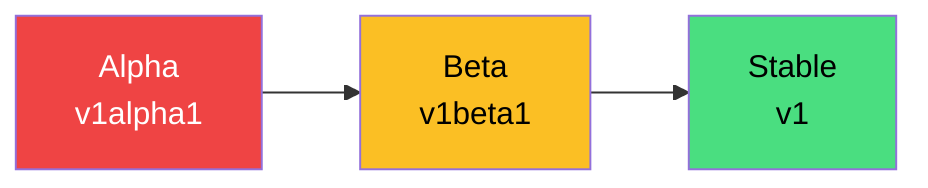
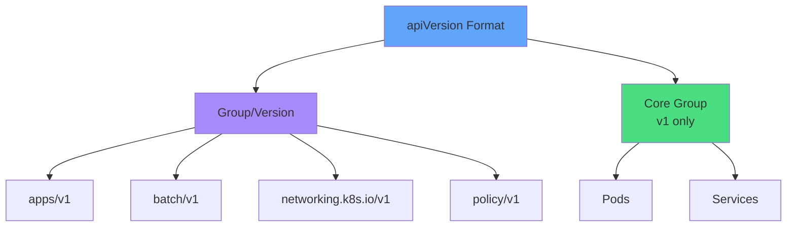
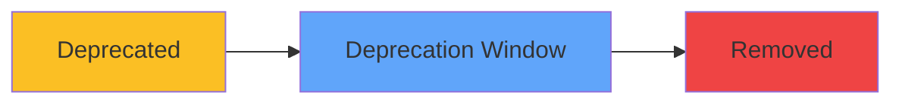
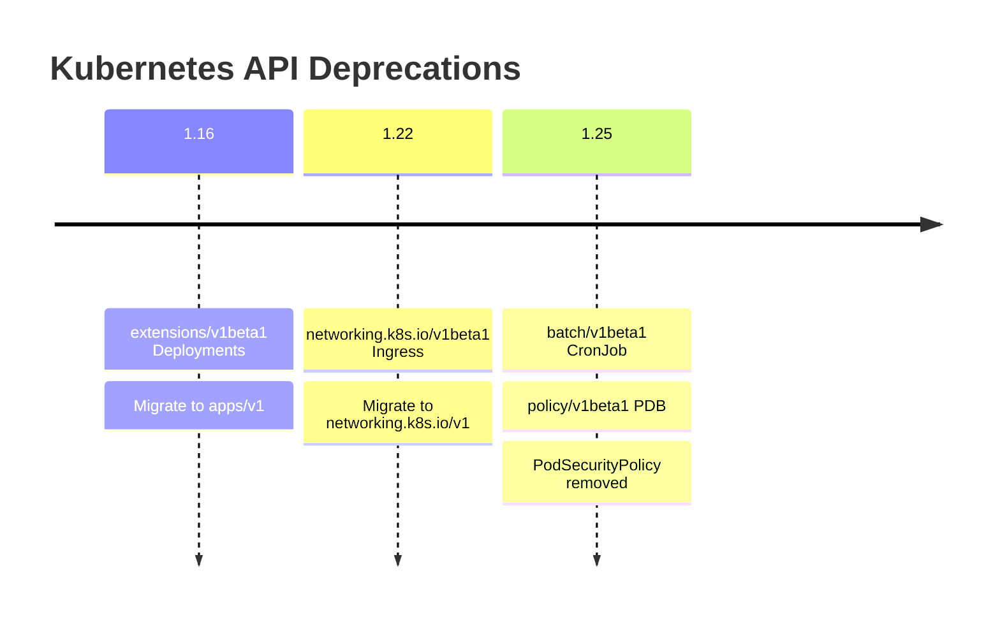
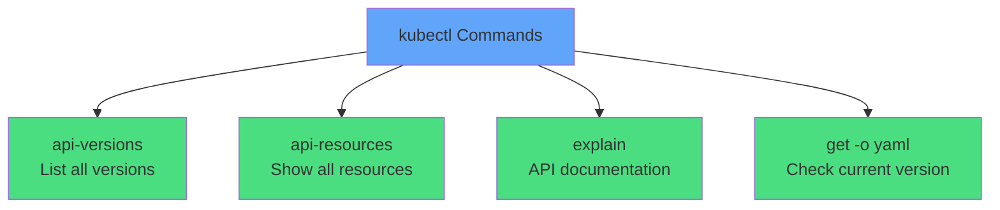
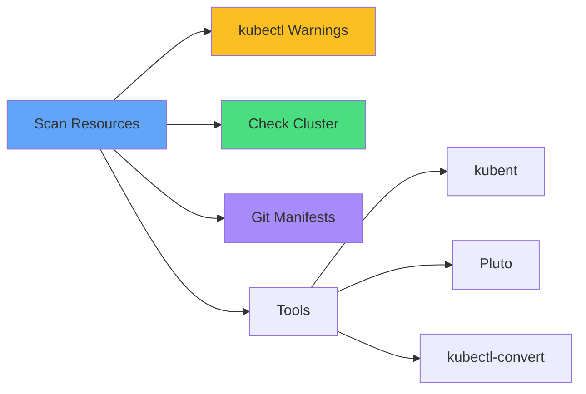
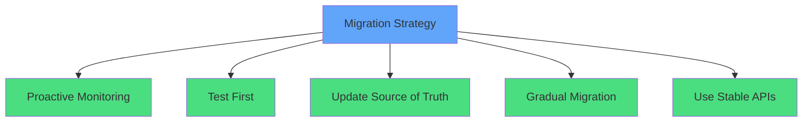
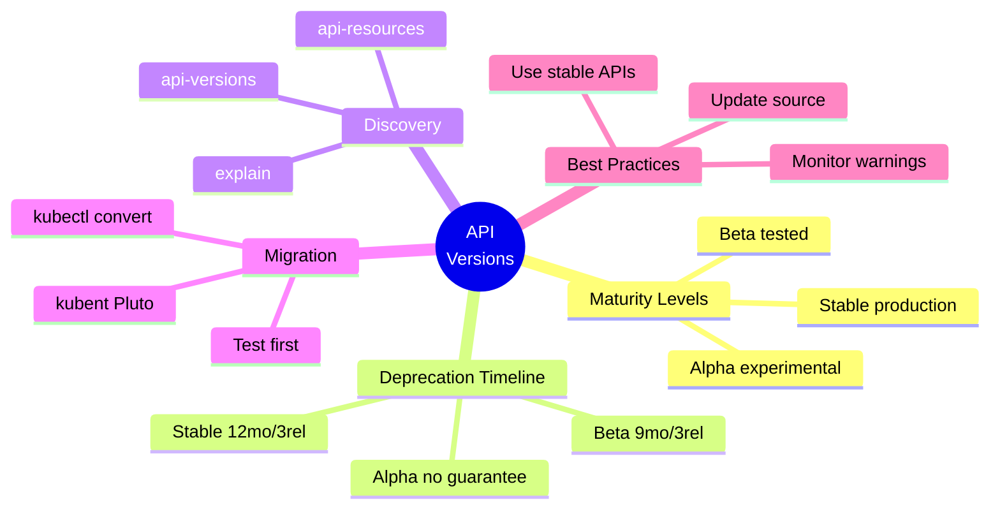

# API Versions & Deprecations

<div class="abs-br m-6 flex gap-2">
  <carbon-api class="text-6xl text-blue-400" />
</div>

<div v-click class="mt-8 text-xl opacity-80">
Managing API evolution across Kubernetes upgrades
</div>

---
layout: center
---

# Why API Versioning Matters

<div class="grid grid-cols-2 gap-6 mt-4">
<div v-click="1">
<carbon-warning class="text-5xl text-red-400 mb-2" />
<strong>Cluster Upgrades</strong><br/>
<span class="text-sm opacity-80">Deprecated APIs can break deployments</span>
</div>
<div v-click="2">
<carbon-certificate class="text-5xl text-blue-400 mb-2" />
<strong>CKAD Exam</strong><br/>
<span class="text-sm opacity-80">Identify and migrate deprecated resources</span>
</div>
<div v-click="3">
<carbon-checkmark class="text-5xl text-green-400 mb-2" />
<strong>Best Practices</strong><br/>
<span class="text-sm opacity-80">Use stable APIs for production</span>
</div>
<div v-click="4">
<carbon-debug class="text-5xl text-purple-400 mb-2" />
<strong>Troubleshooting</strong><br/>
<span class="text-sm opacity-80">Fix "no matches for kind" errors</span>
</div>
</div>

---
layout: center
---

# API Maturity Levels

<div v-click="1">



</div>

<div class="grid grid-cols-3 gap-6 mt-8 text-sm">
<div v-click="2" class="text-center">
<carbon-close class="text-5xl text-red-400 mb-2" />
<strong>Alpha</strong><br/>
Experimental, disabled by default<br/>
<span class="opacity-60">Can be removed anytime</span>
</div>
<div v-click="3" class="text-center">
<carbon-warning class="text-5xl text-yellow-400 mb-2" />
<strong>Beta</strong><br/>
Well-tested, enabled by default<br/>
<span class="opacity-60">Use with caution in prod</span>
</div>
<div v-click="4" class="text-center">
<carbon-checkmark class="text-5xl text-green-400 mb-2" />
<strong>Stable</strong><br/>
Production-ready, long support<br/>
<span class="opacity-60">Recommended for all workloads</span>
</div>
</div>

---
layout: center
---

# API Groups and Versions

<div v-click="1">



</div>

<div class="grid grid-cols-2 gap-4 mt-6 text-sm">
<div v-click="2">
<carbon-document class="inline-block text-2xl text-blue-400" /> <strong>apps/v1:</strong> Deployments, StatefulSets, DaemonSets
</div>
<div v-click="3">
<carbon-timer class="inline-block text-2xl text-green-400" /> <strong>batch/v1:</strong> Jobs, CronJobs
</div>
<div v-click="4">
<carbon-network-3 class="inline-block text-2xl text-purple-400" /> <strong>networking.k8s.io/v1:</strong> Ingress
</div>
<div v-click="5">
<carbon-rule class="inline-block text-2xl text-yellow-400" /> <strong>policy/v1:</strong> PodDisruptionBudget
</div>
</div>

---
layout: center
---

# Deprecation Policy Timeline

<div v-click="1">



</div>

<div class="grid grid-cols-3 gap-6 mt-8">
<div v-click="2" class="text-center">
<carbon-checkmark class="text-5xl text-green-400 mb-2" />
<strong>Stable APIs</strong><br/>
<span class="text-sm">12 months or 3 releases</span><br/>
<span class="text-xs opacity-60">(whichever is longer)</span>
</div>
<div v-click="3" class="text-center">
<carbon-warning class="text-5xl text-yellow-400 mb-2" />
<strong>Beta APIs</strong><br/>
<span class="text-sm">9 months or 3 releases</span><br/>
<span class="text-xs opacity-60">(whichever is longer)</span>
</div>
<div v-click="4" class="text-center">
<carbon-close class="text-5xl text-red-400 mb-2" />
<strong>Alpha APIs</strong><br/>
<span class="text-sm">No guarantees</span><br/>
<span class="text-xs opacity-60">(can be removed anytime)</span>
</div>
</div>

<div v-click="5" class="mt-8 text-center text-lg">
<carbon-idea class="inline-block text-3xl text-blue-400" /> Monitor release notes before upgrades
</div>

---
layout: center
---

# Common Deprecated APIs

<div v-click="1" class="mb-6">



</div>

<div class="grid grid-cols-2 gap-4 text-sm">
<div v-click="2">
<carbon-warning class="inline-block text-2xl text-red-400" /> <strong>v1.16:</strong> extensions/v1beta1 → apps/v1
</div>
<div v-click="3">
<carbon-network-3 class="inline-block text-2xl text-yellow-400" /> <strong>v1.22:</strong> Ingress schema changes
</div>
<div v-click="4">
<carbon-timer class="inline-block text-2xl text-purple-400" /> <strong>v1.25:</strong> CronJob to batch/v1
</div>
<div v-click="5">
<carbon-security class="inline-block text-2xl text-blue-400" /> <strong>v1.25:</strong> PSP → Pod Security Standards
</div>
</div>

<div v-click="6" class="mt-6 text-center text-yellow-400">
<carbon-document class="inline-block text-2xl" /> Always check deprecation guide
</div>

---
layout: center
---

# Discovering API Versions

<div v-click="1">



</div>

<div class="grid grid-cols-2 gap-4 mt-8 text-sm">
<div v-click="2">
<carbon-terminal class="inline-block text-2xl text-green-400" /> <code>kubectl api-versions</code>
<div class="text-xs opacity-60">List all API versions</div>
</div>
<div v-click="3">
<carbon-list class="inline-block text-2xl text-blue-400" /> <code>kubectl api-resources</code>
<div class="text-xs opacity-60">Show resource types & versions</div>
</div>
<div v-click="4">
<carbon-document class="inline-block text-2xl text-purple-400" /> <code>kubectl explain ingress</code>
<div class="text-xs opacity-60">Get API documentation</div>
</div>
<div v-click="5">
<carbon-view class="inline-block text-2xl text-yellow-400" /> <code>kubectl get deploy -o yaml</code>
<div class="text-xs opacity-60">Check running resources</div>
</div>
</div>

---
layout: center
---

# Identifying Deprecated APIs

<div v-click="1">



</div>

<div class="grid grid-cols-2 gap-6 mt-8">
<div v-click="2">
<carbon-warning class="text-4xl text-yellow-400 mb-2" />
<strong>kubectl Warnings</strong><br/>
<span class="text-sm opacity-80">Pay attention to deprecation messages</span>
</div>
<div v-click="3">
<carbon-view class="text-4xl text-blue-400 mb-2" />
<strong>Cluster Scan</strong><br/>
<span class="text-sm opacity-80">Check deployed resources</span>
</div>
<div v-click="4">
<carbon-document class="text-4xl text-green-400 mb-2" />
<strong>Git Repository</strong><br/>
<span class="text-sm opacity-80">Scan YAML files in source control</span>
</div>
<div v-click="5">
<carbon-tool-box class="text-4xl text-purple-400 mb-2" />
<strong>Scanning Tools</strong><br/>
<span class="text-sm opacity-80">kubent, Pluto, kubectl-convert</span>
</div>
</div>

---
layout: center
---

# kubectl convert Tool

<div v-click="1" class="mb-6">

```yaml
# Old manifest (networking.k8s.io/v1beta1)
apiVersion: networking.k8s.io/v1beta1
kind: Ingress
# ...
```

<div class="text-center my-4">
<carbon-arrow-down class="text-4xl text-blue-400" />
</div>

```bash
kubectl convert -f old-manifest.yaml --output-version networking.k8s.io/v1
```

<div class="text-center my-4">
<carbon-arrow-down class="text-4xl text-blue-400" />
</div>

```yaml
# New manifest (networking.k8s.io/v1)
apiVersion: networking.k8s.io/v1
kind: Ingress
# Updated schema with pathType, etc.
```

</div>

<div class="grid grid-cols-2 gap-6 mt-4 text-sm">
<div v-click="2">
<carbon-checkmark class="inline-block text-2xl text-green-400" /> Handles structural API changes
</div>
<div v-click="3">
<carbon-warning class="inline-block text-2xl text-yellow-400" /> Always review converted YAML
</div>
</div>

---
layout: center
---

# Migration Strategies

<div v-click="1">



</div>

<div class="grid grid-cols-2 gap-4 mt-6 text-sm">
<div v-click="2">
<carbon-view class="inline-block text-2xl text-blue-400" /> <strong>Monitor:</strong> Scan regularly with tools
</div>
<div v-click="3">
<carbon-test-tool class="inline-block text-2xl text-green-400" /> <strong>Test:</strong> Dev/staging before prod
</div>
<div v-click="4">
<carbon-document class="inline-block text-2xl text-purple-400" /> <strong>Source Control:</strong> Update Git manifests
</div>
<div v-click="5">
<carbon-arrow-up-right class="inline-block text-2xl text-yellow-400" /> <strong>Gradual:</strong> Incremental migration
</div>
</div>

<div v-click="6" class="mt-8 text-center text-lg">
<carbon-checkmark class="inline-block text-3xl text-green-400" /> Always prefer stable APIs (v1, v2)
</div>

---
layout: center
---

# CKAD Exam Focus

<div v-click="1" class="text-center mb-6">
<carbon-certificate class="inline-block text-6xl text-blue-400" />
</div>

<div class="grid grid-cols-2 gap-4 text-sm">
<div v-click="2">
<carbon-api class="inline-block text-2xl text-green-400" /> Identify deprecated APIs
</div>
<div v-click="3">
<carbon-terminal class="inline-block text-2xl text-green-400" /> Use kubectl api-resources
</div>
<div v-click="4">
<carbon-terminal class="inline-block text-2xl text-green-400" /> Use kubectl api-versions
</div>
<div v-click="5">
<carbon-document class="inline-block text-2xl text-green-400" /> Use kubectl explain
</div>
<div v-click="6">
<carbon-edit class="inline-block text-2xl text-green-400" /> Convert manifests to current versions
</div>
<div v-click="7">
<carbon-rule class="inline-block text-2xl text-green-400" /> Know alpha/beta/stable differences
</div>
<div v-click="8">
<carbon-checkmark class="inline-block text-2xl text-green-400" /> Understand deprecation timeline
</div>
<div v-click="9">
<carbon-timer class="inline-block text-2xl text-red-400" /> Work quickly under pressure
</div>
</div>

---
layout: center
---

# Summary

<div v-click="1">



</div>

---
layout: center
---

# Key Takeaways

<div class="grid grid-cols-2 gap-6 mt-6">
<div v-click="1">
<carbon-api class="text-4xl text-blue-400 mb-2" />
<strong>API maturity levels</strong><br/>
<span class="text-sm opacity-80">Alpha → Beta → Stable progression</span>
</div>
<div v-click="2">
<carbon-timer class="text-4xl text-green-400 mb-2" />
<strong>Deprecation timeline</strong><br/>
<span class="text-sm opacity-80">12 months for stable, 9 for beta</span>
</div>
<div v-click="3">
<carbon-terminal class="text-4xl text-purple-400 mb-2" />
<strong>Discovery commands</strong><br/>
<span class="text-sm opacity-80">api-versions, api-resources, explain</span>
</div>
<div v-click="4">
<carbon-tool-box class="text-4xl text-yellow-400 mb-2" />
<strong>Migration tools</strong><br/>
<span class="text-sm opacity-80">kubectl convert, kubent, Pluto</span>
</div>
</div>

<div v-click="5" class="mt-8 text-center text-lg">
Monitor deprecations, test migrations, use stable APIs <carbon-arrow-right class="inline-block text-2xl" />
</div>
