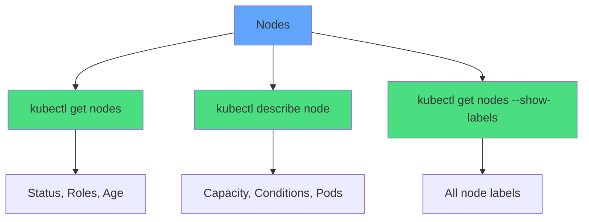

# Node Information

```mermaid
graph TB
    NODES[<carbon-server/> Nodes] --> GET[<carbon-terminal/> kubectl get nodes]
    NODES --> DESCRIBE[<carbon-terminal/> kubectl describe node]
    NODES --> LABELS[<carbon-terminal/> kubectl get nodes --show-labels]

    GET --> STATUS[Status, Roles, Age]
    DESCRIBE --> DETAILS[Capacity, Conditions, Pods]
    LABELS --> LABELS_OUT[All node labels]

    style NODES fill:#60a5fa
    style GET fill:#4ade80
    style DESCRIBE fill:#4ade80
    style LABELS fill:#4ade80
```

Query nodes for troubleshooting

