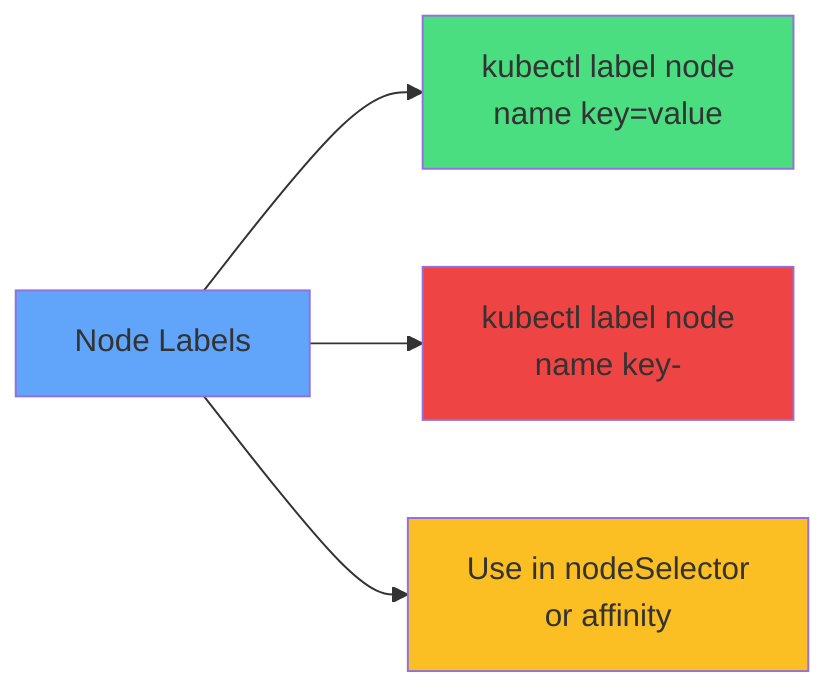

# Node Labels

```mermaid
graph LR
    LABEL[<carbon-tag/> Node Labels] --> ADD[<carbon-add/> kubectl label node<br/>name key=value]
    LABEL --> REMOVE[<carbon-subtract/> kubectl label node<br/>name key-]
    LABEL --> USE[<carbon-settings/> Use in nodeSelector<br/>or affinity]

    style LABEL fill:#60a5fa
    style ADD fill:#4ade80
    style REMOVE fill:#ef4444
    style USE fill:#fbbf24
```

### Add label: `kubectl label node worker1 disk=ssd`
### Remove label: `kubectl label node worker1 disk-`

Labels enable targeted Pod placement

