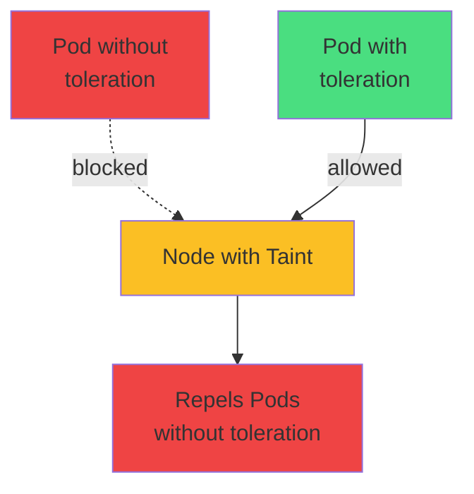

# Taints and Tolerations

```mermaid
graph TB
    NODE[<carbon-server/> Node with Taint] --> REPEL[<carbon-close/> Repels Pods<br/>without toleration]

    POD1[<carbon-container-software/> Pod without<br/>toleration] -.->|blocked| NODE
    POD2[<carbon-container-software/> Pod with<br/>toleration] -->|allowed| NODE

    style NODE fill:#fbbf24
    style REPEL fill:#ef4444
    style POD1 fill:#ef4444
    style POD2 fill:#4ade80
```

### Taint node: `kubectl taint node name key=value:NoSchedule`
### Remove taint: `kubectl taint node name key:NoSchedule-`
### Add toleration to Pod spec

