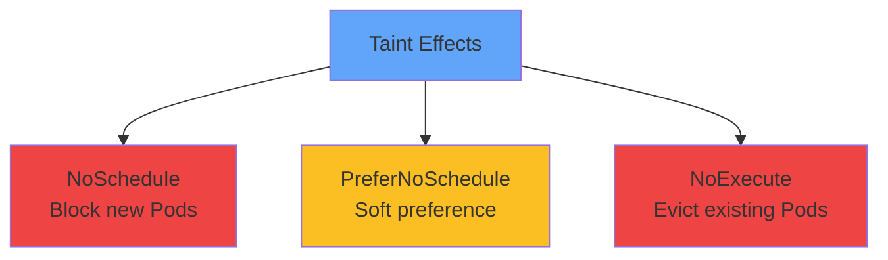

# Taint Effects

```mermaid
graph TB
    EFFECTS[<carbon-warning-alt/> Taint Effects]

    EFFECTS --> NS[<carbon-close/> NoSchedule<br/>Block new Pods]
    EFFECTS --> PNS[<carbon-help/> PreferNoSchedule<br/>Soft preference]
    EFFECTS --> NE[<carbon-logout/> NoExecute<br/>Evict existing Pods]

    style EFFECTS fill:#60a5fa
    style NS fill:#ef4444
    style PNS fill:#fbbf24
    style NE fill:#ef4444
```

NoSchedule and NoExecute are most common

