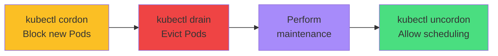

# Node Maintenance Workflow

```mermaid
graph LR
    CORDON[<carbon-locked/> kubectl cordon<br/>Block new Pods] --> DRAIN[<carbon-download/> kubectl drain<br/>Evict Pods] --> MAINTAIN[<carbon-tools/> Perform<br/>maintenance] --> UNCORDON[<carbon-unlocked/> kubectl uncordon<br/>Allow scheduling]

    style CORDON fill:#fbbf24
    style DRAIN fill:#ef4444
    style MAINTAIN fill:#a78bfa
    style UNCORDON fill:#4ade80
```

### `kubectl cordon node1`
### `kubectl drain node1 --ignore-daemonsets --delete-emptydir-data`
### `kubectl uncordon node1`

