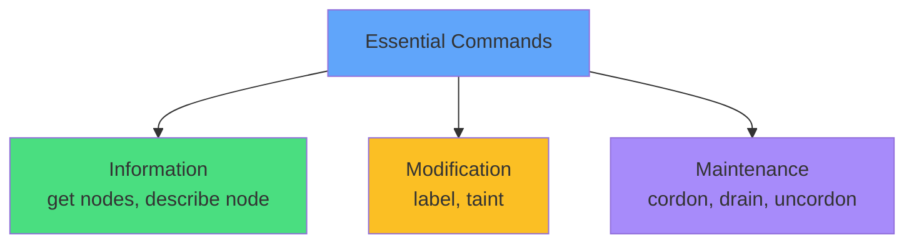

# Quick Commands

```mermaid
graph TB
    CMDS[<carbon-terminal/> Essential Commands]

    CMDS --> INFO[<carbon-view/> Information<br/>get nodes, describe node]
    CMDS --> MODIFY[<carbon-edit/> Modification<br/>label, taint]
    CMDS --> MAINT[<carbon-tools/> Maintenance<br/>cordon, drain, uncordon]

    style CMDS fill:#60a5fa
    style INFO fill:#4ade80
    style MODIFY fill:#fbbf24
    style MAINT fill:#a78bfa
```

### Show specific label: `kubectl get nodes -L disk`
### Force drain: `kubectl drain node --force`
### Check cordoned: `kubectl get nodes` (shows SchedulingDisabled)

