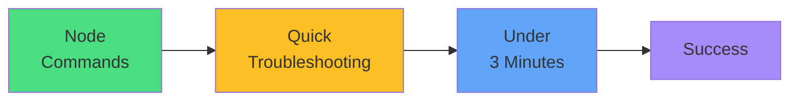

# Exam Mindset

<carbon-lightbulb class="text-yellow-400 text-4xl inline-block" />

### Check node status and labels first
### Cordon-drain-uncordon for maintenance
### Events explain Pending Pods
### Node operations should be quick

