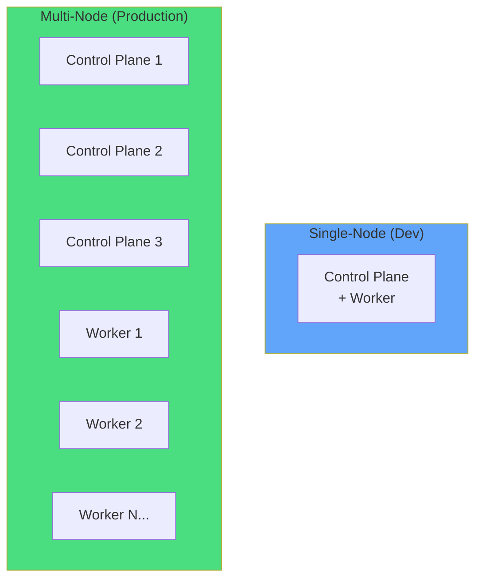
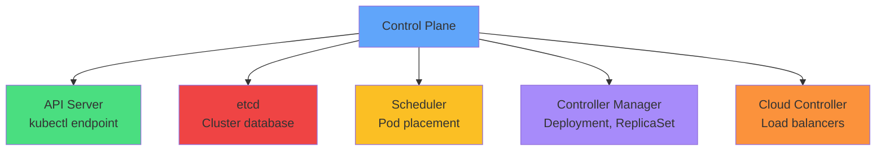
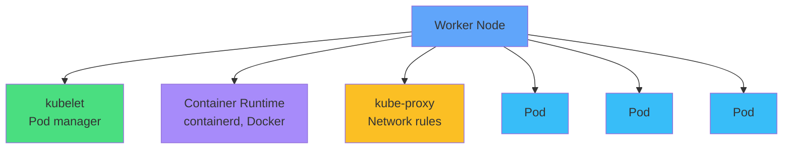
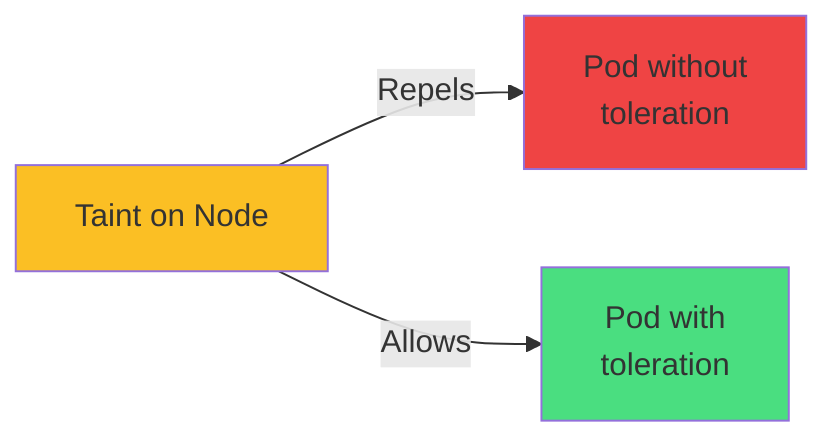
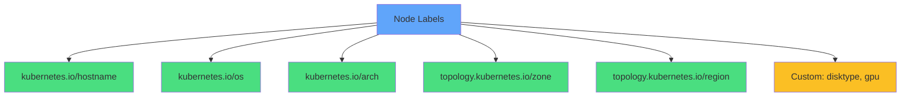
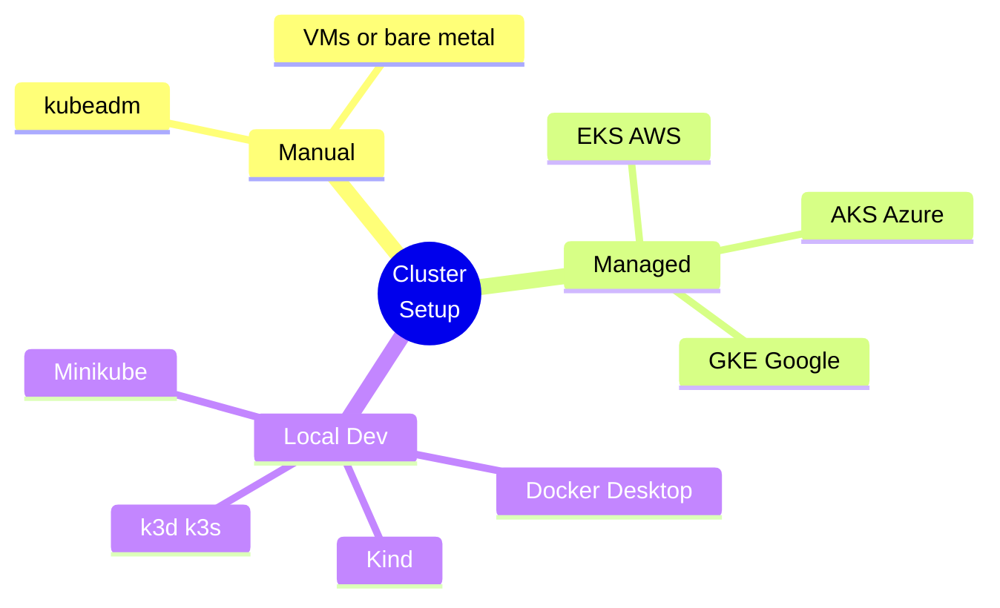
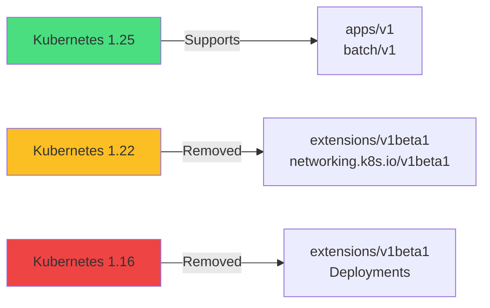
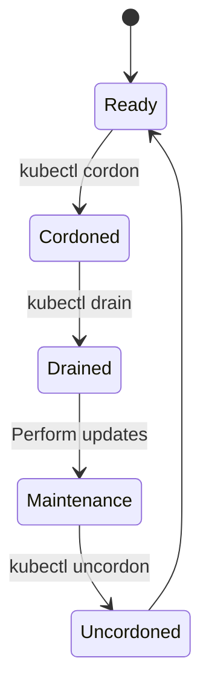
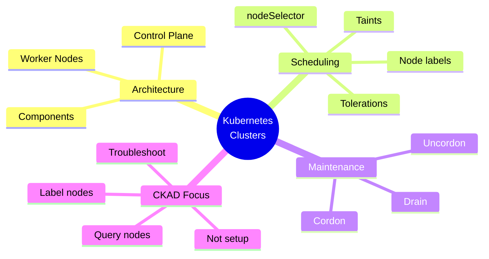

# Kubernetes Clusters

<div class="abs-br m-6 flex gap-2">
  <carbon-kubernetes class="text-6xl text-blue-400" />
</div>

<div v-click class="mt-8 text-xl opacity-80">
Multi-node architecture, components, and maintenance
</div>

---
layout: center
---

# Single vs Multi-Node Clusters

<div v-click="1">



</div>

<div class="grid grid-cols-2 gap-6 mt-8">
<div v-click="2" class="text-center">
<carbon-container-software class="text-5xl text-blue-400 mb-2" />
<strong>Single-Node</strong><br/>
<span class="text-sm opacity-80">Docker Desktop, Minikube<br/>Learning & development</span>
</div>
<div v-click="3" class="text-center">
<carbon-kubernetes class="text-5xl text-green-400 mb-2" />
<strong>Multi-Node</strong><br/>
<span class="text-sm opacity-80">3+ control plane, 10-100+ workers<br/>High availability & scale</span>
</div>
</div>

---
layout: center
---

# Control Plane Components

<div v-click="1">



</div>

<div class="grid grid-cols-2 gap-4 mt-6 text-sm">
<div v-click="2">
<carbon-api class="inline-block text-2xl text-green-400" /> <strong>API Server:</strong> Front-end for Kubernetes
</div>
<div v-click="3">
<carbon-data-base class="inline-block text-2xl text-red-400" /> <strong>etcd:</strong> Distributed key-value store
</div>
<div v-click="4">
<carbon-category-and class="inline-block text-2xl text-yellow-400" /> <strong>Scheduler:</strong> Assigns Pods to nodes
</div>
<div v-click="5">
<carbon-settings class="inline-block text-2xl text-purple-400" /> <strong>Controller Manager:</strong> Runs controllers
</div>
</div>

<div v-click="6" class="mt-6 text-center text-sm opacity-80">
Replicated across 3 or 5 nodes for fault tolerance
</div>

---
layout: center
---

# Worker Node Components

<div v-click="1">



</div>

<div class="grid grid-cols-3 gap-6 mt-8 text-sm">
<div v-click="2" class="text-center">
<carbon-container-software class="text-4xl text-green-400 mb-2" />
<strong>kubelet</strong><br/>
Agent that manages Pods
</div>
<div v-click="3" class="text-center">
<carbon-virtual-machine class="text-4xl text-purple-400 mb-2" />
<strong>Container Runtime</strong><br/>
containerd, Docker, CRI-O
</div>
<div v-click="4" class="text-center">
<carbon-network-3 class="text-4xl text-yellow-400 mb-2" />
<strong>kube-proxy</strong><br/>
Service networking
</div>
</div>

<div v-click="5" class="mt-6 text-center text-lg">
<carbon-container-software class="inline-block text-3xl text-blue-400" /> Workers run your actual workloads
</div>

---
layout: center
---

# Taints and Tolerations

<div v-click="1">



</div>

<div v-click="2" class="mb-4 text-center">
<strong>Format:</strong> <code>key=value:Effect</code>
</div>

<div class="grid grid-cols-3 gap-6 mt-6 text-sm">
<div v-click="3" class="text-center">
<carbon-close class="text-4xl text-red-400 mb-2" />
<strong>NoSchedule</strong><br/>
No new Pods
</div>
<div v-click="4" class="text-center">
<carbon-warning class="text-4xl text-yellow-400 mb-2" />
<strong>PreferNoSchedule</strong><br/>
Avoid if possible
</div>
<div v-click="5" class="text-center">
<carbon-power class="text-4xl text-purple-400 mb-2" />
<strong>NoExecute</strong><br/>
Evict existing Pods
</div>
</div>

<div v-click="6" class="mt-8 text-center">
<carbon-security class="inline-block text-2xl text-blue-400" /> Control plane nodes are typically tainted
</div>

---
layout: center
---

# Node Labels and Selectors

<div v-click="1">



</div>

<div class="grid grid-cols-2 gap-4 mt-6 text-sm">
<div v-click="2">
<carbon-tag class="inline-block text-2xl text-green-400" /> <strong>Standard labels:</strong> hostname, OS, arch
</div>
<div v-click="3">
<carbon-location class="inline-block text-2xl text-blue-400" /> <strong>Topology:</strong> zone, region
</div>
<div v-click="4">
<carbon-settings class="inline-block text-2xl text-purple-400" /> <strong>Custom labels:</strong> disktype, gpu, ssd
</div>
<div v-click="5">
<carbon-filter class="inline-block text-2xl text-yellow-400" /> <strong>nodeSelector:</strong> Place Pods on specific nodes
</div>
</div>

---
layout: center
---

# Cluster Setup Options

<div v-click="1">



</div>

<div v-click="2" class="mt-8 text-center text-yellow-400">
<carbon-warning class="inline-block text-3xl" /> For CKAD: Focus on kubectl, not cluster setup
</div>

---
layout: center
---

# API Version Compatibility

<div v-click="1">



</div>

<div v-click="2" class="mt-8 text-center">
<carbon-document class="inline-block text-3xl text-blue-400" />
<strong class="ml-2">Always check deprecation guide before upgrades</strong>
</div>

<div v-click="3" class="mt-6 text-center text-sm opacity-80">
Test applications against new versions in staging first
</div>

<div v-click="4" class="mt-4 text-center">
<carbon-container-software class="inline-block text-2xl text-purple-400" /> k3d useful for testing different K8s versions
</div>

---
layout: center
---

# Node Maintenance

<div v-click="1">



</div>

<div class="grid grid-cols-3 gap-6 mt-8 text-sm">
<div v-click="2" class="text-center">
<carbon-close class="text-4xl text-yellow-400 mb-2" />
<strong>Cordon</strong><br/>
Mark unschedulable
</div>
<div v-click="3" class="text-center">
<carbon-power class="text-4xl text-red-400 mb-2" />
<strong>Drain</strong><br/>
Evict all Pods
</div>
<div v-click="4" class="text-center">
<carbon-checkmark class="text-4xl text-green-400 mb-2" />
<strong>Uncordon</strong><br/>
Re-enable scheduling
</div>
</div>

<div v-click="5" class="mt-6 text-center text-sm">
<carbon-warning class="inline-block text-2xl text-blue-400" /> Pods don't auto-rebalance after uncordon
</div>

---
layout: center
---

# Node Maintenance Workflow

<div v-click="1">


</div>

<div class="grid grid-cols-2 gap-4 mt-8 text-sm">
<div v-click="2">
<carbon-terminal class="inline-block text-2xl text-yellow-400" /> <code>kubectl cordon node-1</code>
</div>
<div v-click="3">
<carbon-terminal class="inline-block text-2xl text-red-400" /> <code>kubectl drain node-1 --ignore-daemonsets</code>
</div>
<div v-click="4">
<carbon-settings class="inline-block text-2xl text-blue-400" /> Perform OS updates, hardware maintenance
</div>
<div v-click="5">
<carbon-terminal class="inline-block text-2xl text-green-400" /> <code>kubectl uncordon node-1</code>
</div>
</div>

---
layout: center
---

# CKAD Exam Focus

<div v-click="1" class="text-center mb-6">
<carbon-certificate class="inline-block text-6xl text-blue-400" />
</div>

<div class="grid grid-cols-2 gap-4 text-sm">
<div v-click="2">
<carbon-view class="inline-block text-2xl text-green-400" /> Query node information
</div>
<div v-click="3">
<carbon-tag class="inline-block text-2xl text-green-400" /> Use node labels for scheduling
</div>
<div v-click="4">
<carbon-rule class="inline-block text-2xl text-green-400" /> Understand taints/tolerations
</div>
<div v-click="5">
<carbon-settings class="inline-block text-2xl text-green-400" /> Perform node maintenance
</div>
<div v-click="6">
<carbon-debug class="inline-block text-2xl text-green-400" /> Troubleshoot scheduling issues
</div>
<div v-click="7">
<carbon-terminal class="inline-block text-2xl text-green-400" /> Use kubectl get/describe node
</div>
</div>

<div v-click="8" class="mt-8 text-center text-yellow-400">
<carbon-warning class="inline-block text-2xl" /> Know architecture, not cluster setup
</div>

---
layout: center
---

# Key Commands

<div class="grid grid-cols-2 gap-6 mt-4">
<div v-click="1">
<carbon-view class="text-3xl text-blue-400 mb-2" />
<strong>Get nodes</strong>
```bash
kubectl get nodes
kubectl get nodes -o wide
```
</div>
<div v-click="2">
<carbon-document class="text-3xl text-green-400 mb-2" />
<strong>Describe node</strong>
```bash
kubectl describe node <name>
```
</div>
<div v-click="3">
<carbon-tag class="text-3xl text-purple-400 mb-2" />
<strong>Label node</strong>
```bash
kubectl label node <name> key=value
```
</div>
<div v-click="4">
<carbon-settings class="text-3xl text-yellow-400 mb-2" />
<strong>Maintenance</strong>
```bash
kubectl cordon <node>
kubectl drain <node>
kubectl uncordon <node>
```
</div>
</div>

---
layout: center
---

# Summary

<div v-click="1">



</div>

---
layout: center
---

# Key Takeaways

<div class="grid grid-cols-2 gap-6 mt-6">
<div v-click="1">
<carbon-kubernetes class="text-4xl text-blue-400 mb-2" />
<strong>Control plane vs workers</strong><br/>
<span class="text-sm opacity-80">Brain vs execution layer</span>
</div>
<div v-click="2">
<carbon-rule class="text-4xl text-green-400 mb-2" />
<strong>Taints/tolerations</strong><br/>
<span class="text-sm opacity-80">Node isolation mechanism</span>
</div>
<div v-click="3">
<carbon-tag class="text-4xl text-purple-400 mb-2" />
<strong>Labels for placement</strong><br/>
<span class="text-sm opacity-80">nodeSelector and affinity</span>
</div>
<div v-click="4">
<carbon-settings class="text-4xl text-yellow-400 mb-2" />
<strong>Node maintenance</strong><br/>
<span class="text-sm opacity-80">cordon, drain, uncordon</span>
</div>
</div>

<div v-click="5" class="mt-8 text-center text-lg">
Focus on operations, not setup <carbon-arrow-right class="inline-block text-2xl" />
</div>
