# Kubernetes Clusters

<div class="abs-br m-6 flex gap-2">
  <carbon-kubernetes class="text-6xl text-blue-400" />
</div>

<div v-click class="mt-8 text-xl opacity-80">
Multi-node architecture, components, and maintenance
</div>

---
layout: center
---

# Session Overview

<div v-click="1" class="text-center mb-4 text-lg">
<carbon-kubernetes class="inline-block text-5xl text-blue-400" />
</div>

<div v-click="2" class="text-center text-sm opacity-80 mb-6">
Understanding cluster architecture helps with troubleshooting and operations
</div>

<div v-click="3">

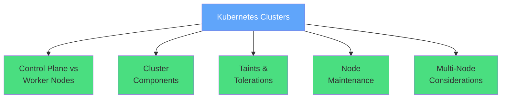

</div>

<div v-click="4" class="mt-6 text-center text-sm opacity-80">
<carbon-warning class="inline-block text-2xl text-yellow-400" /> Cluster setup beyond CKAD scope
</div>

<div v-click="5" class="text-center text-sm opacity-80">
<carbon-checkmark class="inline-block text-2xl text-green-400" /> Focus on architecture and operations
</div>

---
layout: center
---

# Single vs Multi-Node Clusters

<div v-click="1" class="mb-4">
<carbon-container-software class="text-5xl text-blue-400 mb-2" />
<strong>Single-Node Clusters</strong>
</div>

<div v-click="2" class="text-sm opacity-80 mb-4">
Docker Desktop, Minikube - fine for learning
</div>

<div v-click="3">

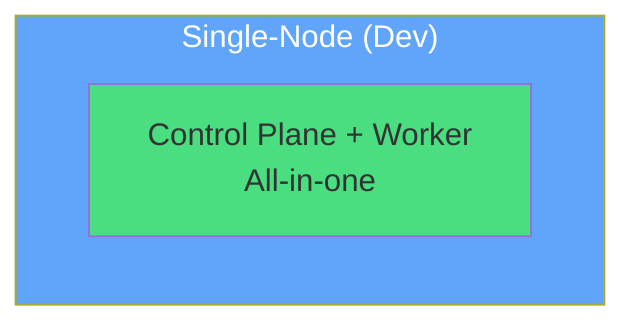

</div>

<div v-click="4" class="mt-6 mb-4">
<carbon-kubernetes class="text-5xl text-green-400 mb-2" />
<strong>Multi-Node Clusters</strong>
</div>

<div v-click="5" class="text-sm opacity-80 mb-4">
Production requires multi-node for high availability and scale
</div>

<div v-click="6">

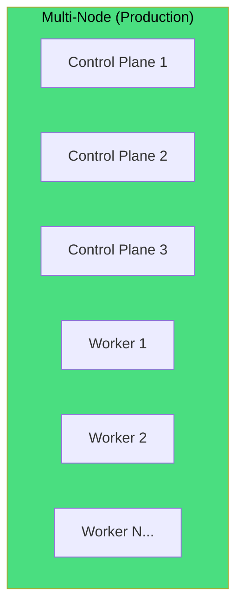

</div>

<div v-click="7" class="mt-6 text-center text-lg">
<strong>Typical Production:</strong> 3+ control plane nodes, 10-100+ workers
</div>

<div v-click="8" class="text-center text-sm opacity-80">
Control plane runs Kubernetes components, workers run your applications
</div>

---
layout: center
---

# Control Plane Components

<div v-click="1" class="text-center mb-4">
<carbon-api class="inline-block text-5xl text-blue-400" />
<strong class="text-xl">The Brain of Kubernetes</strong>
</div>

<div v-click="2">

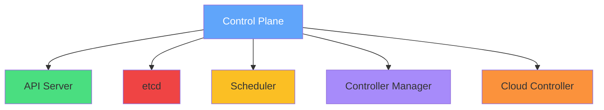

</div>

<div v-click="3" class="mb-4">
<carbon-api class="text-4xl text-green-400 mb-2" />
<strong>API Server</strong>
</div>

<div v-click="4" class="text-sm opacity-80 mb-4">
Front-end for Kubernetes - handles all API requests
</div>

<div v-click="5" class="mb-4">
<carbon-data-base class="text-4xl text-red-400 mb-2" />
<strong>etcd</strong>
</div>

<div v-click="6" class="text-sm opacity-80 mb-4">
Distributed key-value store - the cluster database
</div>

<div v-click="7" class="mb-4">
<carbon-category-and class="text-4xl text-yellow-400 mb-2" />
<strong>Scheduler</strong>
</div>

<div v-click="8" class="text-sm opacity-80 mb-4">
Assigns Pods to nodes
</div>

<div v-click="9" class="mb-4">
<carbon-settings class="text-4xl text-purple-400 mb-2" />
<strong>Controller Manager</strong>
</div>

<div v-click="10" class="text-sm opacity-80 mb-4">
Runs controllers - Deployment, ReplicaSet, etc.
</div>

<div v-click="11" class="mb-4">
<carbon-cloud class="text-4xl text-orange-400 mb-2" />
<strong>Cloud Controller Manager</strong>
</div>

<div v-click="12" class="text-sm opacity-80 mb-4">
Integrates with cloud providers
</div>

<div v-click="13" class="mt-6 text-center text-lg text-blue-400">
<carbon-deployment-unit-technical-execution class="inline-block text-3xl" /> Replicated across 3 or 5 nodes for fault tolerance
</div>

---
layout: center
---

# Worker Node Components

<div v-click="1" class="text-center mb-4">
<carbon-container-software class="inline-block text-5xl text-blue-400" />
<strong class="text-xl">Where Your Workloads Run</strong>
</div>

<div v-click="2">

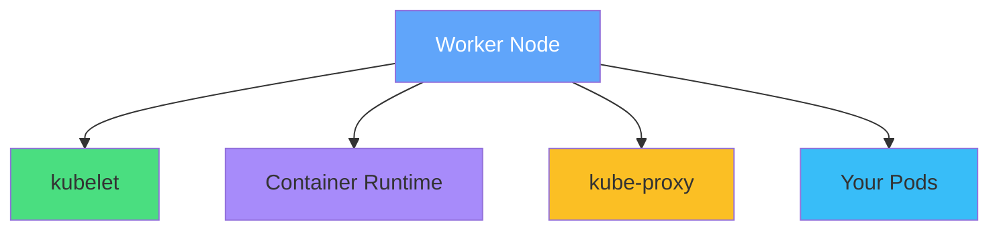

</div>

<div v-click="3" class="mb-4">
<carbon-container-software class="text-4xl text-green-400 mb-2" />
<strong>kubelet</strong>
</div>

<div v-click="4" class="text-sm opacity-80 mb-4">
Agent that manages Pods on the node
</div>

<div v-click="5" class="mb-4">
<carbon-virtual-machine class="text-4xl text-purple-400 mb-2" />
<strong>Container Runtime</strong>
</div>

<div v-click="6" class="text-sm opacity-80 mb-4">
Docker, containerd, or CRI-O
</div>

<div v-click="7" class="mb-4">
<carbon-network-3 class="text-4xl text-yellow-400 mb-2" />
<strong>kube-proxy</strong>
</div>

<div v-click="8" class="text-sm opacity-80 mb-4">
Network proxy for Services
</div>

<div v-click="9" class="mt-6 text-center text-lg">
<carbon-deployment-unit-data class="inline-block text-3xl text-blue-400" /> Workers execute the actual workload
</div>

<div v-click="10" class="text-center text-sm opacity-80">
Nodes can be physical servers, VMs, or cloud instances
</div>

---
layout: center
---

# Taints and Tolerations

<div v-click="1" class="text-center mb-4">
<carbon-rule class="inline-block text-5xl text-blue-400" />
<strong class="text-xl">Node Isolation Mechanism</strong>
</div>

<div v-click="2" class="mb-4">
<carbon-warning class="text-4xl text-yellow-400 mb-2" />
<strong>Taints</strong>
</div>

<div v-click="3" class="text-sm opacity-80 mb-4">
Mark nodes as special - they repel Pods unless the Pod tolerates the taint
</div>

<div v-click="4">

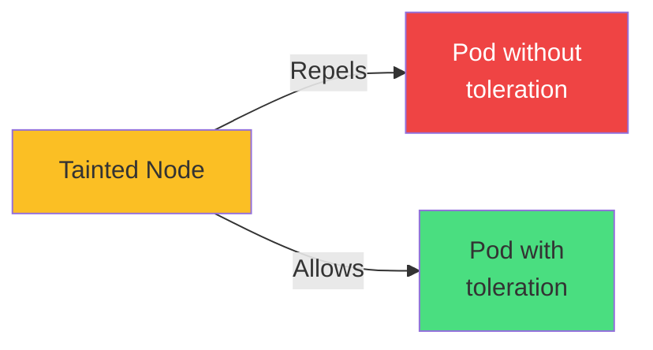

</div>

<div v-click="5" class="mt-6 mb-4 text-center">
<strong>Format:</strong> <code>key=value:Effect</code>
</div>

<div class="grid grid-cols-3 gap-6 text-sm">
<div v-click="6">
<carbon-close class="text-4xl text-red-400 mb-2" />
<strong>NoSchedule</strong>
</div>
<div v-click="7">
<span class="text-xs opacity-80">No new Pods can be scheduled</span>
</div>
<div v-click="8">
<span class="text-xs text-red-400">Existing Pods remain</span>
</div>

<div v-click="9">
<carbon-warning class="text-4xl text-yellow-400 mb-2" />
<strong>PreferNoSchedule</strong>
</div>
<div v-click="10">
<span class="text-xs opacity-80">Avoid scheduling if possible</span>
</div>
<div v-click="11">
<span class="text-xs text-yellow-600">Soft constraint</span>
</div>

<div v-click="12">
<carbon-power class="text-4xl text-purple-400 mb-2" />
<strong>NoExecute</strong>
</div>
<div v-click="13">
<span class="text-xs opacity-80">Evict existing Pods</span>
</div>
<div v-click="14">
<span class="text-xs text-purple-600">Strongest constraint</span>
</div>
</div>

<div v-click="15" class="mt-6 mb-4">
<carbon-checkmark class="text-4xl text-green-400 mb-2" />
<strong>Tolerations</strong>
</div>

<div v-click="16" class="text-sm opacity-80 mb-4">
On Pods - allow scheduling on tainted nodes
</div>

<div v-click="17" class="text-center text-lg text-blue-400">
<carbon-security class="inline-block text-2xl" /> Control plane nodes typically tainted to prevent user workloads
</div>

---
layout: center
---

# Node Labels and Selectors

<div v-click="1" class="text-center mb-4">
<carbon-tag class="inline-block text-5xl text-blue-400" />
<strong class="text-xl">Organizing and Targeting Nodes</strong>
</div>

<div v-click="2" class="mb-4">
<strong>Standard Labels Applied Automatically:</strong>
</div>

<div v-click="3">

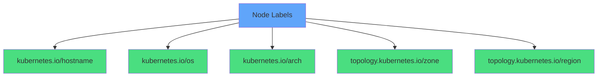

</div>

<div class="grid grid-cols-2 gap-4 mt-6 text-sm">
<div v-click="4">
<carbon-server class="inline-block text-2xl text-green-400" /> <code>kubernetes.io/hostname</code>
</div>
<div v-click="5">
<span class="text-xs opacity-60">Node name</span>
</div>

<div v-click="6">
<carbon-virtual-machine class="inline-block text-2xl text-blue-400" /> <code>kubernetes.io/os</code>
</div>
<div v-click="7">
<span class="text-xs opacity-60">linux or windows</span>
</div>

<div v-click="8">
<carbon-chip class="inline-block text-2xl text-purple-400" /> <code>kubernetes.io/arch</code>
</div>
<div v-click="9">
<span class="text-xs opacity-60">amd64, arm64, etc.</span>
</div>

<div v-click="10">
<carbon-location class="inline-block text-2xl text-yellow-400" /> <code>topology.kubernetes.io/zone</code>
</div>
<div v-click="11">
<span class="text-xs opacity-60">Availability zone</span>
</div>

<div v-click="12">
<carbon-earth class="inline-block text-2xl text-orange-400" /> <code>topology.kubernetes.io/region</code>
</div>
<div v-click="13">
<span class="text-xs opacity-60">Cloud region</span>
</div>

<div v-click="14">
<carbon-settings class="inline-block text-2xl text-red-400" /> <strong>Custom Labels</strong>
</div>
<div v-click="15">
<span class="text-xs opacity-60">disktype=ssd, gpu=true, etc.</span>
</div>
</div>

<div v-click="16" class="mt-6 text-center text-lg">
<carbon-filter class="inline-block text-3xl text-blue-400" /> Use nodeSelector or affinity to place Pods on specific nodes
</div>

---
layout: center
---

# Cluster Setup Options

<div v-click="1" class="text-center mb-4">
<carbon-deployment-pattern class="inline-block text-5xl text-blue-400" />
<strong class="text-xl">Different Ways to Run Kubernetes</strong>
</div>

<div v-click="2">

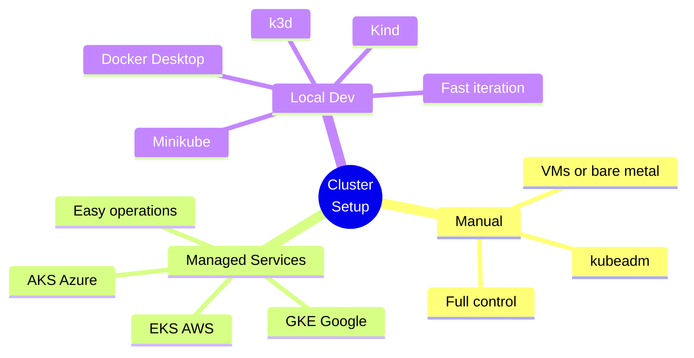

</div>

<div class="grid grid-cols-3 gap-6 mt-6 text-sm">
<div v-click="3" class="text-center">
<carbon-tool-box class="text-4xl text-blue-400 mb-2" />
<strong>Kubeadm</strong><br/>
<span class="text-xs opacity-60">Manual cluster setup<br/>VMs or bare metal</span>
</div>
<div v-click="4" class="text-center">
<carbon-cloud class="text-4xl text-green-400 mb-2" />
<strong>Managed</strong><br/>
<span class="text-xs opacity-60">AKS, EKS, GKE<br/>Cloud providers</span>
</div>
<div v-click="5" class="text-center">
<carbon-container-software class="text-4xl text-purple-400 mb-2" />
<strong>Local Dev</strong><br/>
<span class="text-xs opacity-60">Docker Desktop<br/>k3d, Kind, Minikube</span>
</div>
</div>

<div v-click="6" class="mt-8 text-center text-lg text-yellow-400">
<carbon-warning class="inline-block text-3xl" /> For CKAD: Focus on kubectl commands, not cluster setup
</div>

<div v-click="7" class="text-center text-sm opacity-80">
Know the architecture and how to query cluster state
</div>

---
layout: center
---

# API Version Compatibility

<div v-click="1" class="text-center mb-4">
<carbon-api class="inline-block text-5xl text-blue-400" />
<strong class="text-xl">Kubernetes Versions and API Support</strong>
</div>

<div v-click="2" class="text-center text-sm opacity-80 mb-6">
Different Kubernetes versions support different API versions
</div>

<div v-click="3" class="mb-4">
<carbon-warning class="text-4xl text-red-400 mb-2" />
<strong>Upgrading clusters may break old manifests</strong>
</div>

<div v-click="4">

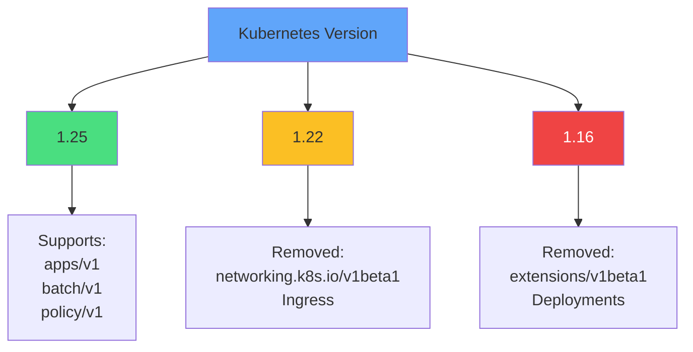

</div>

<div v-click="5" class="mt-6 text-center text-lg">
<carbon-document class="inline-block text-3xl text-blue-400" /> Always check Kubernetes deprecation guide before upgrades
</div>

<div v-click="6" class="text-center text-sm opacity-80">
Test applications against new versions in staging before production
</div>

<div v-click="7" class="mt-4 text-center">
<carbon-container-software class="inline-block text-2xl text-purple-400" /> k3d useful for testing different K8s versions locally
</div>

---
layout: center
---

# Node Maintenance

<div v-click="1" class="text-center mb-4">
<carbon-settings class="inline-block text-5xl text-blue-400" />
<strong class="text-xl">Safely Taking Nodes Offline</strong>
</div>

<div v-click="2">

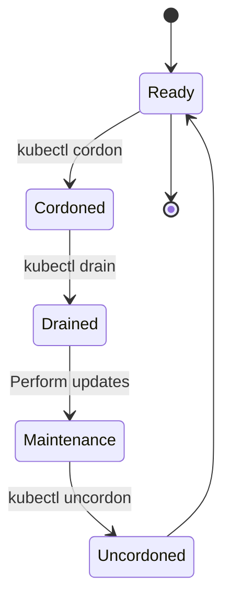

</div>

<div v-click="3" class="mt-6 mb-4">
<carbon-close class="text-4xl text-yellow-400 mb-2" />
<strong>Cordon</strong>
</div>

<div v-click="4" class="text-sm opacity-80 mb-4">
Mark node unschedulable - <code>kubectl cordon</code>
</div>

<div v-click="5" class="mb-4">
<carbon-power class="text-4xl text-red-400 mb-2" />
<strong>Drain</strong>
</div>

<div v-click="6" class="text-sm opacity-80 mb-4">
Evict all Pods gracefully - <code>kubectl drain --ignore-daemonsets</code>
</div>

<div v-click="7" class="mb-4">
<carbon-checkmark class="text-4xl text-green-400 mb-2" />
<strong>Uncordon</strong>
</div>

<div v-click="8" class="text-sm opacity-80 mb-4">
Re-enable scheduling - <code>kubectl uncordon</code>
</div>

<div v-click="9" class="mt-6 text-center text-lg">
<strong>Workflow:</strong> Cordon → Drain → Maintenance → Uncordon
</div>

<div v-click="10" class="text-center text-sm text-yellow-400">
<carbon-warning class="inline-block text-2xl" /> Pods don't automatically rebalance after uncordon
</div>

<div v-click="11" class="text-center text-sm opacity-80">
They stay where they were rescheduled
</div>

---
layout: center
---

# CKAD Exam Focus

<div v-click="1" class="text-center mb-6">
<carbon-certificate class="inline-block text-6xl text-blue-400" />
</div>

<div class="grid grid-cols-2 gap-4 text-sm">
<div v-click="2">
<carbon-view class="inline-block text-2xl text-green-400" /> Query node information
</div>
<div v-click="3">
<carbon-terminal class="inline-block text-2xl text-green-400" /> kubectl get nodes
</div>
<div v-click="4">
<carbon-document class="inline-block text-2xl text-green-400" /> kubectl describe node
</div>
<div v-click="5">
<carbon-tag class="inline-block text-2xl text-green-400" /> Use node labels for scheduling
</div>
<div v-click="6">
<carbon-rule class="inline-block text-2xl text-green-400" /> Understand taints/tolerations
</div>
<div v-click="7">
<carbon-debug class="inline-block text-2xl text-green-400" /> Troubleshoot why Pods don't schedule
</div>
<div v-click="8">
<carbon-settings class="inline-block text-2xl text-green-400" /> Perform node maintenance
</div>
<div v-click="9">
<carbon-edit class="inline-block text-2xl text-green-400" /> kubectl cordon/drain/uncordon
</div>
</div>

<div v-click="10" class="mt-8 text-center text-lg">
<carbon-checkmark class="inline-block text-3xl text-green-400" /> Know architecture and operations
</div>

<div v-click="11" class="text-center text-lg text-yellow-400">
<carbon-warning class="inline-block text-3xl" /> Cluster setup beyond CKAD scope
</div>

---
layout: center
---

# Key Commands

<div class="grid grid-cols-2 gap-6 mt-4 text-sm">
<div v-click="1">
<carbon-view class="text-3xl text-blue-400 mb-2" />
<strong>View Nodes</strong>
</div>
<div v-click="2">
```bash
kubectl get nodes
kubectl get nodes -o wide
```
</div>

<div v-click="3">
<carbon-document class="text-3xl text-green-400 mb-2" />
<strong>Node Details</strong>
</div>
<div v-click="4">
```bash
kubectl describe node <name>
```
</div>

<div v-click="5">
<carbon-tag class="text-3xl text-purple-400 mb-2" />
<strong>Label Nodes</strong>
</div>
<div v-click="6">
```bash
kubectl label node <name> key=value
```
</div>

<div v-click="7">
<carbon-settings class="text-3xl text-yellow-400 mb-2" />
<strong>Maintenance</strong>
</div>
<div v-click="8">
```bash
kubectl cordon <node>
kubectl drain <node> --ignore-daemonsets
kubectl uncordon <node>
```
</div>
</div>

---
layout: center
---

# Summary

<div v-click="1">

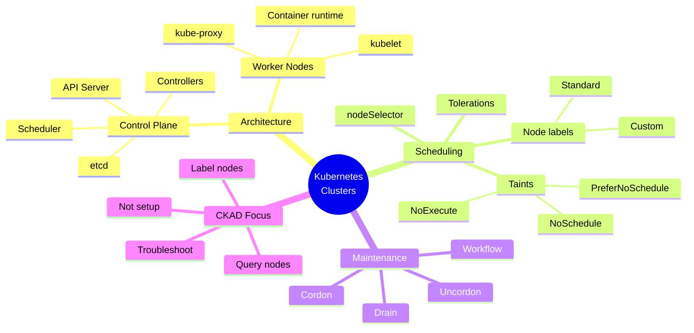

</div>

---
layout: center
---

# Key Takeaways

<div v-click="1" class="mb-4">
<carbon-kubernetes class="text-5xl text-blue-400 mb-2" />
<strong>Control Plane vs Workers</strong>
</div>

<div v-click="2" class="text-sm opacity-80 mb-6">
Brain vs execution layer - understand the components and roles
</div>

<div v-click="3" class="mb-4">
<carbon-rule class="text-5xl text-green-400 mb-2" />
<strong>Taints and Tolerations</strong>
</div>

<div v-click="4" class="text-sm opacity-80 mb-6">
Node isolation mechanism - control where Pods can schedule
</div>

<div v-click="5" class="mb-4">
<carbon-tag class="text-5xl text-purple-400 mb-2" />
<strong>Labels for Pod Placement</strong>
</div>

<div v-click="6" class="text-sm opacity-80 mb-6">
Use nodeSelector and affinity to target specific nodes
</div>

<div v-click="7" class="mb-4">
<carbon-settings class="text-5xl text-yellow-400 mb-2" />
<strong>Node Maintenance Workflow</strong>
</div>

<div v-click="8" class="text-sm opacity-80 mb-6">
Cordon → Drain → Maintenance → Uncordon
</div>

<div v-click="9" class="text-center text-lg">
<carbon-terminal class="inline-block text-3xl text-blue-400" /> Focus on operations, not cluster setup
</div>

---
layout: center
---

# Next Steps

<div v-click="1" class="text-center mb-8">
<carbon-education class="inline-block text-6xl text-blue-400" />
</div>

<div v-click="2">

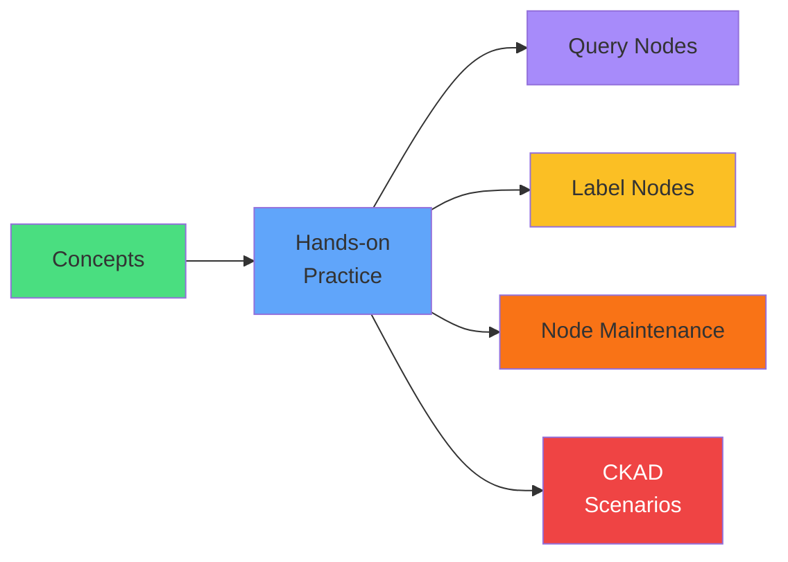

</div>

<div v-click="3" class="mt-8 text-center text-xl">
Let's explore cluster operations! <carbon-arrow-right class="inline-block text-2xl" />
</div>
