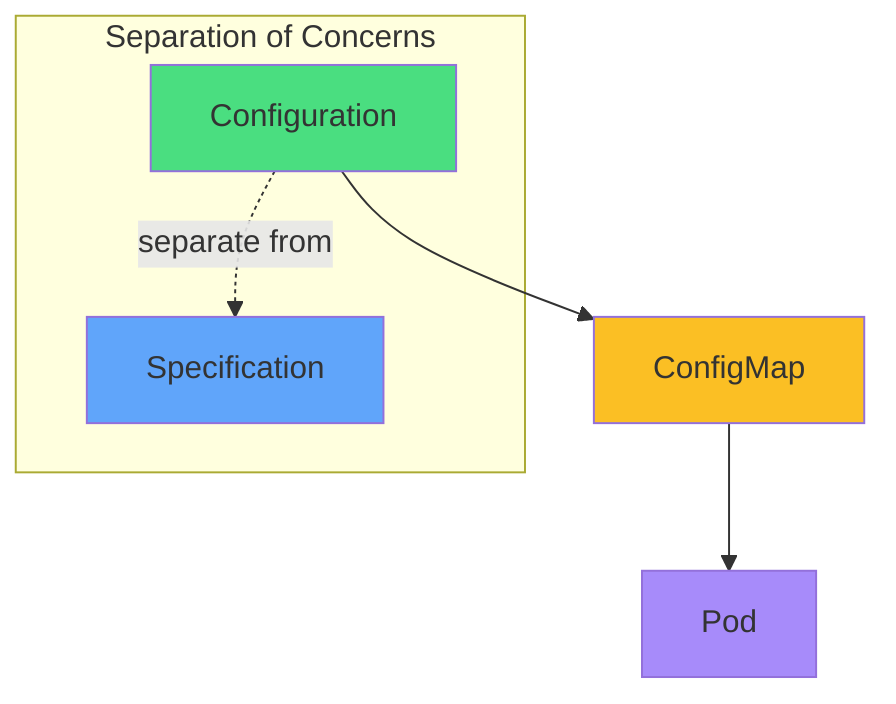

# Configuration Management

```mermaid
graph TB
    subgraph Separation of Concerns
        C[<carbon-settings/> Configuration] -.->|separate from| S[<carbon-code/> Specification]
    end
    C --> CM[<carbon-document/> ConfigMap]
    CM --> P[<carbon-container-software/> Pod]
    style C fill:#4ade80
    style S fill:#60a5fa
    style CM fill:#fbbf24
    style P fill:#a78bfa
```

<carbon-timer class="text-3xl text-red-400 inline-block" />
 
Target: 4-6 minutes including Pod configuration

