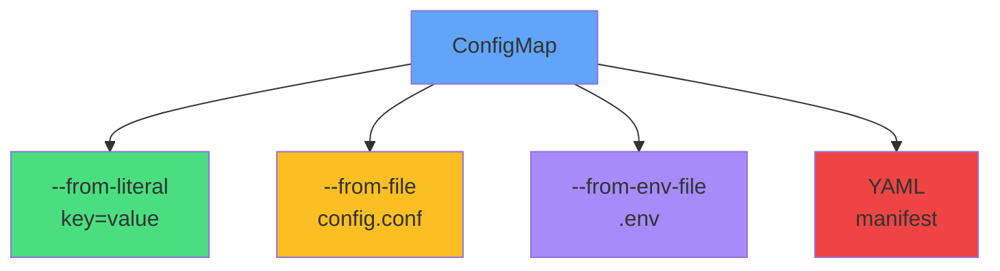

# Creation Methods

```mermaid
graph TB
    CM[<carbon-settings/> ConfigMap]
    L[<carbon-text-link/> --from-literal<br/>key=value]
    F[<carbon-document/> --from-file<br/>config.conf]
    E[<carbon-code/> --from-env-file<br/>.env]
    Y[<carbon-document-blank/> YAML<br/>manifest]
    CM --> L
    CM --> F
    CM --> E
    CM --> Y
    style CM fill:#60a5fa
    style L fill:#4ade80
    style F fill:#fbbf24
    style E fill:#a78bfa
    style Y fill:#ef4444
```

Choose the right method to save time

