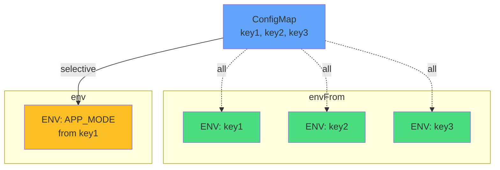

# Environment Variables

<carbon-code class="text-5xl text-green-400 mb-4" />

## envFrom
Load all keys

```yaml
envFrom:
- configMapRef:
    name: app-config
```

<carbon-text-link class="text-5xl text-blue-400 mb-4 mt-6" />

## env
Selective injection

```yaml
env:
- name: APP_MODE
  valueFrom:
    configMapKeyRef:
      name: app-config
      key: mode
```

::right::

<div class="mt-16">



</div>
