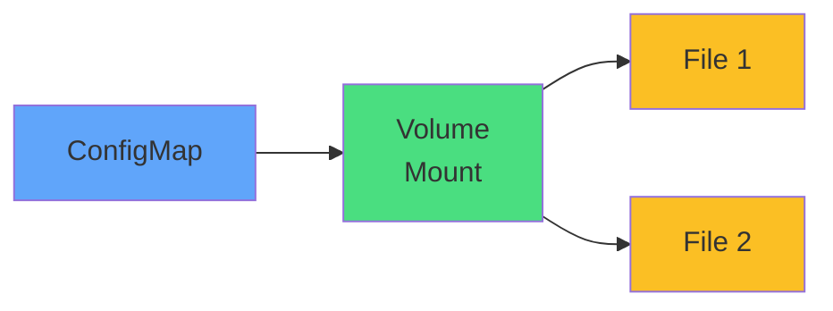

# Volume Mounting

## Environment Vars
<carbon-locked class="text-3xl text-red-400" />

Immutable after creation

## Volume Mounts
<carbon-renew class="text-3xl text-green-400" />

Updates automatically

