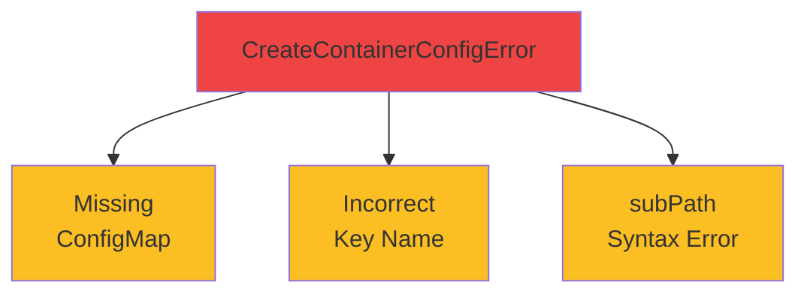

# Common Errors



<div class="mt-8 text-center">

```bash
kubectl describe pod <pod-name>
```

<div class="text-lg opacity-80 mt-4">
<carbon-timer class="text-3xl text-red-400 inline-block" />
<br/>
Diagnose in < 1 minute
</div>

</div>
