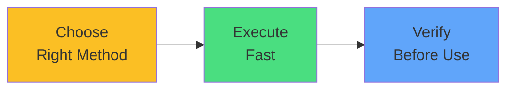

# Exam Mindset

<carbon-lightbulb class="text-yellow-400 text-4xl inline-block" />

### Quick wins if you know the syntax
### --from-literal for simple cases
### Verify ConfigMap before using in Pods

Imperative commands until muscle memory

