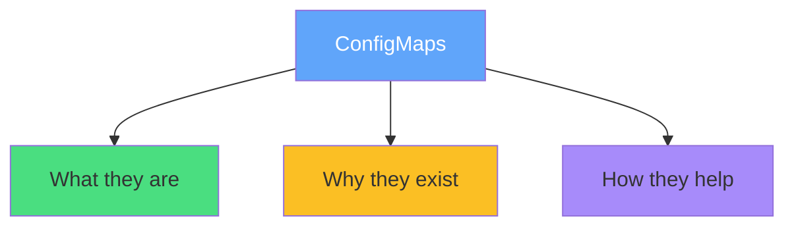
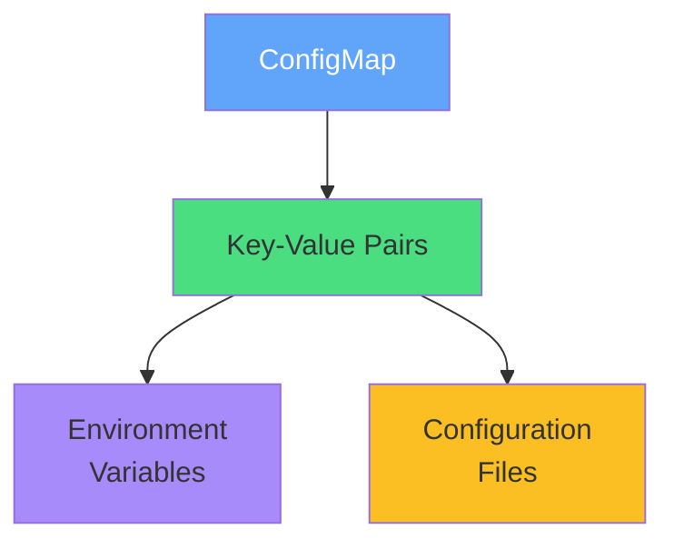
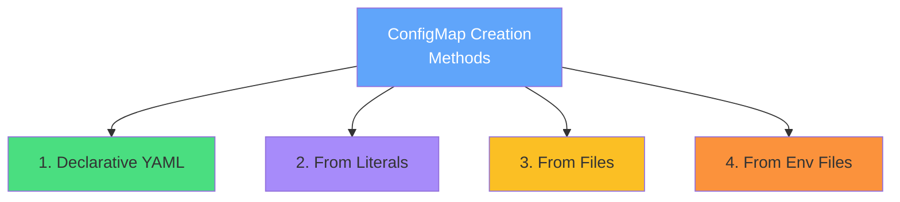
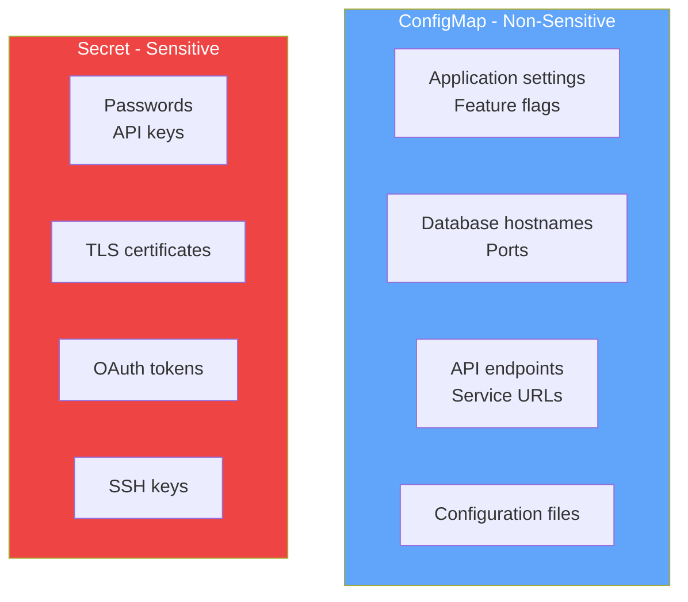
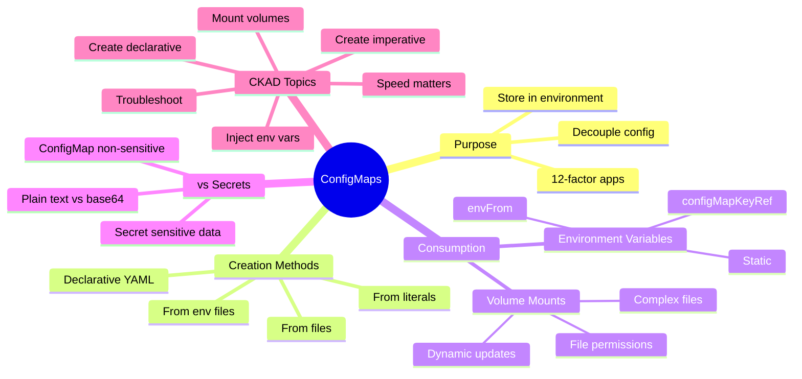
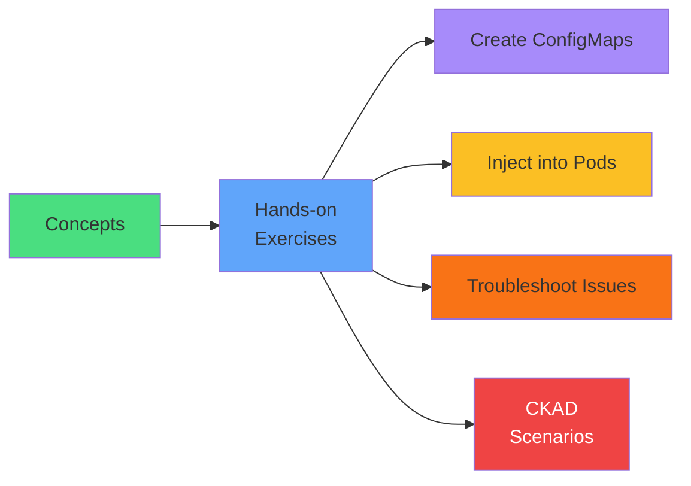

# ConfigMaps

<div class="abs-br m-6 flex gap-2">
  <carbon-settings class="text-6xl text-blue-400" />
</div>

<div v-click class="mt-8 text-xl opacity-80">
Decoupling configuration from container images
</div>

---
layout: center
---

# Introduction

<div v-click="1" class="text-center mb-4">
<carbon-settings class="inline-block text-5xl text-blue-400" />
</div>

<div v-click="2" class="text-center text-lg mb-6">
Core CKAD exam topic - essential for production environments
</div>

<div v-click="3">



</div>

<div v-click="4" class="mt-6 text-center text-sm opacity-80">
<carbon-idea class="inline-block text-2xl text-blue-400" /> Build cloud-native apps following twelve-factor methodology
</div>

---
layout: center
---

# The Configuration Challenge

<div v-click="1" class="mb-4">
<carbon-warning class="text-5xl text-red-400 mb-2" />
<strong>How do you manage configuration across different environments?</strong>
</div>

<div v-click="2" class="mb-4">
<carbon-close class="text-4xl text-yellow-400 mb-2" />
<strong>Problem 1: Hardcoded Configuration</strong>
</div>

<div v-click="3" class="text-sm opacity-80 mb-4">
Values hardcoded in code or bundled in container images
</div>

<div v-click="4" class="text-sm text-red-400 mb-4">
✗ Violates separation of concerns - config mixed with code
</div>

<div v-click="5" class="mb-4">
<carbon-image class="text-4xl text-yellow-400 mb-2" />
<strong>Problem 2: Multiple Images</strong>
</div>

<div v-click="6" class="text-sm opacity-80 mb-4">
Different container images for dev, staging, production
</div>

<div v-click="7" class="text-sm text-red-400 mb-4">
✗ Defeats purpose of containers - should be portable and immutable
</div>

<div v-click="8" class="mb-4">
<carbon-renew class="text-4xl text-yellow-400 mb-2" />
<strong>Problem 3: Rebuild Required</strong>
</div>

<div v-click="9" class="text-sm opacity-80 mb-4">
Changing simple config values requires rebuilding entire image
</div>

<div v-click="10" class="text-sm text-red-400 mb-4">
✗ Time-consuming and error-prone
</div>

<div v-click="11" class="mt-6 text-center text-lg">
<carbon-idea class="inline-block text-3xl text-blue-400" /> 12-Factor App, Factor 3: "Store config in the environment"
</div>

<div v-click="12" class="text-center text-sm opacity-80">
Kubernetes ConfigMaps solve this exact problem
</div>

---
layout: center
---

# What Are ConfigMaps?

<div v-click="1" class="text-center mb-4">
<carbon-settings class="inline-block text-5xl text-blue-400" />
<strong class="text-xl">Kubernetes API Object</strong>
</div>

<div v-click="2" class="text-center text-lg mb-6">
Stores non-confidential configuration data as key-value pairs
</div>

<div v-click="3" class="text-center text-sm opacity-80 mb-6">
Think: dictionary or hash map living in your cluster
</div>

<div v-click="4">



</div>

<div v-click="5" class="mt-6 mb-2">
<carbon-checkmark class="text-3xl text-green-400 mb-2" />
<strong>ConfigMaps Decouple Configuration:</strong>
</div>

<div class="grid grid-cols-2 gap-4 text-sm">
<div v-click="6">
<carbon-image class="inline-block text-2xl text-blue-400" /> Same image across environments
</div>
<div v-click="7">
<carbon-edit class="inline-block text-2xl text-green-400" /> Update config without rebuilding
</div>
<div v-click="8">
<carbon-document class="inline-block text-2xl text-purple-400" /> Manage declaratively with YAML
</div>
<div v-click="9">
<carbon-version class="inline-block text-2xl text-yellow-400" /> Version control separately
</div>
</div>

<div v-click="10" class="mt-6 mb-2">
<carbon-list class="text-3xl text-blue-400 mb-2" />
<strong>Two Types of Data:</strong>
</div>

<div v-click="11" class="text-sm opacity-80">
1. Simple key-value pairs → surface as environment variables
</div>

<div v-click="12" class="text-sm opacity-80">
2. Larger text data (config files) → surface as files in container filesystem
</div>

<div v-click="13" class="mt-6 text-center text-lg text-red-400">
<carbon-warning class="inline-block text-2xl" /> Non-sensitive data only! Use Secrets for passwords, API keys
</div>

---
layout: center
---

# Creating ConfigMaps - Four Methods

<div v-click="1">



</div>

<div v-click="2" class="mt-8 mb-4">
<carbon-document class="text-4xl text-green-400 mb-2" />
<strong>Method 1: Declarative YAML</strong>
</div>

<div v-click="3" class="text-sm opacity-80 mb-4">
Most common in production - version control and kubectl apply
</div>

<div v-click="4" class="mb-4">

```yaml
apiVersion: v1
kind: ConfigMap
metadata:
  name: app-config
data:
  database_host: mysql.default.svc.cluster.local
  database_port: "3306"
  log_level: info
```

</div>

<div v-click="5" class="mb-4">
<carbon-terminal class="text-4xl text-purple-400 mb-2" />
<strong>Method 2: From Literal Values</strong>
</div>

<div v-click="6" class="text-sm opacity-80 mb-2">
Quick testing - fast but no version control
</div>

<div v-click="7" class="mb-4">

```bash
kubectl create configmap app-config \
  --from-literal=database_host=mysql \
  --from-literal=database_port=3306
```

</div>

<div v-click="8" class="mb-4">
<carbon-document-attachment class="text-4xl text-yellow-400 mb-2" />
<strong>Method 3: From Files</strong>
</div>

<div v-click="9" class="text-sm opacity-80 mb-2">
Existing config files - filename becomes key, contents become value
</div>

<div v-click="10" class="mb-4">

```bash
kubectl create configmap nginx-config --from-file=nginx.conf
```

</div>

<div v-click="11" class="mb-2">
<carbon-list class="text-4xl text-orange-400 mb-2" />
<strong>Method 4: From Environment Files</strong>
</div>

<div v-click="12" class="text-sm opacity-80 mb-2">
.env file format - parses KEY=value per line
</div>

<div v-click="13">

```bash
kubectl create configmap app-config --from-env-file=app.env
```

</div>

---
layout: center
---

# Consuming ConfigMaps - Environment Variables

<div v-click="1" class="text-center mb-4">
<carbon-list class="inline-block text-5xl text-blue-400" />
<strong class="text-xl">Method 1: Environment Variables</strong>
</div>

<div v-click="2" class="mb-4">
<carbon-flow class="text-4xl text-green-400 mb-2" />
<strong>Loading All Keys with envFrom:</strong>
</div>

<div v-click="3" class="mb-4">

```yaml
spec:
  containers:
  - name: app
    image: myapp:1.0
    envFrom:
    - configMapRef:
        name: app-config
```

</div>

<div v-click="4" class="text-sm opacity-80 mb-6">
Takes every key-value pair and creates corresponding environment variable
</div>

<div v-click="5" class="mb-4">
<carbon-filter class="text-4xl text-blue-400 mb-2" />
<strong>Loading Individual Keys (selective and rename):</strong>
</div>

<div v-click="6" class="mb-4">

```yaml
env:
- name: DATABASE_HOST
  valueFrom:
    configMapKeyRef:
      name: app-config
      key: database_host
```

</div>

<div v-click="7" class="text-sm opacity-80 mb-6">
Fine-grained control over which values your application sees
</div>

<div class="grid grid-cols-2 gap-6 text-sm">
<div v-click="8">
<carbon-checkmark class="text-3xl text-green-400 mb-2" />
<strong>Good for:</strong><br/>
<span class="opacity-80">Simple values, feature flags</span>
</div>
<div v-click="9">
<carbon-warning class="text-3xl text-yellow-400 mb-2" />
<strong>Limitations:</strong><br/>
<span class="opacity-80">Visible to all processes<br/>Can collide with system vars<br/>Only read at container start</span>
</div>
</div>

---
layout: center
---

# Consuming ConfigMaps - Volume Mounts

<div v-click="1" class="text-center mb-4">
<carbon-data-volume class="inline-block text-5xl text-blue-400" />
<strong class="text-xl">Method 2: Volume Mounts</strong>
</div>

<div v-click="2" class="text-center text-sm opacity-80 mb-6">
Surface configuration as files in container filesystem
</div>

<div v-click="3" class="mb-4">

```yaml
spec:
  containers:
  - name: app
    image: myapp:1.0
    volumeMounts:
    - name: config-volume
      mountPath: /config
      readOnly: true
  volumes:
  - name: config-volume
    configMap:
      name: app-config
```

</div>

<div v-click="4" class="text-sm opacity-80 mb-6">
Every key becomes a file in /config directory<br/>
Key = filename, Value = file contents
</div>

<div v-click="5" class="mb-4">
<carbon-checkmark class="text-4xl text-green-400 mb-2" />
<strong>Advantage 1: Complex Formats</strong>
</div>

<div v-click="6" class="text-sm opacity-80 mb-4">
Support JSON, YAML, XML files - app reads them like traditional deployment
</div>

<div v-click="7" class="mb-4">
<carbon-security class="text-4xl text-blue-400 mb-2" />
<strong>Advantage 2: Better Security</strong>
</div>

<div v-click="8" class="text-sm opacity-80 mb-4">
File permissions control, read-only access
</div>

<div v-click="9" class="mb-4">
<carbon-renew class="text-4xl text-purple-400 mb-2" />
<strong>Advantage 3: Dynamic Updates</strong>
</div>

<div v-click="10" class="text-sm opacity-80 mb-4">
Kubernetes auto-propagates changes within ~60 seconds<br/>
Environment variables are static and require Pod restart
</div>

<div v-click="11" class="mt-6 text-center text-lg text-red-400">
<carbon-warning class="inline-block text-2xl" /> Gotcha: Volume mounts replace entire directory!
</div>

<div v-click="12" class="text-center text-sm opacity-80">
Mounting to /app overwrites everything - use subPath for individual files
</div>

---
layout: center
---

# ConfigMaps vs Secrets

<div v-click="1" class="text-center mb-6">
<carbon-rule class="inline-block text-5xl text-blue-400" />
<strong class="text-xl">Understanding the Distinction</strong>
</div>

<div v-click="2">



</div>

<div class="grid grid-cols-2 gap-6 mt-8">
<div v-click="3">
<carbon-settings class="text-4xl text-blue-400 mb-2" />
<strong>ConfigMaps</strong>
</div>
<div v-click="4">
<span class="text-sm opacity-80">Stored in plain text in etcd<br/>Easily readable by anyone with cluster access</span>
</div>

<div v-click="5">
<carbon-locked class="text-4xl text-red-400 mb-2" />
<strong>Secrets</strong>
</div>
<div v-click="6">
<span class="text-sm opacity-80">Base64-encoded (not encrypted by default)<br/>Can enable encryption at rest in etcd<br/>Handled more carefully throughout system</span>
</div>
</div>

<div v-click="7" class="mt-8 text-center text-xl">
<carbon-rule class="inline-block text-3xl text-yellow-400" /> Simple Rule:
</div>

<div v-click="8" class="text-center text-lg">
Wouldn't commit to public Git? Don't put in ConfigMap - use Secret
</div>

---
layout: center
---

# CKAD Exam Relevance

<div v-click="1" class="text-center mb-6">
<carbon-certificate class="inline-block text-6xl text-blue-400" />
<strong class="text-xl">Core CKAD Exam Topic</strong>
</div>

<div v-click="2" class="text-center text-sm opacity-80 mb-6">
Expect multiple questions testing your understanding
</div>

<div v-click="3" class="mb-4">
<carbon-edit class="text-4xl text-green-400 mb-2" />
<strong>Creation Methods</strong>
</div>

<div v-click="4" class="text-sm opacity-80 mb-4">
kubectl create (imperative) AND YAML (declarative)<br/>
Practice both until second nature
</div>

<div v-click="5" class="mb-4">
<carbon-list class="text-4xl text-blue-400 mb-2" />
<strong>Consumption Patterns</strong>
</div>

<div v-click="6" class="text-sm opacity-80 mb-4">
Environment variables AND volume mounts<br/>
Know when to use each method
</div>

<div v-click="7" class="mb-4">
<carbon-debug class="text-4xl text-purple-400 mb-2" />
<strong>Troubleshooting</strong>
</div>

<div v-click="8" class="text-sm opacity-80 mb-4">
Missing ConfigMaps, incorrect keys, volume mount issues<br/>
kubectl describe and kubectl logs are your friends
</div>

<div v-click="9" class="mb-4">
<carbon-renew class="text-4xl text-yellow-400 mb-2" />
<strong>Update Behavior</strong>
</div>

<div v-click="10" class="text-sm opacity-80 mb-4">
Env vars don't update automatically, volumes do<br/>
Know when to restart Pods
</div>

<div v-click="11" class="mt-6 text-center text-xl text-red-400">
<carbon-timer class="inline-block text-3xl" /> Speed Matters!
</div>

<div v-click="12" class="text-center text-lg">
Create ConfigMap + inject into Pod in under 2 minutes
</div>

<div v-click="13" class="text-center text-sm opacity-80">
Imperative kubectl commands often faster than YAML from scratch
</div>

---
layout: center
---

# Best Practices

<div v-click="1" class="mb-4">
<carbon-tag class="text-4xl text-blue-400 mb-2" />
<strong>Naming and Organization</strong>
</div>

<div v-click="2" class="text-sm opacity-80 mb-4">
• Descriptive names: app-config, nginx-config<br/>
• One ConfigMap per application or component<br/>
• Include version numbers for immutable ConfigMaps
</div>

<div v-click="3" class="mb-4">
<carbon-dashboard class="text-4xl text-green-400 mb-2" />
<strong>Size Management</strong>
</div>

<div v-click="4" class="text-sm opacity-80 mb-4">
• Keep under 1 MiB total<br/>
• Split large configs into multiple ConfigMaps<br/>
• Consider external stores for very large files
</div>

<div v-click="5" class="mb-4">
<carbon-security class="text-4xl text-purple-400 mb-2" />
<strong>Security</strong>
</div>

<div v-click="6" class="text-sm opacity-80 mb-4">
• Always use readOnly: true for volume mounts<br/>
• Set appropriate file permissions with defaultMode<br/>
• Never store sensitive data in ConfigMaps
</div>

<div v-click="7" class="mb-4">
<carbon-version class="text-4xl text-yellow-400 mb-2" />
<strong>Update Strategy</strong>
</div>

<div v-click="8" class="text-sm opacity-80 mb-4">
• Use immutable ConfigMaps in production (safety + performance)<br/>
• Version your ConfigMaps, use Deployment rolling updates<br/>
• Understand your app's configuration reload behavior
</div>

---
layout: center
---

# Summary

<div v-click="1">



</div>

---
layout: center
---

# Key Takeaways

<div v-click="1" class="mb-4">
<carbon-settings class="text-5xl text-blue-400 mb-2" />
<strong>ConfigMaps Store Non-Sensitive Configuration</strong>
</div>

<div v-click="2" class="text-sm opacity-80 mb-6">
Kubernetes API objects for key-value config data<br/>
Decouple configuration from container images
</div>

<div v-click="3" class="mb-4">
<carbon-edit class="text-5xl text-green-400 mb-2" />
<strong>Four Creation Methods</strong>
</div>

<div v-click="4" class="text-sm opacity-80 mb-6">
YAML, literals, files, env files - know them all
</div>

<div v-click="5" class="mb-4">
<carbon-list class="text-5xl text-purple-400 mb-2" />
<strong>Two Consumption Methods</strong>
</div>

<div v-click="6" class="text-sm opacity-80 mb-6">
Env vars (simple, static) vs volume mounts (complex, dynamic)
</div>

<div v-click="7" class="mb-4">
<carbon-locked class="text-5xl text-red-400 mb-2" />
<strong>Use Secrets for Sensitive Data</strong>
</div>

<div v-click="8" class="text-sm opacity-80 mb-6">
Passwords, keys, certificates - never in ConfigMaps
</div>

<div v-click="9" class="text-center text-lg">
<carbon-timer class="inline-block text-3xl text-yellow-400" /> Practice speed for CKAD success
</div>

---
layout: center
---

# Next Steps

<div v-click="1" class="text-center mb-8">
<carbon-education class="inline-block text-6xl text-blue-400" />
</div>

<div v-click="2">



</div>

<div v-click="3" class="mt-8 text-center text-xl">
Let's get hands-on with practical exercises! <carbon-arrow-right class="inline-block text-2xl" />
</div>
