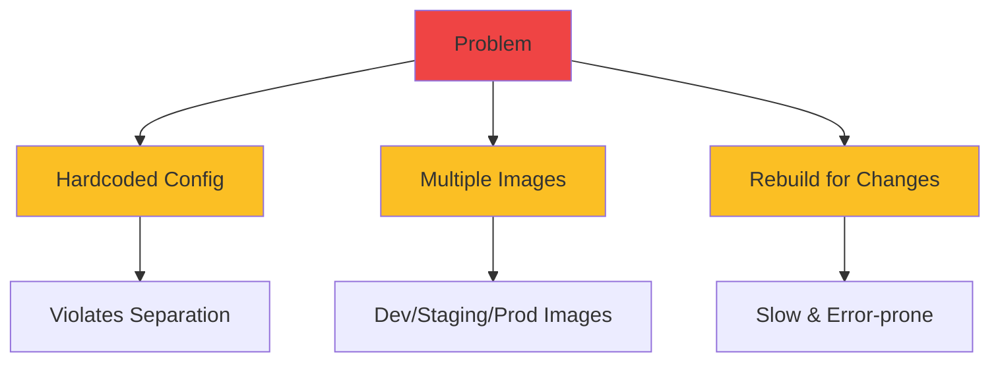
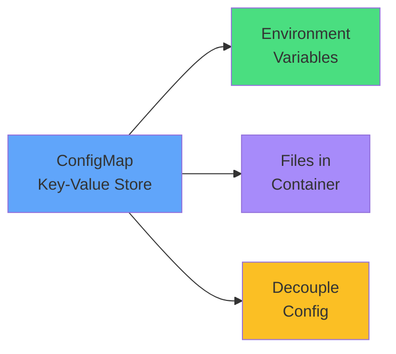
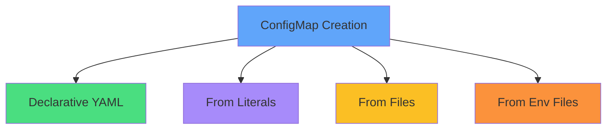
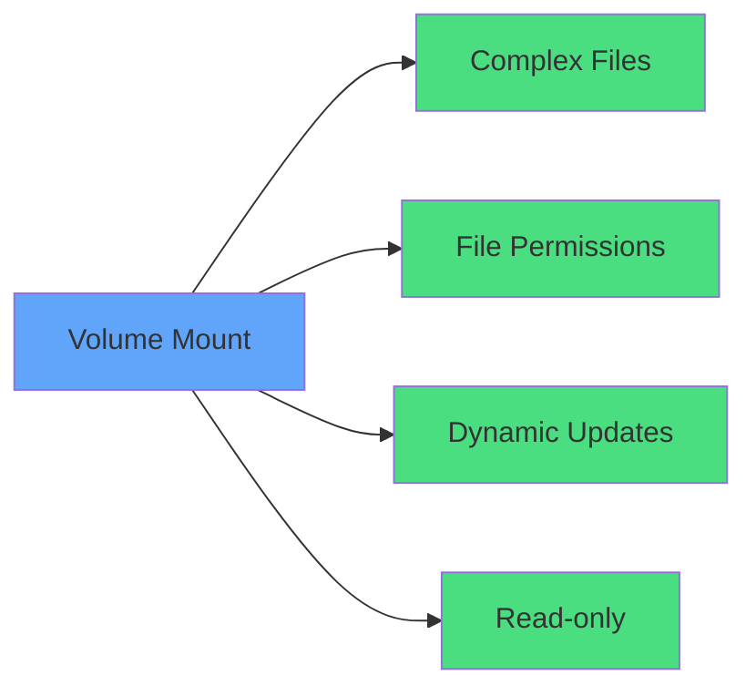
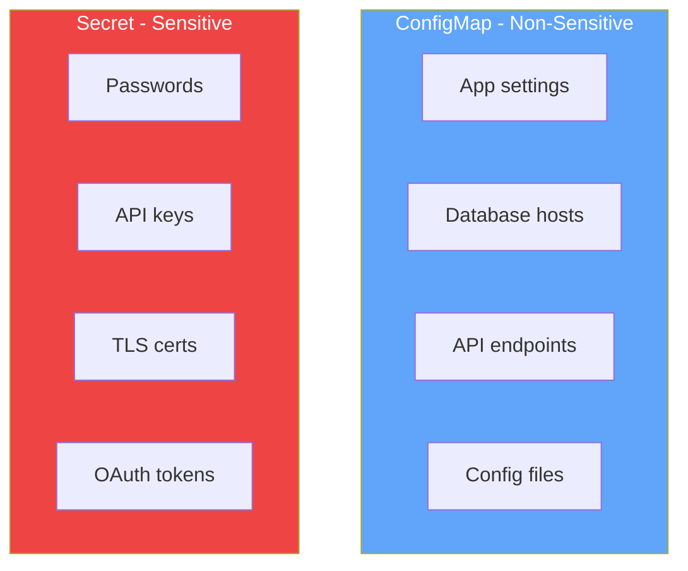
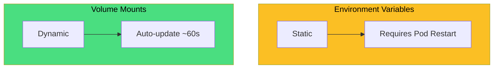
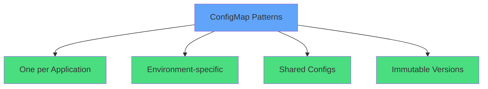
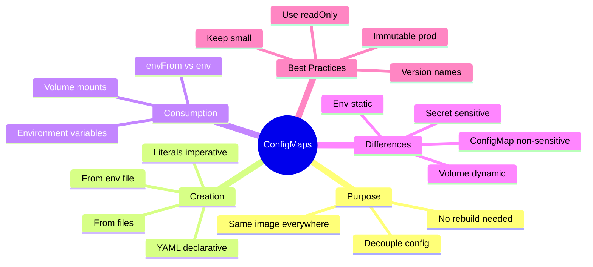

# ConfigMaps

<div class="abs-br m-6 flex gap-2">
  <carbon-settings class="text-6xl text-blue-400" />
</div>

<div v-click class="mt-8 text-xl opacity-80">
Decoupling configuration from container images
</div>

---
layout: center
---

# The Configuration Challenge

<div v-click="1">



</div>

<div class="grid grid-cols-3 gap-6 mt-8 text-sm">
<div v-click="2" class="text-center">
<carbon-close class="text-4xl text-red-400 mb-2" />
<strong>Hardcoded</strong><br/>
Config mixed with code
</div>
<div v-click="3" class="text-center">
<carbon-image class="text-4xl text-yellow-400 mb-2" />
<strong>Multiple Images</strong><br/>
Different per environment
</div>
<div v-click="4" class="text-center">
<carbon-renew class="text-4xl text-orange-400 mb-2" />
<strong>Rebuild Required</strong><br/>
Change = rebuild image
</div>
</div>

<div v-click="5" class="mt-8 text-center text-lg">
<carbon-idea class="inline-block text-3xl text-blue-400" /> 12-factor app: Store config in the environment
</div>

---
layout: center
---

# What Are ConfigMaps?

<div v-click="1">



</div>

<div v-click="2" class="mt-8 text-center mb-4">
<carbon-settings class="inline-block text-5xl text-blue-400" />
<div class="text-xl mt-2"><strong>Kubernetes API object for non-confidential configuration</strong></div>
</div>

<div class="grid grid-cols-2 gap-6 mt-6 text-sm">
<div v-click="3">
<carbon-checkmark class="inline-block text-2xl text-green-400" /> Same image across environments
</div>
<div v-click="4">
<carbon-edit class="inline-block text-2xl text-blue-400" /> Update config without rebuilding
</div>
<div v-click="5">
<carbon-document class="inline-block text-2xl text-purple-400" /> Manage configuration declaratively
</div>
<div v-click="6">
<carbon-version class="inline-block text-2xl text-yellow-400" /> Version control separately from code
</div>
</div>

<div v-click="7" class="mt-6 text-center text-red-400">
<carbon-warning class="inline-block text-2xl" /> For non-sensitive data only (use Secrets for sensitive data)
</div>

---
layout: center
---

# Creating ConfigMaps - Four Methods

<div v-click="1">



</div>

<div class="grid grid-cols-2 gap-4 mt-6 text-sm">
<div v-click="2">
<carbon-document class="inline-block text-2xl text-green-400" /> <strong>YAML:</strong> Version control, production
</div>
<div v-click="3">
<carbon-terminal class="inline-block text-2xl text-purple-400" /> <strong>Literals:</strong> Quick testing, CLI
</div>
<div v-click="4">
<carbon-document-attachment class="inline-block text-2xl text-yellow-400" /> <strong>Files:</strong> Existing config files
</div>
<div v-click="5">
<carbon-list class="inline-block text-2xl text-orange-400" /> <strong>Env Files:</strong> .env format
</div>
</div>

---
layout: center
---

# Method 1: Declarative YAML

<div v-click="1" class="mb-4">

```yaml
apiVersion: v1
kind: ConfigMap
metadata:
  name: app-config
data:
  database_host: mysql.default.svc.cluster.local
  database_port: "3306"
  log_level: info
```

</div>

<div class="grid grid-cols-3 gap-4 text-sm">
<div v-click="2" class="text-center">
<carbon-version class="text-3xl text-green-400 mb-2" />
<strong>Version Control</strong><br/>
Track changes in Git
</div>
<div v-click="3" class="text-center">
<carbon-deployment-pattern class="text-3xl text-blue-400 mb-2" />
<strong>Production Ready</strong><br/>
Declarative management
</div>
<div v-click="4" class="text-center">
<carbon-application class="text-3xl text-purple-400 mb-2" />
<strong>kubectl apply</strong><br/>
Apply changes easily
</div>
</div>

---
layout: center
---

# Methods 2-4: Imperative Creation

<div v-click="1" class="mb-3">

**From Literals:**
```bash
kubectl create configmap app-config \
  --from-literal=database_host=mysql \
  --from-literal=database_port=3306
```

</div>

<div v-click="2" class="mb-3">

**From Files:**
```bash
kubectl create configmap nginx-config --from-file=nginx.conf
```
<span class="text-xs opacity-60">Filename becomes key, content becomes value</span>

</div>

<div v-click="3">

**From Env File:**
```bash
kubectl create configmap app-config --from-env-file=app.env
```
<span class="text-xs opacity-60">Parses KEY=value format</span>

</div>

<div v-click="4" class="mt-6 text-center">
<carbon-timer class="inline-block text-3xl text-yellow-400" /> Fast for testing, but no version control
</div>

---
layout: center
---

# Consuming ConfigMaps - Environment Variables

<div v-click="1" class="mb-4">

**Load All Keys (envFrom):**
```yaml
spec:
  containers:
  - name: app
    image: myapp:1.0
    envFrom:
    - configMapRef:
        name: app-config
```

</div>

<div v-click="2" class="mb-4">

**Load Individual Keys:**
```yaml
env:
- name: DATABASE_HOST
  valueFrom:
    configMapKeyRef:
      name: app-config
      key: database_host
```

</div>

<div class="grid grid-cols-2 gap-6 mt-4">
<div v-click="3" class="text-center">
<carbon-checkmark class="text-3xl text-green-400 mb-2" />
<strong>Good for:</strong> Simple values, feature flags
</div>
<div v-click="4" class="text-center">
<carbon-warning class="text-3xl text-yellow-400 mb-2" />
<strong>Limitation:</strong> Static, requires restart
</div>
</div>

---
layout: center
---

# Consuming ConfigMaps - Volume Mounts

<div v-click="1" class="mb-4">

```yaml
spec:
  containers:
  - name: app
    image: myapp:1.0
    volumeMounts:
    - name: config-volume
      mountPath: /config
      readOnly: true
  volumes:
  - name: config-volume
    configMap:
      name: app-config
```

</div>

<div v-click="2" class="text-center mb-4 text-sm opacity-80">
Each key becomes a file: <code>/config/database_host</code>, <code>/config/database_port</code>
</div>

<div class="grid grid-cols-3 gap-4 text-sm">
<div v-click="3" class="text-center">
<carbon-document class="text-3xl text-green-400 mb-2" />
<strong>Complex Formats</strong><br/>
JSON, YAML, XML files
</div>
<div v-click="4" class="text-center">
<carbon-security class="text-3xl text-blue-400 mb-2" />
<strong>Better Security</strong><br/>
File permissions control
</div>
<div v-click="5" class="text-center">
<carbon-renew class="text-3xl text-purple-400 mb-2" />
<strong>Dynamic Updates</strong><br/>
Auto-propagate changes (~60s)
</div>
</div>

---
layout: center
---

# Volume Mount Advantages

<div v-click="1">



</div>

<div v-click="2" class="mt-8 text-center mb-4">
<carbon-renew class="inline-block text-4xl text-purple-400" />
<div class="text-lg mt-2"><strong>Updates propagate automatically (env vars don't!)</strong></div>
</div>

<div v-click="3" class="mt-6 text-center text-red-400">
<carbon-warning class="inline-block text-2xl" /> Volume mounts replace entire directory - use subPath for individual files
</div>

---
layout: center
---

# ConfigMaps vs Secrets

<div v-click="1">



</div>

<div class="grid grid-cols-2 gap-6 mt-8">
<div v-click="2">
<carbon-settings class="text-4xl text-blue-400 mb-2" />
<strong>ConfigMaps</strong><br/>
<span class="text-sm opacity-80">Plain text, easily readable</span>
</div>
<div v-click="3">
<carbon-locked class="text-4xl text-red-400 mb-2" />
<strong>Secrets</strong><br/>
<span class="text-sm opacity-80">Base64-encoded, encryption at rest</span>
</div>
</div>

<div v-click="4" class="mt-8 text-center text-lg">
<carbon-rule class="inline-block text-3xl text-yellow-400" /> Rule: Don't commit to public Git? Use Secret
</div>

---
layout: center
---

# CKAD Exam Relevance

<div v-click="1" class="text-center mb-6">
<carbon-certificate class="inline-block text-6xl text-blue-400" />
</div>

<div class="grid grid-cols-2 gap-4 text-sm">
<div v-click="2">
<carbon-edit class="inline-block text-2xl text-green-400" /> Create ConfigMaps (imperative & declarative)
</div>
<div v-click="3">
<carbon-list class="inline-block text-2xl text-green-400" /> Inject as environment variables
</div>
<div v-click="4">
<carbon-data-volume class="inline-block text-2xl text-green-400" /> Mount as volumes
</div>
<div v-click="5">
<carbon-debug class="inline-block text-2xl text-green-400" /> Troubleshoot missing ConfigMaps
</div>
<div v-click="6">
<carbon-renew class="inline-block text-2xl text-green-400" /> Understand update behavior
</div>
<div v-click="7">
<carbon-terminal class="inline-block text-2xl text-green-400" /> Use kubectl describe & logs
</div>
<div v-click="8">
<carbon-rule class="inline-block text-2xl text-yellow-400" /> Know when to use Secrets instead
</div>
<div v-click="9">
<carbon-timer class="inline-block text-2xl text-red-400" /> Create + inject in under 2 minutes
</div>
</div>

---
layout: center
---

# Best Practices

<div class="grid grid-cols-2 gap-6 mt-4">
<div v-click="1">
<carbon-tag class="text-4xl text-blue-400 mb-2" />
<strong>Naming</strong><br/>
<span class="text-sm opacity-80">Descriptive names, version numbers for immutable</span>
</div>
<div v-click="2">
<carbon-dashboard class="text-4xl text-green-400 mb-2" />
<strong>Size Management</strong><br/>
<span class="text-sm opacity-80">Keep under 1 MiB, split large configs</span>
</div>
<div v-click="3">
<carbon-security class="text-4xl text-purple-400 mb-2" />
<strong>Security</strong><br/>
<span class="text-sm opacity-80">Use readOnly: true, never store secrets</span>
</div>
<div v-click="4">
<carbon-version class="text-4xl text-yellow-400 mb-2" />
<strong>Updates</strong><br/>
<span class="text-sm opacity-80">Use immutable ConfigMaps in production</span>
</div>
</div>

<div v-click="5" class="mt-8 text-center text-lg">
<carbon-deployment-pattern class="inline-block text-3xl text-blue-400" /> Version ConfigMaps with Deployment rolling updates
</div>

---
layout: center
---

# Update Behavior Comparison

<div v-click="1">



</div>

<div class="grid grid-cols-2 gap-6 mt-8">
<div v-click="2" class="text-center">
<carbon-close class="text-5xl text-yellow-400 mb-2" />
<strong>Environment Variables</strong><br/>
<span class="text-sm opacity-80">Set at container start<br/>No automatic updates</span>
</div>
<div v-click="3" class="text-center">
<carbon-checkmark class="text-5xl text-green-400 mb-2" />
<strong>Volume Mounts</strong><br/>
<span class="text-sm opacity-80">Kubernetes propagates changes<br/>App must reload config</span>
</div>
</div>

<div v-click="4" class="mt-8 text-center text-red-400">
<carbon-warning class="inline-block text-2xl" /> Application must detect and reload config changes
</div>

---
layout: center
---

# Common Patterns

<div v-click="1">



</div>

<div class="grid grid-cols-2 gap-4 mt-6 text-sm">
<div v-click="2">
<carbon-application class="inline-block text-2xl text-green-400" /> <strong>app-config:</strong> One ConfigMap per app
</div>
<div v-click="3">
<carbon-tag class="inline-block text-2xl text-blue-400" /> <strong>app-config-prod:</strong> Environment-specific
</div>
<div v-click="4">
<carbon-network-overlay class="inline-block text-2xl text-purple-400" /> <strong>shared-config:</strong> Multiple apps share
</div>
<div v-click="5">
<carbon-version class="inline-block text-2xl text-yellow-400" /> <strong>app-config-v2:</strong> Versioned for rollbacks
</div>
</div>

---
layout: center
---

# Summary

<div v-click="1">



</div>

---
layout: center
---

# Key Takeaways

<div class="grid grid-cols-2 gap-6 mt-6">
<div v-click="1">
<carbon-settings class="text-4xl text-blue-400 mb-2" />
<strong>Decouple configuration</strong><br/>
<span class="text-sm opacity-80">Store config separately from images</span>
</div>
<div v-click="2">
<carbon-list class="text-4xl text-green-400 mb-2" />
<strong>Environment variables</strong><br/>
<span class="text-sm opacity-80">Simple values, static, requires restart</span>
</div>
<div v-click="3">
<carbon-data-volume class="text-4xl text-purple-400 mb-2" />
<strong>Volume mounts</strong><br/>
<span class="text-sm opacity-80">Complex files, dynamic updates</span>
</div>
<div v-click="4">
<carbon-locked class="text-4xl text-red-400 mb-2" />
<strong>Use Secrets for sensitive data</strong><br/>
<span class="text-sm opacity-80">Passwords, keys, certificates</span>
</div>
</div>

<div v-click="5" class="mt-8 text-center text-lg">
Master both imperative and declarative approaches <carbon-arrow-right class="inline-block text-2xl" />
</div>
