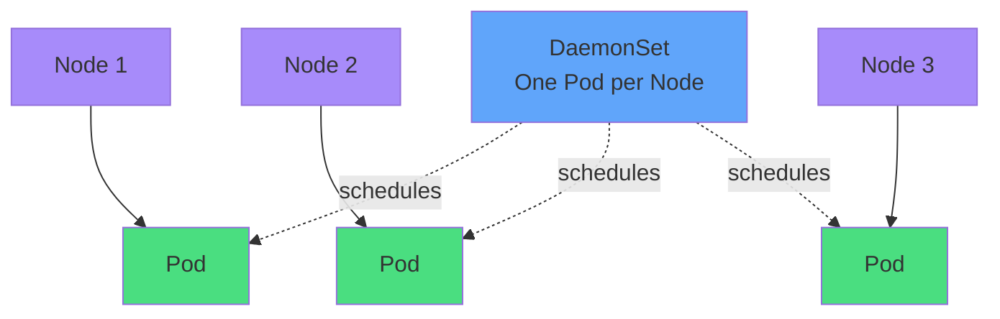

# DaemonSet Pattern

```mermaid
graph TB
    DS[<carbon-virtual-machine/> DaemonSet<br/>One Pod per Node]

    N1[<carbon-server/> Node 1] --> P1[<carbon-container-software/> Pod]
    N2[<carbon-server/> Node 2] --> P2[<carbon-container-software/> Pod]
    N3[<carbon-server/> Node 3] --> P3[<carbon-container-software/> Pod]

    DS -.->|schedules| P1
    DS -.->|schedules| P2
    DS -.->|schedules| P3

    style DS fill:#60a5fa
    style N1 fill:#a78bfa
    style N2 fill:#a78bfa
    style N3 fill:#a78bfa
    style P1 fill:#4ade80
    style P2 fill:#4ade80
    style P3 fill:#4ade80
```

Automatic node coverage

