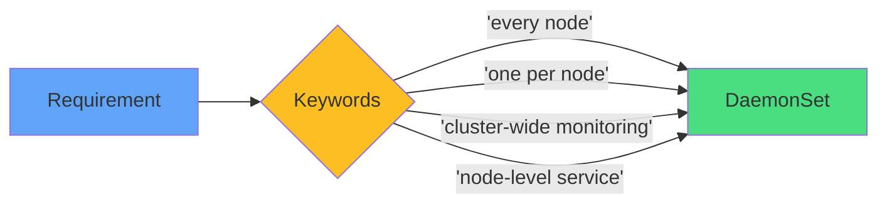

# Recognizing DaemonSet Use Cases

### DaemonSet Scenarios
<carbon-checkmark-filled class="text-4xl text-green-400" />

- Monitoring agents
- Log collectors
- Storage daemons
- Network plugins

### Deployment Scenarios
<carbon-deploy class="text-4xl text-blue-400" />

- Application servers
- APIs
- Batch processors
- Stateless services

