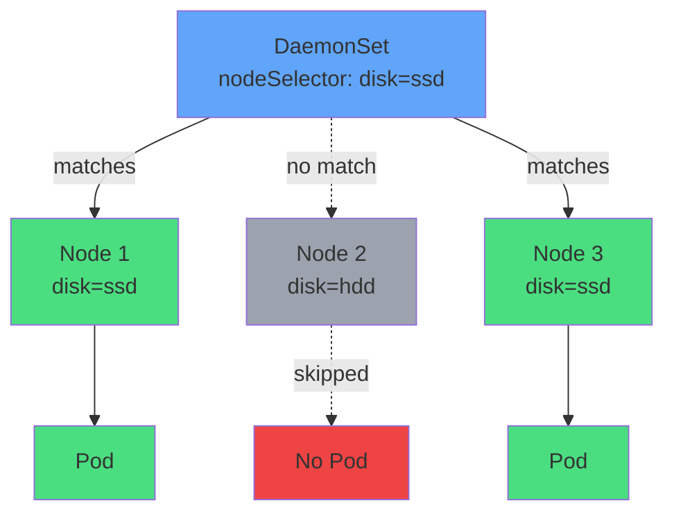

# Node Selector Configuration

```mermaid
graph TB
    DS[<carbon-virtual-machine/> DaemonSet<br/>nodeSelector: disk=ssd]

    N1[<carbon-server/> Node 1<br/>disk=ssd] --> P1[<carbon-container-software/> Pod]
    N2[<carbon-server/> Node 2<br/>disk=hdd] -.->|skipped| SKIP[<carbon-close/> No Pod]
    N3[<carbon-server/> Node 3<br/>disk=ssd] --> P3[<carbon-container-software/> Pod]

    DS -->|matches| N1
    DS -.->|no match| N2
    DS -->|matches| N3

    style DS fill:#60a5fa
    style N1 fill:#4ade80
    style N2 fill:#9ca3af
    style N3 fill:#4ade80
    style P1 fill:#4ade80
    style P3 fill:#4ade80
    style SKIP fill:#ef4444
```

Target specific nodes by labels

