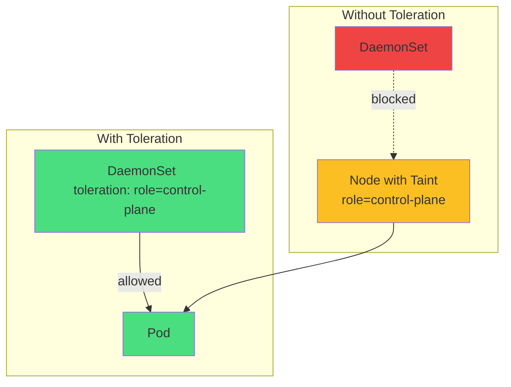

# Tolerations for Tainted Nodes

```mermaid
graph TB
    TAINT[<carbon-warning-alt/> Node with Taint<br/>role=control-plane]

    subgraph Without Toleration
        DS1[<carbon-virtual-machine/> DaemonSet] -.->|blocked| TAINT
    end

    subgraph With Toleration
        DS2[<carbon-virtual-machine/> DaemonSet<br/>toleration: role=control-plane] -->|allowed| POD[<carbon-container-software/> Pod]
    end

    TAINT --> POD

    style TAINT fill:#fbbf24
    style DS1 fill:#ef4444
    style DS2 fill:#4ade80
    style POD fill:#4ade80
```

### System services often need tolerations
Run on control plane or specially tainted nodes

