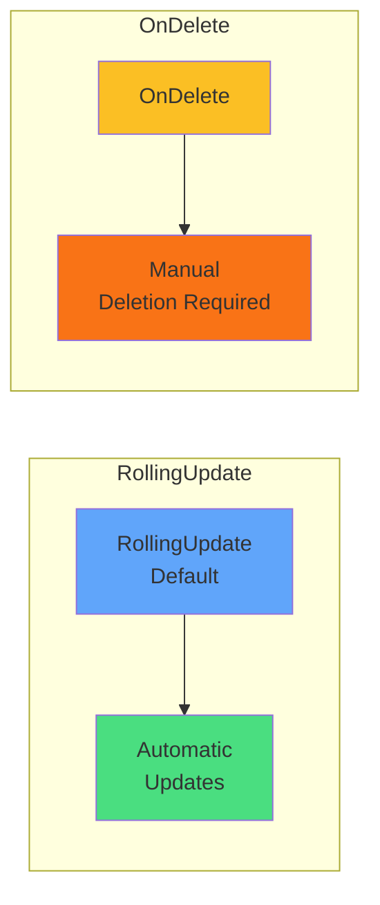

# Update Strategies

### RollingUpdate (default)
Pods automatically updated when DaemonSet changes

### OnDelete
Pods only updated when manually deleted

Configure `maxUnavailable` for rolling updates

