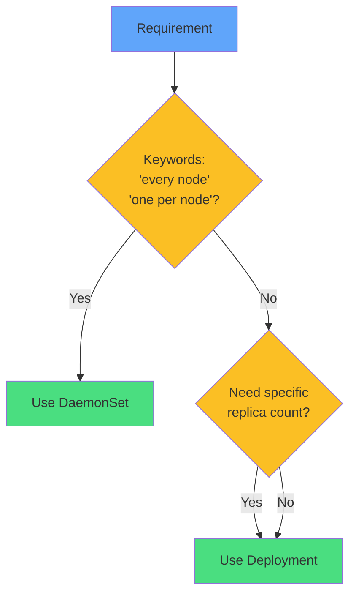

# Exam Decision Flow

```mermaid
graph TB
    START[<carbon-document-tasks/> Requirement] --> Q1{<carbon-decision-tree/> Keywords:<br/>'every node'<br/>'one per node'?}
    Q1 -->|Yes| DS[<carbon-virtual-machine/> Use DaemonSet]
    Q1 -->|No| Q2{<carbon-decision-tree/> Need specific<br/>replica count?}
    Q2 -->|Yes| DEP[<carbon-deploy/> Use Deployment]
    Q2 -->|No| DEP

    style START fill:#60a5fa
    style Q1 fill:#fbbf24
    style Q2 fill:#fbbf24
    style DS fill:#4ade80
    style DEP fill:#4ade80
```

Pattern recognition is the key skill

