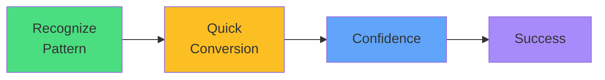

# Exam Mindset

<carbon-lightbulb class="text-yellow-400 text-4xl inline-block" />

### Look for "one per node" or "every node"
### Convert Deployment → DaemonSet (change kind, remove replicas)
### Practice pattern recognition

